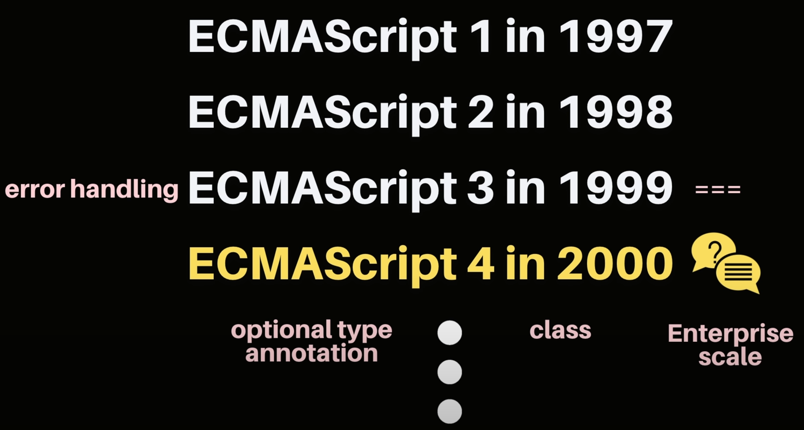

https://www.youtube.com/watch?v=wcsVjmHrUQg&list=PLv2d7VI9OotTVOL4QmPfvJWPJvkmv6h-2&index=1

새로운 언어를 배울때 바로 문법부터 공부하는 것보다 언어의 탄생배경과 이 언어를 배웠을때 어느 분야에서 활용할 수 있고, 나에게 어떤 이득이 생길 수 있는지에 대한 이해가 필수입니다🙌 우리 이번영상에서는 전반적인 역사의 흐름을 통해 기본적인 개념들을 이해해보는 시간을 가져보도록 할께요

1993년

Netscape(Marc Andreessen): 비전문가도 쉽게 쓸 수 있는 UI 웹 요소가 더해진 Mosaic Web Browser 출시 (NetScape)

HTML, CSS로 간단하게 정적인 페이지를 만들 수 있다.

어떻게 동적인 웹사이트를 만들 수 있을까?

-> 그래! Scripting 언어를 추가하자! (DOM 요소 조작)

Java -> 웹사이트 주로 개발하는 개발자들에게 어렵고 무거움

-> Brendan Eich 스카웃해서 Scheme script 언어 변형

Super flexible for anything

1994 Mocha 언어 탄생

추후 LiveScript로 이름이 바뀌게 된다.

Interpreter 포함해서 개발됨.

LiveScript로 코드 짬 -> Interpreter가 코드 이해해서 알맞게 DOM 요소 조작 가능

그 당시 Java 인기 -> LiveScript의 이름을 JavaScript로 변경

1995년 - Netscape Navigator 브라우저 위에 Javascript, 이 Javascript를 이해할 수 있는 엔진 포함되어서 출시된다.

Microsoft: 우리도 우리만의 브라우저 출시해야 겠군.

Netscape의 Netscape Navigator 브라우저 **Reverse engineering**

고대로 베껴와서 조금만 기능 변경. JScript라고 이름 변경해서 시장에 내놓음.

Internet Explorer 내놓는다.

웹개발자 - 다른 브라우저 위에서 동작하는 코드 만들어야..

1996. 11 - Netscape가 ECMA International에 찾아가서

우리가 Javascript를 만들었는데, 이걸로 표준안을 한 번 만들어보자

1997. 7

ECMAScript 1 시장에 등장

브라우저에서 동작하는 언어를 만들 때,

그 언어를 엔진이 이해하기 위해서 변수는 어떻게 만들고, 함수는 이런 식으로 정의해야 하고,

이런 문법적인 사항들을 잘 정리한 문서.

그 뒤에 새로운 버전들 추가적으로 나오게 되었다.

ECMAScript 3에서는 새로운 error handling 방식에 대한 문법,

=== 관계 연산자 등이 새로 추가되었다.

ECMAScript 4부터는 굉장히 다양한 아이디어가 제안으로 들어오게 된다.

class 넣자, optional type annotation은 어때?

(2000)많은 것들이 논의되는 동안, Internet Explorer의 점유율 95%

MS 건방져지기 시작

class 추가하면 script 언어가 아니지 않느냐

우리는 표준 안따르겠다.

ECMAScript 표준안에 참가하지 않음.

2004

moz:lla 사에서 Firefox 출시

ECMAScript4에 "ActionScript3을 만들었고 이걸 이해하는 Tamarin이란 멋진 엔진이 있는데, 

이걸로 표준안 만들어보자" 제안

Tamarin은 JScript, JavaScript와 너무 달랐기 때문에,

이거로 표준안 진행하기엔 좀 무리

표준화를 두고 NetScape, Microsoft, moz://a 3사의 신경전

불쌍한 개발자들은 시장에 존재하는 다양한 브라우저에서 잘 동작할 수 있도록 웹 페이지를 만듦.

2004

Jesse James Garrett - **AJAX**

Asynchronous JavaScript and XML

비동기적으로 데이터를 서버에서 받아오고 처리할 수 있도록 도와주는 정말 획기적인 ajax가 도입된다.

시장에 Opera Browser도 등장

개발자 사이에 커뮤니티 형성

커뮤니티에서 **jQuery, dojo, mootools**와 같은 라이브러리들이 많이 나오게 된다.

라이브러리들이 해결하고자 하는 공통된 문제점 - 하나

개발자들이 더 이상 다른 브라우저의 구현 사항을 신경쓰지 않아도 되게 만드는 것

우리가 제공하는 API, 함수들만 호출하면,

다른 브라우저상에서 동작하게 하는 건 우리가 신경쓸께

라이브러리 중에서도 "write less, do more"이란 슬로건을 내세운 jquery가 많은 사랑을 받게 된다.

2008

웹 시장을 급격하게 바꾸는 정말 진취적인 사건

Google에서 Chrome Browser 출시

JIT(just-in-time compilation) 엔진이라는 정말 강력한 엔진 포함

자바스크립트를 실행하는 속도가 엄청 빠른 강력한 엔진이 포함된 브라우저

크롬의 획기적인 등장 - 다른 브라우저: 우리가 성능 개선을 해야겠군..

2008년 7월

모든 브라우저 모여서 생산적인 대화를 하게 된다.

표준안을 만들어보자.

2009

ECMAScript 5가 나옴.

2015

ECMAScript 6가 나옴.

여러분들이 흔하게 사용하는 class, arrow function, const, let

모든 아이들이 ECMAScript 6에 정의되어 있다.

그 외에도 매 해마다 새로운 버전이 나오는 중.

커다란 변화는 ECMAScript 5, 6에서 정의되었다고 할 수 있다.

이제는 말할 수 있다.

JavaScript는 성숙하고 잘 정착된 언어이다.

Mature, Settled down

모든 브라우저들이 이 ECMAScript의 표준안을 잘 따라가고 있기 때문에, 

jquery, dojo, mootools와 같은 라이브러리의 도움 없이도 

충분히 JavaScript와 Web APIs에서 제공하는 API만으로도

모든 브라우저에서 잘 동작할 수 있는 웹사이트나 웹 어플리케이션을 만들 수 있다.

각 브라우저마다 ECMAScript의 표준안을 따라가는 다양한 엔진들이 존재한다.

크롬의 V8 JavaScript 엔진

node.js, Electron에서도 많이 이용되어진다.

2020년 2월 경 MS사에서도 드디어 V8엔진을 배치해서 사용

시장에서 다양한 사용자들은 다양한 브라우저를 사용 중.

모든 사용자들이 최신 브라우저를 쓰는 것은 아님.

개발자들은 쿨한 기능이 탑재된 최신 버전의 ECMAScript로 개발하고 싶다.

개발할 때는 최신 버전의 ECMAScript를 쓰고,

사용자에게 배포할 때만 JavaScript TransCompiler를 이용해서, 즉 ECMAScript의 최신 버전을 5나 6으로 변환해서,

변환된 코드를 생산해주는 transcompiler가 가능한 것이 바로 **BABEL**

요새 동향

**SPA**(Single Page Application)이 굉장히 뜨고 있다.

웹사이트를 만드는 것은 더이상 충분하지 않다.

하나의 페이지 안에서 데이터를 받아와서, 필요한 부분만 부분적으로 업데이트하는 것이 굉장히 유행하고 있다.

물론 JavaScript만으로도 충분히 구현 가능하지만, SPA를 조금 더 쉽게 만들기 위해서

React, Ngular, Vue같은 아이들이 나오게 된다.

이런 라이브러리나 프레임워크들을 이용해서, SPA를 조금 더 쉽게 구현해낼 수가 있다.

JavaScript는 브라우저를 위한, 브라우저에서 동적인 요소를 추가하기 위해서 만들어진 언어.

ECMAScript의 활발한 표준화를 통해서, 강력한 V8 JavaScript 엔진을 통해서,

node.js가 등장하게 된다.

JavaScript 엔진을 이용한 BackEnd에서 서비스를 구현할 수 있도록 만들어진 언어.

React Native같은 아이들을 이용해서 모바일 어플리케이션도 충분히 만들 수 있다.

electron을 이용해서 Desktop 어플리케이션도 만들 수 있다.

JavaScript 배우면 이용할 수 있는 분야 무궁무진하다.

앞으로 JavaScript의 잠재력도 무궁무진하다.

브라우저에서 동작할 수 있는 유일한 언어는 자바스크립트 였는데요,

요즘엔 Web Assembly가 등장해서 C, C++, C#, Java, Python, Go 등 다양한 언어들을 이용해서 웹 어플리케이션을 만드는 것이 가능해졌습니다.

굉장히 가능성이 무궁무진한 아이

C++로 만든 게임도 Web Browser에서 쉽게 동작할 수 있도록 만들 수 있따.

그래픽 툴 중 하나인 Figma도 이 Web Assembly를 이용해서 만들어진 좋은 예이다.

JavaScript는 가장 많이 사용되는 언어에서 7년 동안 꾸준히 1위 차지

가장 사랑받는 언어 11위

개발자들이 배워보고 싶은 언어 2위

전 세계 평균 연봉 -> $56k 

타입스크립트 배우면 $60k정도 기대 가능

많은 분들이 query selector나 console log같은 웹 API 시대를 JavaScript 언어로 오해하시는 경우가 많다.

우리가 앞으로 진행할 강의에서는 JavaScript 언어 자체를 먼저 배워서,

여러분들이 다른 곳에서도 충분히 활용할 수 있게 알아볼 것이다.

그 뒤에 Web APIs들을 배워서, 우리가 브라우저랑 프론트엔드 상에서 어떻게 더 활용할 수 있는지에 대해서 조금 더 공부해보도록 하겠습니다.

JS 배운 다음에는, 많은 분야에서 활용할 수 있는 여러분들의 몸값이 많이 올라갈 수 있는 좋은 기회가 되었으면 좋겠다.

