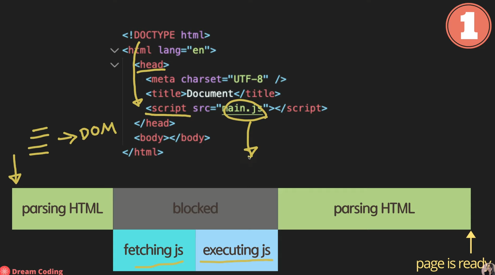
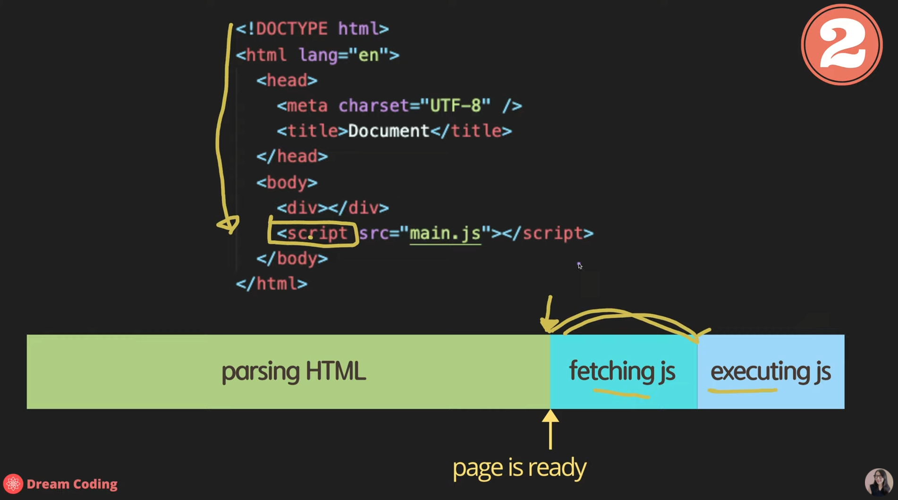
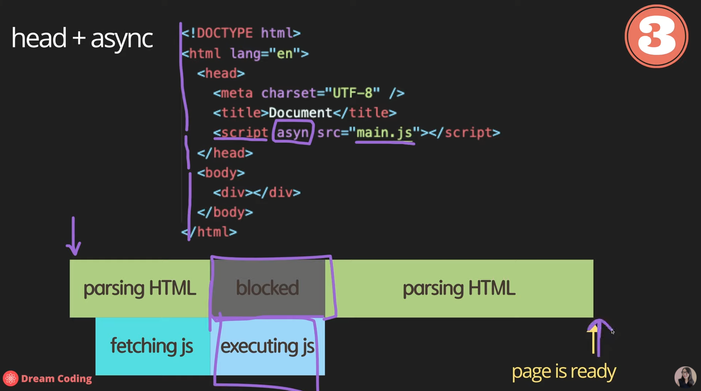
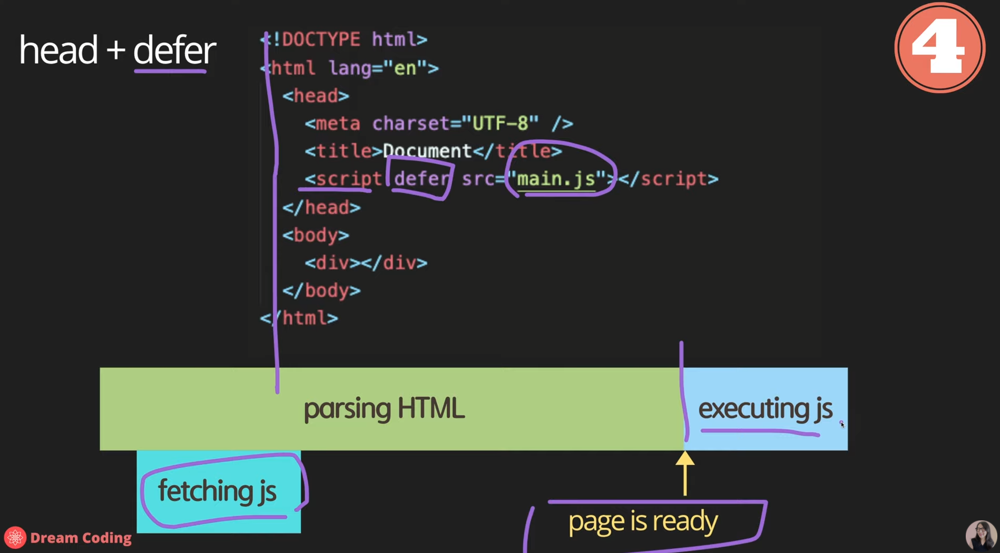
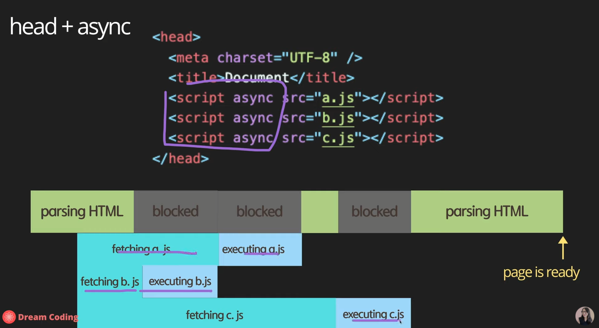
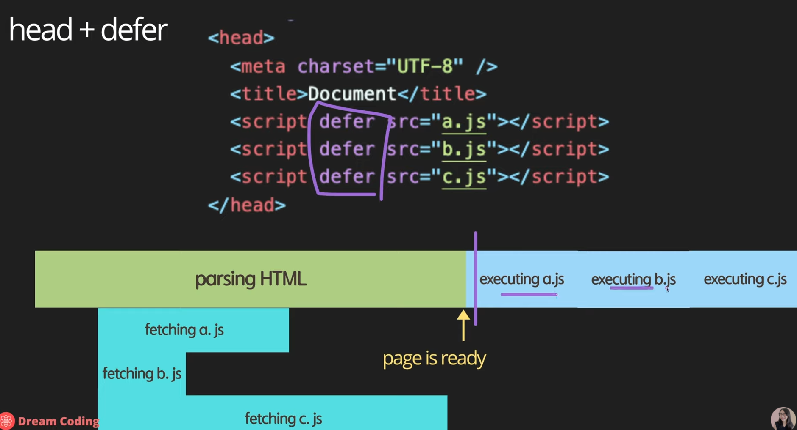

https://www.youtube.com/watch?v=tJieVCgGzhs&list=PLv2d7VI9OotTVOL4QmPfvJWPJvkmv6h-2&index=2


Hello World 화면에 출력해보기

async vs defer


- Hello World!

폴더 새로 만든 뒤

main.js

```js
console.log('Hello World!');
```

node.js로 실행 가능


node.js에는 javascript 엔진이 있어서,

브라우저 없이도 javascript를 실행할 수 있다.


node.js로 javascript를 공부해도 좋지만,

우린 나중에 web APIs들을 배울 것이기 때문에,

html과 작성한 main.js를 연결해서 거기서부터 개발해나가는 방식으로 공부해보겠다.


- Preparation

main.js와 같은 폴더에서

index.html 만들기

```html
<!DOCTYPE html>
<html lang="en">
<head>
  <meta charset="UTF-8">
  <meta http-equiv="X-UA-Compatible" content="IE=edge">
  <meta name="viewport" content="width=device-width, initial-scale=1.0">
  <title>Document</title>
  <script src="main.js"></script>
</head>
<body>
  
</body>
</html>
```

! 누르고 tab

script 작성. main.js 연결

Ctrl + shift + P 누르고

Open with live Server 누르면 브라우저에서 바로 확인 되죠?

[난 index.html 누르고 Alt + B 단축키로 창 실행]

크롬에서 F12 누르면 Developer Tool 나옴.

Console 창에 Hello World! 볼 수 있다.

Console APIs. 그 중에 log라는 함수를 이용해서, 우리가 원하는 메시지를 콘솔창에 출력하는 것을 확인해볼 수 있다.

아까 node.js를 이용해서 콘솔 창에 출력하는 것도 볼 수 있죠?

그것은 바로 node.js와 Web APIs 둘 다 console에 관련된 API가 있는 것이다.

이 API들의 Interface가 둘 다 동일하다.


MDN 사이트에서 보면 Console API는 Web API중 하나인 것을 볼 수 있다.

API는 Applcation Programming Interface의 약자

Web APIs는 javascript 언어 자체에 포함된 아이가 아니라, 브라우저가 제공하는, 브라우저가 이해할 수 있는 함수들이다.

Console API spec에 가시면, 함수들은 어떤 것들이 있고, 어떤 데이터를 파라미터 형태로 전달해야 하는지 잘 작성되어져 있다.

제가 전달하고 싶은 포인트 - Console은 언어 자체에 포함된 아이는 아니지만, 통상적으로 많이 쓰이는 아이라서 Node.js와 Web APIs에 공통적으로 포함되어 있어서, 똑같은 Console API를 이용해서 Node.js에서도 출력할 수 있고, 브라우저 상에서도 콘솔 창에 출력되는 것을 확인할 수 있다.


- Dev Tools

브라우저에서 딸려나오는 개발 툴을 잘 활용하시면, 공부하실 때나 현업에서 일하실 때 유용하게 쓸 수 있다.

html, css 배울 때 elements 탭에서 작성한 요소들을 확인하고 기능을 확인했다면,

콘솔 탭에서는 코드에서 작성한 메시지를 확인할 수 있지만, javascript를 실행할 수 있다.

동적으로 요소들 검사, 붙여넣고, 지우는 간단한 기능 할 수 있다.

console.log('Ellie');

alert('Hello');


hello

-> hello is not defined

var hello;

hello = 10;

hello

-> 10


간단한 javascript 동작 가능


Sources탭 나중에 디버깅할 때 굉장히 유용

우리가 작성한 코드가 확인된다.

나중에 BreakPoint를 걸어서 디버깅할 때도 유용하게 쓰인다.


Network 탭

네트워크가 어떻게 발생하는지, 얼마나 많은 size의 데이터가 오고가는지 검사도 할 수 있다.


Performance 분석, Memory 분석 등 굉장히 다양한 것들을 확인해볼 수 있다.

나중에 차근차근히 javascript를 배워나가면서 필요할 때마다 소개시켜드리도록 하겠습니다.


- 자바스크립트의 공식 사이트는?

ecma-international.org

개발자가 보기에 조금 난해할 수 있다.


수많은 개발자가 가는 곳

developer.mozilla.org

MDN 사이트

html, css 배울 때도 항상 MDN 강조해서 말씀드림.

MDN 가셔서 javascript 배우는 것을 추천드림.


- async vs defer

이번에는 조금 중요한, html에서 javascript를 포함할 때, 어떻게 포함하는 게 더 효율적인지 짚고 넘어가보겠다.

index.html


1. 

head 안에 script가 포함되어 있는걸 볼 수 있다.

이렇게 포함했을 때, 과연 어떤 순서대로 사용자에게 페이지가 보여지게 될까?




head 안에 그냥 script 포함하게 되면

사용자가 html 파일 다운로드 받았을 때,

브라우저가 한 줄 한 줄씩 분석하게 된다. parsing

분석하고 이해한 것을 CSS와 병합하여 DOM 요소로 변환하다.

DOM 요소로 변환하는 과정은 다음에 자세히


이렇게 html을 한 줄씩 parsing하다가, script 태그가 보이면 main.js를 다운받아야 되네 라고 이해함.

html parsing하는 것을 잠시 멈추고, 필요한 main.js를 서버에서 다운받아서 이것을 실행한 다음에 parsing하는 부분으로 넘어간다.


이렇게 하면 단점 -> 만약 여러분들의 js 파일이 사이즈가 어마어마하게 크고 인터넷도 엄청 느림

-> 사용자가 여러분들의 웹사이트를 보는 데까지 많은 시간이 소요된다.

그래서 그냥 script를 head에 포함하는 것은 좋은 게 아니다.


2. 

그래서 그 다음으로 많이 하시는 게, body 안에, 제일 끝부분에 script를 추가




이렇게 하게 되면, 브라우저가 html을 다운받아서, 쭉 parsing해서 페이지가 준비가 된 다음에 script를 만나서, 서버에서 fetching, 받아오고 실행하게 된다.

그래서 페이지가 사용자들에게 js를 받기 전에도 이미 준비가 되어서, 사용자가 page contents를 볼 수가 있다.

이런 방법도 좋지만, 이 방법의 단점은 무엇일까요?


사용자가 기본적인 html의 contents를 빨리 본다는 장점은 있지만, 만약 여러분들의 web site가 javascript에 굉장히 의존적인 아이라면, 즉 사용자가 의미 있는 컨텐츠를 보기 위해서는, javascript를 이용해서 server에 있는 데이터를 받아온다던지, 아니면 DOM 요소를 더 이쁘게 꾸며준다던지, 그런 식으로 동작하는 웹사이트라면, 사용자가 정상적인 페이지를 보기 전까지는 fetching하는, 서버에서 자바스크립트를 받아오는 시간도 기다려야 되고, 실행하는 시간도 기다려야 되는 단점이 있다.


3. head + async

그 다음으로 우리가 살펴볼 수 있는 옵션은, head 안에 script를 이용하되, asyn라는 속성 값을 쓰는 것이다.



asyn는 bool type의 속성 값이기 때문에, 이렇게 선언하는 것만으로도 true로 설정이 된다.

asyn 사용하게 되면, 브라우저가 html을 다운로드 받아서 parsing하다가 asyn 발견

-> 병렬로 main.js 파일을 다운로드 받자 라고 명령을 해놓고 다시 parsing

main.js 다운로드가 완료되면, 그 때 parsing하는 것을 멈추고 다운로드 된 js파일을 실행하게 된다.

실행을 다 하고 나서, 나머지 html을 parsing


이렇게 하면 장단점

body 끝에 사용하는 것보다, fetching이 parsing하는 동안 병렬적으로 일어나기 때문에, 다운로드 받는 시간을 절약할 수 있다.

하지만 javascript가 html이 parsing되기 전에 실행되기 때문에, 만약 javascript 파일에서 query selector를 이용해서 DOM 요소를 조작한다 그러면, 조작하려고 하는 시점에 html이 우리가 원하는 요소가 아직 정의되어 있지 않을 수 있다.

그래서 그 부분이 조금 위험할 수 있다.

html 파싱하는 동안 언제든지 javascript를 실행하기 위해서 멈출 수 있기 때문에, 사용자가 페이지를 보는 데 시간이 여전히 조금 더 걸릴 수 있다.


4. head + defer

그 다음으로 우리가 생각해볼 수 있는 옵션은 defer



똑같이 head 안에 script를 쓰고, 이번에는 defer를 쓴다.

parsing을 하다가, 어 script defer가 있네 -> main.js를 다운로드 받자 명령만 시켜놓고,

나머지 html을 끝까지 parsing하게 된다.

마지막에 parsing이 끝난 다음에, 다운로드되어진 javascript를 실행.

딱 봐도 defer이 가장 좋은 옵션

html을 parsing하는 동안, 필요한 javascript를 다 다운로드 받아놓고, 

html parsing을 먼저 해서 사용자들에게 페이지를 보여준 다음에, 바로 이어서 javascript를 실행했기 떄문.


조금만 더 async와 defer의 차이를 살펴보자.

async - 먼저 다운로드된 애들을 실행한다.



정의된 스크립트 순서에 상관없이, 먼저 다운로드 된 애를 실행.

만약 여러분들의 javascript가 순서에 의존적이라면, async 이용시 조금 문제가 될 수 있다.




defer는 parsing하는 동안 필요한 javascript를 다 다운로드 받아놓은 뒤에 순서대로 실행

우리가 정의한 순서가 지켜지기 때문에, 우리가 원하는대로 script가 실행이 될 것이라는 것을 예상할 수 있다.

여러모로 살펴봤을 때, head 안에 defer 옵션을 사용해서 하는 것이 제일 효율적이고 안전하다고 볼 수 있다.


- Use strict!

javascript 이용하실 때는, 제일 윗 부분에 'use strict';를 정의해주면 좋다.

typescript를 쓸 때는 전혀 선언할 필요가 없다.

순수 vanilla javascript를 쓸 때는 꼭 쓰는 게 좋다.

왜?

JavaScript 되게 빨리 만든 언어

-> 되게 유연한 언어

flexible === dangerous

개발자가 많은 실수를 할 수 있다.

선언되지 않은 변수에 값 할당, 기존에 존재하는 프로토타입 변경

이런 비상식적인 것들은 다른 언어를 공부하고 온 개발자가 봤을 때, 미친 듯한 행동들

다행히 'use strict'; 는 ECMAScript 5에 추가

선언하게 되면 비상식적인 것 쓸 수 없다.


use strict; 안쓰고

a = 6; 라고 선언

-> 브라우저에서는 전혀 문제가 될 게 없다.

use strict; 선언하게 되면 에러 발생.

a는 정의되어 있지 않아.

let a;

하면 문제 없음

앞으로 vanilla javascript로 개발할 때는, 파일 위에 use strict를 선언해주면서 strict 모드로 개발하는 것을 추천.

조금 더 상식적인 범위 안에서 javascript를 이용할 수 있다.

strict mode 사용 시 javascript engine이 좀 더 효율적으로, 빠르게 javascript를 분석할 수 있다.

실행하는 데 있어서 조금 더 나은 성능 개선까지 우리가 기대할 수가 있다.

여기까지 재밌게 따라오셨으면 좋겠다.

이어지는 다음 강의 시간 - 함께 노트를 작성하며 꼼꼼하게 javascript를 배우고, 친해지는 시간을 갖도록 하겠다.

