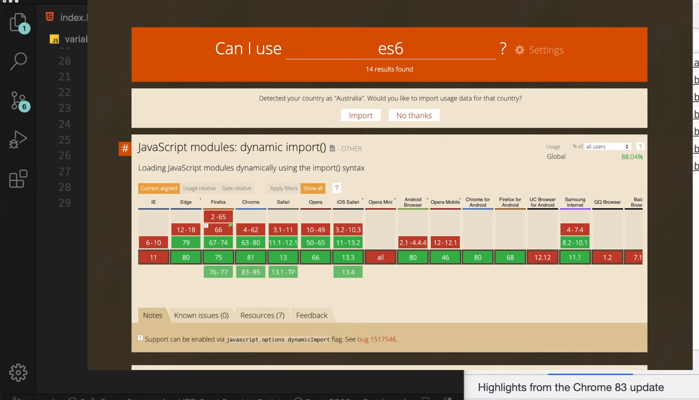
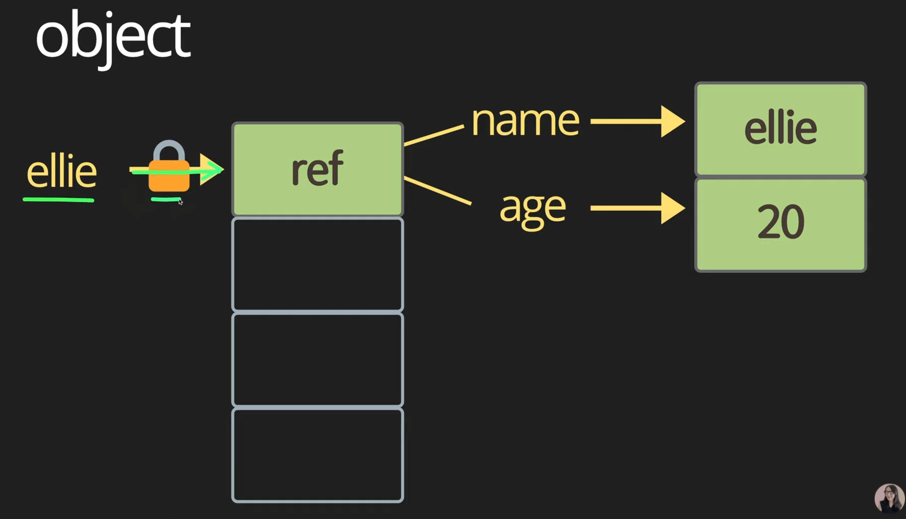

https://www.youtube.com/watch?v=OCCpGh4ujb8&list=PLv2d7VI9OotTVOL4QmPfvJWPJvkmv6h-2&index=3


드디어 JavaScript 문법 배우는 시간


프로그래밍 언어에서 가장 중요한 것은?

입력, 연산, 출력

전송도 있을 수 있음


CPU에 최적화된 연산

메모리의 사용을 최적화


프로그래밍 처음 하시는 분도 노트 작성하면서 따라오실 수 있게

기존에 조금 아시는 분들도 새로 추가된 ES6 문법, 인터뷰에 자주 나오는 헷갈릴 수 있는 개념 정리하면서 진행 예정.


프로그래밍에서 가장 중요한 변수에 대해 정리

main.js -> variable.js로 변경

바닐라 자바스크립트 - 'use strict';로 모던하게 개발 공부


### 2. Variable

변수, 변경될 수 있는 값.

let이란 키워드 사용. (added in ES6)

요새 ES6 이전 문법 많이 쓰지 않는다.

ES6 가르쳐줄께 = javascript 가르쳐줄께

```js
let name = 'ellie';
console.log(name);
name = 'hello';
console.log(name);
```

let으로 name 변수 선언과 동시에 ellie라는 변수의 값 할당

name을 hello로 바꾸면 hello라고 변경되어서 나오는 것을 확인할 수 있다.


application 실행 시 application마다 쓸 수 있는 메모리가 할당된다.

텅텅 빈 박스.. application마다 쓸 수 있는 박스 제한적으로 할당된다.

let name -> 한 가지의 박스를 가리킬 수 있는 포인터가 생긴다.

name이란 변수가 가리키고 있는 변수 어딘가에 ellie 저장 가능.

추후에 다른 값을 넣어서 저장할수도 있다.


- Block Scope

괄호를 이용해서 코드를 Block안에 작성

Block 밖에서는 안의 내용 볼 수 없다.

```js
let globalName = 'global name';
{
  let name = 'ellie';
  console.log(name);
  name = 'hello';
  console.log(name);
}
console.log(name);
console.log(globalName);
```

밖에서 콘솔 찍어도 아무런 값도 나오지 않는 것을 확인할 수 있다.

반대로, 블록을 쓰지 않고 파일 안에다가 바로 정의해서 쓰는 변수 - Global Scope

어느 곳에서나 접근 가능.

블록 안에서도 당연히 쓸 수 있다.


글로벌한 변수들은 어플리케이션이 실행되는 순간부터 끝날 때까지 항상 메모리에 탑재되어 있기 때문에,

최소한으로 쓰는 것이 좋다.

가능하면 클래스나 함수, if나 for loop. 필요한 부분에서만 정의해서 쓰는 것이 좋다.


자바스크립트에서 변수를 선언할 수 있는 키워드는 딱 하나. let

이것은 ES6에 추가되었다고 말씀드림.

그 전엔 var를 썼다.

아직도 var 쓰고 있으면 빡 때리면서 쓰지말라하십셔


대부분의 프로그래밍 언어 - 변수 선언하면서 값 할당

js var에서는 미친 행동 가능.

선언하기 전에 값 할당 가능.

심지어 값 할당 전에 출력 가능. (undefined)

값 할당한 다음에 출력하면 값 나오는 것 확인 가능.


let으로 똑같이 하면 에러 난다. (정상)

```js
// var (don't even use this!)
// var hoisting (move declaration from bottom to top)
console.log(age);
age = 4;
console.log(age);
var age;

name = 4;
let name;
```


이것을 var hoisiting이라고 한다.

간혹 면접에서 hoisiting에 대해서 물어보는 경우가 있다.

Q) hoisting이 뭔가?

A) 어디에 선언했느냐에 상관 없이 항상 선언을 제일 위로 끌어올려주는 것을 말합니다.

hoisiting 영단어 뜻: 끌어올려주다


지금은 변수를 파일 제일 상단에, 즉 global scope에 선언했기 때문에, 파일 제일 위에 선언이 올라가게 된다.

지금 우리가 여기서 age 출력 -> undefined.


var를 쓰면 안되는 또다른 이유 - block scope이 없다.

block을 철저히 무시하는 아이

age block 안에 선언해도 밖에서 출력하면, 정상적으로 나온다.

```js
{
  age = 4;
  var age;
}
console.log(age);
```


우리가 아무리 저 깊은 곳에 block을 이용해서 변수를 선언해도, 어디에서나, 아무 곳에서나 보일 수 있는게 var

초창기에 이런 유연성을 이용해서, 금방금방 프로그램을 대충대충 짜도 동작할 수 있는 어플리케이션을 만들었지만,

어느정도 규모의 프로젝트를 하다 보면, 선언하지도 않은 값들이 할당되는 이상한 일이 발생.

이것이 var 때문.

이렇게 큰 단점들이 있었기 때문에, 대부분의 개발자들이 var를 썼을 때 위험부담을 알고 있었기 때문에 let이 나왔다.

많은 개발자들이 변수를 선언할 땐 let을 써라고 얘기하고 있다.

굳이 var를 쓸 이유가 있다.





어떤 최신 기술을 쓸 때는 compatibility, 호환성을 생각해봐야 한다.

ES6는 다행히 major browser에서 다 지원

IEㅠㅠ 그냥 무시하시고 개발하면 된다.

정말 지원해야 한다면 BABEL을 이용해서, ES6로 개발하시고 나중에 최종적으로 배포할 때 ES5나 4로 내려서 개발하면 된다.


### 3. Constant

두 번째로 변수에 대해 알아봤는데요, 이번에는 Constant에 대해 알아보도록 하겠습니다.

한 번 할당하면 값이 절대 바뀌지 않는 아이.

변수를 이용하면 변수가 메모리 어딘가에 할당된 박스를 가리킴

포인터를 이용해 값을 계속 바꿔나갈 수가 있었다.

constant는 가리키고 있는 포인터가 잠겨있다.

값을 선언함과 동시에 할당한 뒤론, 절대 다시 값 변경 불가능.


값 계속 변경될 수 있는 것을 Mutable data type이라고 한다.

virus도 mutation을 통해서 계속 유전자 서열을 바꿔나간다.

data type도 변경되는 mutable type - let 키워드를 이용한 변수

constance - 변경이 불가능하기 때문에 immutable data type이라고 불린다.

많은 개발자들이 `favor immutable data type always`라는 말을 많이 한다.

웬만하면 값을 할당한 다음에 다시는 변경되지 않는 데이터 타입을 사용해라


좋은 이유 3가지

- 보안 상의 이유

  한 번 작성한 값을, 해커들이 값 삽입해서 값 변경하는 것 방지

- thread safety

  어플리케이션이 실행되면 한 가지 프로세스가 할당되고, 프로세스 안에서 다양한 스레드가 동시에 돌아가면서, 어플리케이션을 조금 더 효율적으로 빠르게 동작할 수 있도록 도와준다.

  다양한 thread들이 동시에 변수에 접근해서 값 변경 가능.

  동시에 값 변경하는 것은 위험한 것이다.

  가능하면 값이 변하지 않는 것을 사용하는 게 좋다.

  앞으로 변경될 이유가 없다면, 웬만하면 const를 이용해서 프로그램을 작성하는 게 좋다.

- 코드를 변경하거나 다른 개발자가 코드 바꿀 때 실수 방지 가능


정리) 변수 선언시

Mutable type의 let, Immutable type의 const가 있다.


### 4. Variable types

자바스크립트 데이터 타입에는 어떤 것이 있을까?

어떤 프로그래밍 언어든 primitive type / object type 두 가지로 나뉘어 있다.

primitive type: 더 이상 작은 단위로 나눠질 수 없는 한 가지 아이템

number, string, boolean, null, undefined, symbol이 있다.


object: single item을 여러 개 묶어서 한 박스로 관리할 수 있게 해준다.

javascript에서는 function도 data type중에 하나이다.


"우리 프로그래밍 언어는 first-class function이 지원돼"

= function도 다른 데이터 타입처럼 변수에 할당 가능.

함수의 parameter, 인자로도 전달이 되고, return type으로 function return 가능.


C같은 경우 low level 언어

개발자들이 프로그래밍 짜면서 세세하게 메모리 조절 가능.

숫자 관련 변수 short, int, double 등 굉장히 다양한 변수가 존재한다.

내가 얼마나 큰 사이즈의 데이터를 담느냐에 따라 미리 생각 잘해서 변수 할당.

한 반에 들어갈 학생 수 long으로 받으면 굉장한 낭비

short나 int 쓰는 것이 적합


java도 숫자에 관련된 data type 매우 많다.


javascript는 number 하나면 숫자 끝!

얼마나 큰 사이즈의 숫자를 할당할 것인지 전혀 생각할 필요가 없다.

심지어 number라고 선언하지 않아도 된다.

type이 dynamic하게 결정되기 때문에

```javascript
let a = 12;
let b = 1.2;
```

이런 식으로 어떤 숫자든 할당해주면 끝


typescript에서는 type이 추가되나요?

아니요

```typescript
let a: number  = 12;
let b: number = 1.2;
```

number 하나면 충분하다.

대신 이렇게 number라고 type을 명확하게 명시해서 작성해야 한다.


number에서도 조금 특별한 값이 정해져 있다.

```javascript
const infinity = 1 / 0;
const negativeInfinity = -1 / 0;
const nAn = 'not a number' / 2;
```

infinity, -infinity, NaN(Not a number)

특별한 세 개의 숫자 값..

이게 중요한 이유: 나중에 DOM 요소를 javascript를 이용해서 포지션 변경 등 다양한 계산

나누고자 하는 값이 0인지 아닌지, 숫자인지 아닌지 연산 바로 하면, 숫자가 아닌 NaN을 받을 수 있다.

-> 사용자에게 에러 발생 가능.

항상 연산할 때 값이 valid한지 확인하고 연산하는 것이 중요하다.


새로 추가됐다고 알면 좋은 것 - bigInt

javascript의 number `-2**53 ~ 2**53` 범위 숫자만 표현 가능.

최근에 bigInt란 타입 추가됨.

숫자 젤 마지막에 n만 넣으면 bigInt로 간주된다.

```javascript
const bigInt = 1234567890123456789012345679801234567890n; // over (-2**53) ~ 2**53
console.log(`value:${bigInt}, type: ${typeof bigInt}`);
Number.MAX_SAFE_INTEGER;
```

type bigInt로 나오는 것을 확인할 수 있다.

최근에 추가되었기 때문에 크롬 파폭 지원 가능.

사파리에선 인식 못함 ㅠㅠ 지원 안됨.

프로그래밍 하면서 큰 범위의 숫자 쓸 일 많이 없으나 알아두면 좋을 듯.


string

```javascript
const char = 'c';
const brendan = 'brendan';
const greeting = 'hello ' + brendan;
console.log(`value: ${greeting}, type: ${typeof greeting}`);
const helloBab = `hi ${brendan}!`; // template literals (string)
console.log(`value: ${helloBab}, type: ${typeof helloBab}`);
console.log('value: ' + helloBob + 'type: ' + typeof helloBob);
```

다른 프로그래밍 언어에서 char 한 가지만 들어있는 char type이 있지만,

javasript는 하나든 여러 개든 string type으로 할당된다.

일반 string과 다른 변수, + 기호로 string 붙일 수 있다.

많이 쓰는 게 template literals

백틱 이용해서 원하는 string 적고 $와 {}기호를 이용하면 변수의 값이 자동으로 붙여져서 나온다.

`+`기호 써서 붙이면 굉장히 번거로움. 백틱 이용시 간편하게 string 만들 수 있다.


까다로운 데이터 타입 끝!

boolean

참 혹은 거짓

```javascript
// boolean
const canRead = true;
const test = 3 < 1; // false
console.log(`value: ${canRead}, type: ${typeof canRead}`);
console.log(`value: ${test}, type: ${typeof test}`);

// null
let nothing = null;
console.log(`value: ${nothing}, type: ${typeof nothing}`);

// undefined
let x;
console.log(`value: ${x}, type: ${typeof x}`);
```

false 값은 0, null, undefined, NaN, ''

true는 다른 모든 값.

true라고 바로 할당해도 되고, expression으로 평가해도 된다.


null, undefined

비슷한 것 같지만 다른 애.

null: 너는 텅텅 비어있는 empty 값이야라고 지정

undefined: 선언은 되었지만 값이 아무것도 지정되어 있지 않다.

명확하게 undefined로 할당해도 되고, 안해도 된다.


```javascript
const symbol1 = Symbol('id');
const symbol2 = Symbol('id');
console.log(symbol1 === symbol2)
```

심볼은 나중에 map이나 자료구조에서 고유한 식별자가 필요하거나, 동시에 다발적으로, concurrence하게 일어날 수 있는 코드에서 우선 순위를 주고싶을 때, 정말 고유한 식별자가 필요할 때 쓰이는 아이.

간혹 식별자를 string을 이용해서 쓰는 방법도 있다.

다른 모듈이나 파일에서 동일한 string을 썼을 때, 동일한 식별자로 간주.

Symbol은 동일한 아이로 만들었지만, 두 가지 심볼은 다른 경우이다.

동일한 아이인지 검사하면 false가 나옴.

symbol은 동일한 string으로 작성해도 다른 symbol로 만들어진다.

주어진 string에 상관 없이 고유한 식별자를 만들 때 사용된다.


동일한 식별자를 만들고 싶을 경우

```javascript
const gSymbol1 = Symbol.for('id');
const gSymbol2 = Symbol.for('id');
console.log(gSymbol1 === gSymbol2) // true
console.log(`value: ${symbol1}, type: ${typeof symbol1}`)
```


심볼은 바로 출력하면 에러가 발생.

항상 .discription으로 변환해서 string으로 변환해서 출력해야 한다.


--

지금까지 javascript에서 변수를 어떻게 선언하는지, data type은 어떤 것이 있는지 알아보았다.

이제 javascript의 하이라이트인 Dynamic typing에 대해 알아보겠다.

자바스크립트는 dynamically typed language라고 불린다.

앞에서 잠시 보여드린 C, Java는 statically type language이다.

그 말은, 변수를 선언할 때, 어떤 타입인지 결정해서, 타입을 같이 선언했던 방법

javascript: 선언할 때 어떤 타입인지 선언하지 않고, 프로그램이 동작할 때 할당된 값에 따라 타입이 변경될 수 있다.

내가 좋은 아이디어가 있을 때, 빠르게 프로토타입을 할 때 유용.

다수의 엔지니어가 규모가 있는 플젝을 만들 때 발등에 불 떨어질 수 있다.

예제를 통해 보여드리고 싶다.

변수와 type에 대해 이해할 수 있는 시간.

```javascript
// 5. Dynamic typing: dynamically typed language
let text = 'hello';
console.log(`value: ${text}, type: ${typeof text}`)
text = 2;
console.log(`value: ${text}, type: ${typeof text}`)
text = '7' + 5;
console.log(`value: ${text}, type: ${typeof text}`)
text = '8' + '2';
console.log(`value: ${text}, type: ${typeof text}`)
// console.log(text.charAt(0));
```

text는 string 변수가 된다.


2를 다시 할당하면? type이 숫자로 변경되었다.


만약 text에 string + number type을 더하면?

문자열 + 숫자

숫자를 string으로 변환

75가 된다.


string / string

javascript 엔진이 숫자들을 나눌 수 있는 나누기 연산이군

string 안에 숫자가 있잖아

number로 타입 변환, 나누기 연산이 된다.


여기서 정말 위험한 것을 보여드리겠다.

많은 개발자들이 text란 이름을 통해 string type을 예상하고 있다.

```javascript
let text = 'hello';
console.log(text.charAt(0));
```

첫 번째 있는 char를 받아와야지


programming 언어에서 인덱스는 배열을 쓸 때 항상 0부터 시작한다.

0번째니까 첫 번째 h가 출력된다.

string으로 이해하기 때문에 h 받아오는 게 맞다.

중간에 누군가가 type을 숫자로 바꿔버림

다른 누군가가 string으로 이해해서 text.charAt(0)을 하면

에러 발생


javascript는 런타임에서 타입이 정해지기 때문에 에러가 발생하는 경우가 굉장히 많다.

dynamic type때문에 하도 뒤통수를 많이 맞아서, TypeScript가 나오게 된다.

TypeScript는 자바스크립트 위에 타입이 올려진 아이.

TypeScript를 먼저 배워야 되지 않을까요?

TypeScript는 자바스크립트 위에 타입이 올려진 언어이기 때문에, JavaScript를 충분히 배우고 TypeScript로 넘어가도 된다.

JavaScript를 배우면, 바로 브라우저가 이해할 수 있기 때문에, 실시간으로 연동해서 볼 수 있다.

TypeScript는 결국 Browser가 이해할 수 있는 JavaScript로 TransCompiler를 이용해야 한다.

실시간으로 보는 게 어렵기 때문에, 일단 JavaScript를 충분히 배우신 다음에, 나중에 TypeScript 배우면 된다.

배우는 데에 어렵지 않다.


깜빡하고 primitive type에 대해서만 얘기하고, Object랑 function에 대해 얘기하지 않음 ㅠㅠ

중요한 아이라서 나중에 따로 영상으로 알려드릴 예정

Object는 일상 생활에서 보는 물건과 물체를 대표할 수 있는 박스 형태.

```javascript
// object, real-life object, data structure
const ellie = {name: 'ellie', age: 20};
ellie.age = 21;
```


그냥 변수 name, age는 아무것도 설명되지 않지만, 

ellie라는 Object를 만들어서 엘리의 이름, 나이 얘기할 수 있다.

ellie는 const로 지정되어 있어서, 한 번 할당된 Object는 다시는 다른 Object로 변경이 불가하다.



ellie는 const keyword로 정의되어 있기 때문에, ellie가 가리키고 있는 포인터는 잠겨있어서 다른 Object로 할당이 불가하지만,

ellie Object 안에는 name, age라는 변수 존재.

ellie.name, ellie.age 이런 식으로 하면, 각각 포인터가 가리키고 있는 메모리에 다른 값으로 할당 가능.

ellie.age = 21; 이렇게 변경 가능.


Object랑 function 너무 중요해서 다음에 자세히 알려드리도록 하겠다.


변수에 관련된 모든 사항들을 살펴보았다.

노트로 정리하는 데에는 이유가 있다.

정리하면서 다시 복습할 수 있음.

여러분들에게 Playground이다.

console.log를 이용해서 실제 값이나 타입이 어떻게 변경되는지 직접 코드를 짜면서 확인할 수 있다.

이해 잘 되지 않는 부분은 console.log로 실제 프로그래밍 하면서 공부하는 것을 추천.


다음 시간) Operator와 function에 대해서 좀 더 자세히 알려드릴 수 있는 시간으로 찾아오겠습니다.


