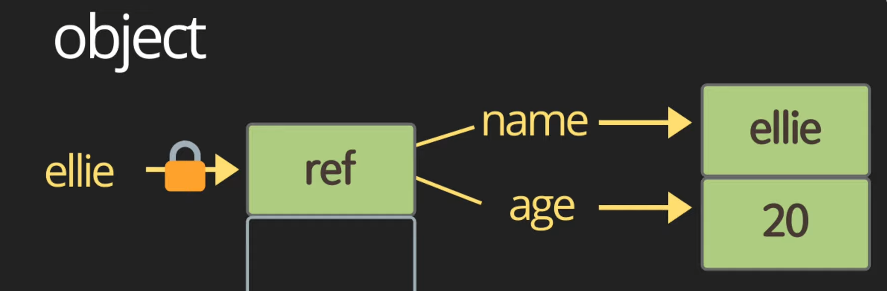
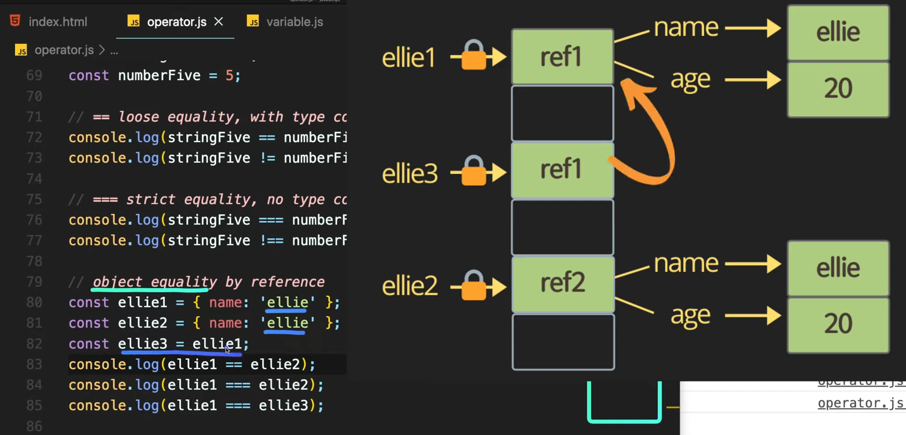

https://www.youtube.com/watch?v=YBjufjBaxHo&list=PLv2d7VI9OotTVOL4QmPfvJWPJvkmv6h-2&index=4


연산(operators)에 대해 알아보겠다.


연산은 한 번 배워두면 가성비 너무 좋다.

다른 프로그래밍 언어에서 공통으로 쓸 수 있기 때문.


지난 시간에 variable과 const의 차이점,

mutable data type과 immutable data type에 대해서 설명해 드렸다.

조금 헷갈리게 설명한 것 같아서 한 번 더 깔끔하게 정리하고 넘어감.


Variable, rw(read/write)

메모리의 값을 읽고 쓰는 게 가능하다.

값 설정 이후 값 변경 -> variable 읽고 쓰기 가능.


반대로 const는 읽기만 가능.

const 선언한 뒤엔 자물쇠가 생겨버려서, 읽기만 가능하고 다른 값들 쓰기 불가능.

변수 바꿀 이유 없다면 웬만하면 const로 작성하는 것이 바람직한 습관.


메모리 값 저장되는 방법 두 가지.

primitive, object 방식에 따라서 메모리가 다른 방식으로 저장된다.

primitive: value, 값 자체가 메모리에 저장된다.

object: 너무 커서 메모리에 한 번에 다 올라갈 수 없다.

가리키고 있는 곳에 reference가 있다.

reference는 실제로 Object를 가리키고 있는 곳이다.

const ellie라고 선언하면, ellie는 잠겨서 다른 Object로 선언이 불가능하지만, 



엘리의 이름과 나이는 계속 변경이 가능한 것도 이 이유 중 하나.


primitive type: value로 값이 저장된다.

object: object를 가리키는 reference가 메모리에 저장된다.


data type엔 immutable data type과 mutable data type 두 가지가 있다.

immutable data type: 데이터 타입 자체를 절대 변경하지 못하는 것.

primitive types: 한 번 ellie라는 string을 정의하게 되면, 

ellie를 통째로 메모리에 올렸다가 다른 string에 올렸다가 다른 string으로 변경이 가능하지, 

ellie라는 string 자체를 i를 빼고 다른 것으로 바꾼다던지,

data 자체를 변경하는 것은 불가능하다.

object 중에서도 꽁꽁 얼어있는 object가 있다. (frozen objects)

이런 object도 변경이 불가능하기 때문에, 이런 아이들을 immutable data types라고 합니다.


반대로 적용이 가능한 타입: Object

ellie object 선언 후 엘리 안에 있는 이름이나 나이 변경했자너

object는 스스로 변경 가능 -> mutable data types

javascript에서 기본적으로 모든 objects는 변경이 가능하다.

array: mutable data type

간혹 다른 언어 mutable, immutable 두 가지 분리해서 data type이 존재하는 경우도 있다.

javascript 대체적으로 대부분 object는 mutation이 가능한 아이이다.

이해 조금 안되어도 ㄱㅊ

다음에 object나 class를 다룰 때 한 번 더 짚고 넘어가겠다.

note만 작성해놓고 담에 자세히 알려드리겠다.


이제 operator로 넘어가자.


### 1. String concatentation

```js
// 1. String concatenation
console.log('my' + ' cat');
console.log('1' + 2);
console.log(`string literals: 1 + 2 = ${1 + 2}`);
```

`+` 기호를 이용해서 문자열과 문자열을 합해서 새로운 문자열을 만들 수 있다.

문자열에 숫자를 더하게 되면, 숫자가 문자열로 변해서 합쳐질수도 있고,

백틱 기호를 활용해서 string literal을 만들 수 있다.

${} 이용하면 변수값 계산해서 string으로 포함해서 문자열을 만든다.


string literal 좋은 점: 줄바꿈을 하거나 중간에 특수한 기호로 ````를 이용해도,

고대로 문자열로 변환되어서 나온다.

중간에 ' 인식 안될 경우 `\'`로 표현해줘야 제대로 인식된다.

새로 줄바꿈할 때 \n을 해줘야 한다. 탭은 \t


### 2. Numeric operators

두 번째는 너무 쉬운 Numeric operators

```js
// 2. Numeric operators
console.log(1 + 1); // add
console.log(1 - 1); // substract
console.log(1 / 1); // divide
console.log(1 * 1); // multiply
console.log(5 % 2); // remainder
console.log(2 ** 3); // exponentiation
```

숫자들을 더하고 빼고 나누고 곱하고 나머지, 승 연산 가능.


### 3. ++, -- operators

세 번쨰는 우리가 흔하게 쓰는 increment, decrement operators

```js
// 3. Increment and decrement operators
let counter = 2;
const preIncrement = ++counter;
// counter = counter + 1;
// preIncrement = counter;
console.log(`preIncrement: ${preIncrement}, counter: ${counter}`)
const postIncrement = counter++;
// postIncrement = counter;
// counter = counter + 1;
```

count라는 변수가 있으면, 변수 안에 ++를 앞에 붙여주게 되면 preIncrement

이건 아래 주석 코드와 동일하다.

counter에 1 더한 다음에 preIncrement에 값 할당.

preIncrement에 숫자 3이 할당된다.


postIncrement

먼저 변수의 값을 postIncrement에 할당한 다음에, counter의 값을 1 더한다.


--도 똑같다.

값 하나씩 감소.

앞에 있으면 바로 업데이트돼서 할당

뒤에 붙이면 할당해놓고 update는 그 뒤에 일어난다.


### 4. = operators

```js
// 4. Assignment operators
let x = 3;
let y = 6;
x += y; // x = x + y;
x -= y;
x *= y;
x /= y;
```

네 번 째는 바로 할당하는 operators

앞에서도 많이 살펴봤죠?

할당이 가능하고, 다만 x = x + y;

반복되는 x 생략. x += y로 코드 작성 가능.


### 5. <= operators

다섯 번째는 비교하는 operators

```js
// 5. Comparison operators
console.log(10 < 6); // less than
console.log(10 <= 6); // less than or equal
console.log(10 > 6); // greater than
console.log(10 >= 6); // greater than or equal
```

지난 시간에 배웠다.


### 6. Logical operators

이제 집중! 여섯 번째로 중요한 logical operators.

```js
// 6. Logical operators: || (or), && (and), ! (not)
const value1 = false;
const value2 = 4 < 2;

// || (or), finds the first truthy value
console.log(`or: ${value1 || value2 || check()}`);

// && (and), finds the first falsy value
console.log(`and: ${value1 && value2 && check()}`);

function check() {
  for (let i = 0; i < 10; i++) {
    // wasting time
    console.log('😲')
  }
  return true;
}
```

|| (or), && (and), ! (not) 세 가지의 연산자.

많은 분들이 여기서 조금 헷갈려 하시는 듯.


or 연산자 보시면, value나 expressions들 중에서 하나라도 true -> true

check가 true -> ture로 return


진짜 중요) or 연산자는 처음으로 true가 나오면, 거기서 멈춘다.

왜냐? or 중에 어떤 것이든 하나라도 true면 난 true다.

value1가 true면 뒤에 상관없음.

-> 뒤에 wasting time 출력되지 않는다.


여기에서 많은 주니어분들이 코드 지적을 당한다.

computation이 heavy한, 연산이 많이 하는 함수를 호출하거나, 

expression같은 아이를 제일 앞에 두게 되면?

안 되겠죠?

당연히 simple한 value1, value2를 제일 앞에 둬서 

얘네들이 false, false일 때만, 마지막에 마지못해 호출하는 게 제일 좋다.

expression이나 함수 호출하는 아이들 제일 뒤에 배치하는 것이 효율적인 코드 작성.


&& 연산자도 비슷.

대신 &&는 세 개가 다 true여야 true 리턴.

value1이 false면 뒤에 실행 안 됨.

and도 heavy한 operator일수록 뒤에서 체크하는 것이 좋다.


and는 간편하게 null check같은 것 할 때도 많이 쓰인다.

```js
// often used to compress long if-statement
// nullableObject && nullableObject.something
if (nullableObject != null) {
  nullableObject.something;
}
```

Object가 null이면 false가 되기 때문에, 뒤에 실행이 안되겠죠?

nullObject가 null이 아닐 때만 Object의 something이란 value를 받아오게 된다.

굳이 코드로 풀어보면 이런 느낌


not 연산자

```js
console.log(!value1);
```

값을 반대로 바꿔준다.


### 7. Equality operators

일곱 번째로 Equality operators에 대해 한 번 알아보겠다.

```js
// 7. Equality
const stringFive = '5';
const numberFive = 5;

// == loose equality, with type convension
console.log(stringFive == numberFive);
console.log(stringFive != numberFive);

// === strict equality, no type convension
console.log(stringFive === numberFive);
console.log(stringFive !== numberFive);
```

두 개의 = 사인을 쓰게 되면 loose equality

타입 변경해서 검사.

stringFive == numberFive


javascript 엔진은 '문자열이긴 한데, 안에 들어있는 것은 숫자 5 -> 너네 둘은 똑같아'


===

strict equality

type 신경써서 타입 다르면 다른 애

stringFive !== numberFive


코딩하실 때 웬만하면 string equality를 사용해서 검사하는 게 더 좋다.


equality 공부하실 때 Object를 조금 더 신경써서 공부할 필요가 있다.

Object는 메모리에 탑재될 때 reference 형태로 저장된다고 말씀드렸다.

ellie1, 2는 똑같은 데이터가 들어있는 object지만, 실제로 메모리엔 1과 2엔 각각 다른 reference가 들어있고, 다른 reference는 서로 다른 object를 가리키고 있다.




ellie3은 ellie1의 reference를 갖고 있으니까, 똑같은 reference를 갖고 있게 되는거죠?

console에는 과연 어떤 값이 출력되게 될까요?

f, f, t

ellie1이 갖고 있는 reference value를 ellie3으로 할당했기 때문에 3은 똑같은 reference를 갖고 있다.


Programming의 하이라이트인 conditional operator와 눕스?에 대해 알아볼 것이다.

이것을 써야 그 때서야 비로소 프로그래밍을 했다고 할 수 있다.


### 8. Conditional operators: if

여덟 번째로 배울 것은 if, else if, else

```js
// 8. Conditional operators: if
// if, else if, else
const name = 'ellie';
if (name === 'ellie') {
  console.log('Welcome, Ellie!');
} else if (name === 'coder') {
  console.log('You are amazing coder');
} else {
  console.log('unknown')
}
```

if statement는 [괄호 안의] statement가 true면, 안에 있는 block을 실행하게 된다.


### 9. ? Operators

그 다음으로는 if를 좀 더 간단하게 쓸 수 있는 Ternary operator

```js
// 9. Ternary operator: ?
// condition ? value1 : value2;
console.log(name === 'ellie' ? 'yes' : 'no');
```

statement에 ?를 붙이면.. true니?

true면 왼쪽에 있는 애 실행. 아니면 : 다음에 나오는 아이 실행.

값을 할당하거나 간편하게 출력할 때 많이 사용.

지금은 ellie가 아니기 때문에 no가 출력되는 것을 확인할 수 있다.

간혹 Ternary operator를 nesting해서, 묶고 묶고 묶어서 쓰시는 경우가 있다.

그렇게 하면 코드 가독성이 떨어지기 때문에 if나 switch를 쓰는 게 맞다.

간단할 때만 쓰는 게 좋다.


### 10. switch opeators

다음으로 배울 것은 switch

```js
// 10. Switch statement
// use for multiple if checks
// use for enum-like value check
// use for multiple type checks in TS
const browser = 'IE';
switch (browser) {
  case 'IE':
    console.log('go away!');
    break;
  case 'Chrome':
  case 'Firefox':
    console.log('love you!');
    break;
  default:
    console.log('small all!');
    break;
}
```

너무 쉽다.

크롬, 파폭 같은 결과 출력

붙여놓을 수 있다.


if else if else if 여러 번 반복시 switch 사용 고려하는 것이 좋다.

나중에 typescript에서 정해져 있는 type을 검사하거나, 

enum 비슷한 아이들을 검사할 때 switch를 쓰는 것이 가독성에 좋다.


### 11. While loop

우리가 드디어 반복문을 배워볼 것이다.

```js
// 11. Loops
// while loop, while the condition is truthy,
// body code is executed.
let i = 3;
while (i > 0) {
  console.log(`while: ${i}`);
  i--;
}
```

while -> statement가 false로 나오기 전까지, 무한대로 반복해서 계속해서 보내는 것을 말한다.

3 -> 2 -> 1 -> 0에서 멈춤


### do-while loop

먼저 block을 실행한 다음에 조건이 맞는지 검사한다.

```js
// do while loop, body code is executed first,
// then check the condition.
do {
  console.log(`do while: ${i}`);
  i--;
} while (i > 0);
```

i가 0임에도, 블럭을 먼저 실행해서 출력이 먼저 되고나서, i가 0인지 검사해서 멈춘다.

블럭을 먼저 실행하고 싶다 -> do while

조건문이 맞을 때만 쓰고 싶다 -> while


### for loop

거의 다 왔다. for loop에 대해서 알아보겠다.

```js
// for loop, for(begin; condition; step)
for (i = 3; i > 0; i--) {
  console.log(`for: ${i}`);
}

for (let i = 3; i > 0; i = i - 2) {
  console.log(`inline variable for: ${i}`);
}
```

시작하는 문장, condition이 중간에 오고, 마지막으로 어떤 step을 밟아나갈지 명시한다.

begin 처음 한 번만 호출.

block 실행하기 전에 condition이 맞는지 아닌지 검사한 다음에,

block이 실행되면 step을 실행하게 된다.

condition, step만 무한히.. condition이 안맞을 때까지 계속 실행한다.

위처럼 기존에 존재하는 변수에 값 할당하는 경우도 있고, 

아래처럼 for 안에서 inline variable declaration이라고 하는데,

블록 안에 let이란 지역변수를 선언해서 작성하는 것도 좋다.


### nested loop

while, for는 서로 nesting해서 작성할 수 있다.

```js
// nested loop
for (let i = 0; i < 10; i++) {
  for (let j = 0; j < 10; j++) {
    console.log(`i: ${i}, j:${j}`);
  }
}
```

i=0일 때 j=0-9까지 돌림

i=1일 때 j=0-9


nesting해서 작성하면 O(n^2)

CPU에 좋지 않으므로 되도록 피하는게 좋다.


퀴즈

break, continue 써서 루프 끝낼 수 있다.

break: 루프 완전히 끝낸다.

continue: 지금꺼만 스킵하고 다음 스텝으로 넘어간다.

```js
// break, continue
// Q1. iterate from 0 to 10 and print only even numbers
// (use continue)
for (let i = 0; i < 11; i++) {
  if (i % 2 !== 0){
    continue;
  }
  console.log(`q1. ${i}`);
}

// Q2. iterate from 0 to 10 and print numbers until reaching 8
// (use break)
for (let i = 0; i < 11; i++) {
  if (i > 8){
    break;
  }
  console.log(`q2. ${i}`);
}
```


loop 공부할 때 label이란 것도 있다.

궁금하시면 찾아봐도 좋을 듯.

현업에서는 사용하고 있지 않다.

label 쓰게 되면 나쁜 냄새가 난다고 한다.

쓰지 않고 코드 간단하게 바꿔서, 충분히 피해서 작성할 수 있기 때문.

