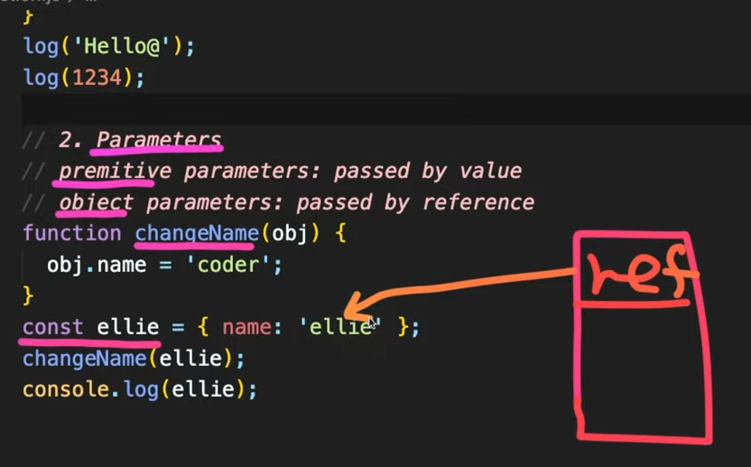

https://www.youtube.com/watch?v=e_lU39U-5bQ&list=PLv2d7VI9OotTVOL4QmPfvJWPJvkmv6h-2


[Function](#Function)

[1. Function declaration](#1. Function declaration)

[Lovely Typescript](#Lovely Typescript)

[2. Parameters](#2. Parameters)

[3. Default Parameters](#3. Default Parameters)

[4. Rest Parameters](#4. Rest Parameters)

[5. Local Scope](#5. Local Scope)

[6. Return](#6. Return)

[7. Early Return](#7. Early Return)

[1. Function Expression](#1. Function Expression)

[2. Callback hell](#2. Callback hell)

[Arrow function](#Arrow function)

[IIFE](#IIFE)


오늘, 다음 시간에 배울 function과 object는 javascript에서 꽃이라고 불릴 정도로 아주 핵심적인 기능을 담당하고 있다.

오늘은 function에 대해 알아보는 시간을 가져보겠다.

오늘 영상은 처음부터 끝까지 전반적인 것을 이해하겠다는 마음으로 들은 뒤, 노트를 정리하며 직접 function을 만들며 연습하는 시간을 가지면 좋겠다.


여러분들이 사용하는 프로그램은 각각 고유한 기능이 있다.

프로그램 안에서도 각각 저마다의 기능을 수행하는 함수들이 있다.

processor language, 절차적인 언어는 함수가 프로그래밍 내에서 굉장히 중요한 기능을 담당한다.


Q) 엘리, 자바스크립트에는 class가 추가되어서, object oriented programming language가 아닌가요?

추가된 클래스도 자바 언어처럼 pure한 object oriented가 아니고,

프로토 타입을 베이스로 한 가짜의 object-oriented

나중에 object와 class에 대해 자세히 알려드릴 것.

어쨌든 자바스크립트도 processal language 중 하나라고 볼 수 있다.


그래서 이 function이 굉장히 중요한 기능을 담당하고 있기 떄문에,

때로는 sub-program이라고 부릅니다.

프로그램 안에서 각각의 작은 단위의 기능들을 수행하는 것이 바로 function


어떤 언어를 배우시든, function은 기본적으로 input, parameters를 받아서 이것들을 잘 처리한 다음에 output, return하는 것이 function

언어 자체에 존재하는 function들을 쓸 때, 또는 API(Application Programming Interface)들을 쓸 때 함수들의 이름을 보고 '이 함수는 이런 일을 할 수 있겠구나'라고 생각할 수 있다.

전달해야 하는 parameters들이 무엇인지, 어떤 값이 return되게 기대할 수 있는지 interface를 보고서 이런 일을 수행하겠구나 예상 가능.

함수엔 input과 output이 중요하고, function의 이름을 잘 짓는 것이 굉장히 중요하다.


### Function

프로그램을 구성하는 굉장히 기본적인 building block

```javascript
// Function
// - fundamental building block in the program
// - subprogram can be used multiple times
// - performs a task or calculates a value
```


subprogram이라고도 불리며, 여러 번 재사용이 가능하다는 장점이 있다.

한 가지의 task나 어떤 값을 계산하기 위해 사용.


### 1. Function declaration

Javascript에서 function을 정의하는 방법

```javascript
// 1. Function declaration
// function name(param1, param2) {body... return;}
// one function === one thing
// naming: doSomething, command, verb
// e.g. createCardAndPoint -> createCard, createPoint
// function is object in JS
```


function이란 키워드를 이용하고, 함수의 이름을 지정한 다음에, parameters를 쭉 나열한 다음, body, 함수 안에 기본적인 business logic을 작성한 다음 return하면 된다.

간단

정말 중요한 포인트: 하나의 함수는 한 가지의 일만 하도록 만들어야 한다.

함수의 이름을 작성할 때..

지난 시간에 변수 이름을 작성할 때는 now, 명사로 지정. 

함수는 무언가 동작하는 것이기 떄문에, command 형태로, verb, 동사 형태로 지정해야 한다.

함수의 이름을 정하기 너무 어렵다면, 혹시 내가 함수 안에서 너무 많은 것들을 하고 있지는 않은지 생각해 볼 필요가 있다. 세분화해서 나눌 수 있진 않은지 고민하면 함수 깨끗하게 만들 수 있다.


조금 중요한 포인트 - Javascript에서 function은 object이다.

그렇기 때문에 function을 변수에다가 할당할 수 있고, parameter로 전달 되고, 함수를 리턴할 수도 있게 된다.

```javascript
function printHello() {
  console.log('Hello');
}
printHello();
```

function 키워드 쓴다.

함수 잘 정의했다면 함수 호출 가능.


이 함수는 사실 쓸모가 없다.

계속 Hello만 출력되자너

좀 쓸모 있는 함수를 만들기 -> parameter로 메시지 전달

```javascript
function log(message) {
  console.log(message);
}
log('Hello');
```

전달된 메시지를 화면에 출력하도록 만드는 것이 좋다.


자바스크립트에서는 타입이 없다고 누누히 설명드렸다.

그렇기 때문에 조금 아쉽게도 함수 자체의 interface만 보았을 때 메시지가 string을 전달해야 하는지, 숫자를 전달해야 하는지 명확하지 않다.

사용하는 사람이 숫자를 전달할 수도 있다.

다행히 숫자가 문자열로 변환되어서 출력되기 때문에, 상관없지만

다른 함수에서 타입이 중요한 경우 javascript는 좀 난해할 수 있다.


### Lovely Typescript

우리가 지금 Javascript를 배운다 해서, 여러분이 나중에 Javascript로만 코딩할 건 아니다.

나중에 현업에 가면 Typescript도 쓰고, 다양한 언어들을 공부하시게 될 것.

조금 맛보기로 Typescript에 대해 소개해드리겠다.


TypeScript -> Playground

왼쪽에 Typescript 쓰시면 오른쪽에 Javascript 변환된 거 보실 수 있다.

똑같은 Javascript 코드를 작성하면 TypeScript에서는 타입을 적지 않았다며 컴플레인을 건다.

```typescript
function log(message: string): number {
    console.log(message);
    return 0;
}
```

string이라고 타입을 명시해주면, 좋았어 라며 에러 없어지는게 보이죠?

typescript에서는 항상 parameter나 return type에 type을 명시하도록 되어 있다.


return number 하고 싶어서 number 적어주면 또 불평

야 리턴 하나도 안했잖아 ㅡㅡ

return 값을 숫자로 하면 complaint가 사라지는 것을 확인할 수 있다.

변환된 javascript에서는 type 여전히 없다.


규모 있는 플젝하거나, 현업에서 다양한 개발자들과 일하거나,

우리가 작성한 것을 나중에 라이브러리 형태로 API를 제공해야 할 때,

typescript를 쓰는 게 좀 더 명확하고 개발 일을 쉽게 만들어준다.

함수의 interface만 딱 봐도, 얘가 정확하게 무엇을 하는 아이인지 함수의 이름과, 전달돼야 하는 parameter와 그의 데이터 타입, 어떤 값이 리턴되는지를 확실하게 확인하고 쓸 수 있기 때문이다.

반대로 JS는 interface가 명확하게 명시되어 있지 않기 때문에, Programming을 만들 때 많은 문제가 있다.

단점이 있기 때문에 보완하고자 TypeScript가 나오게 되었다.

JS 다 배운 뒤 나중에 TS 꼭꼭 배우기를 추천드립니다.


### 2. Parameters

function에 전달되는 parameters

```javascript
// 2. Parameters
// premitive parameters: passed by value
// object parameters: passed by reference
function changeName(obj) {
  obj.name = 'coder';
}
const ellie = { name: 'ellie' };
changeName(ellie);
console.log(ellie);
```

premitive type같은 경우 메모리에 value가 그대로 저장되어 있기 때문에, value가 전달된다.

object같은 경우 메모리에 reference가 저장되어진다고 말씀드렸죠?

그래서 reference가 전달되어집니다.

조금 더 자세히 이해하기 위해 예제를 보면 좋을 듯.


changeName 전달된 object의 이름을 coder로 무조건 변경하는 함수.

ellie라는 const 정의한 다음에, ellie라는 object를 만들어서 할당해주면

메모리에는 object가 만들어진 reference가 메모리에 들어가게 된다.

이 reference는 이 object를 메모리 어딘가에 가리키고 있다.




changeName(ellie)를 전달하게 되면

ellie.name을 coder로 변경하게 된다.

추적하면 ellie 이름이 coder로 변경된 것을 볼 수 있다.

object는 reference로 전달되기 때문에, 함수 안에서 object의 값을 변경하게 되면, 그 변경된 사항이 그대로 메모리에 적용되기 때문에, 나중에 추후에 변경된 사항을 확인할 수 있다.


### 3. Default Parameters

세 번째는 Default Parameters에 대해 알아보자.

ES6에 추가된 친구

```javascript
// 3. Default parameters (added in ES6)
function showMessage(message, from) {
  if (from === undefined) {
    from = 'unknown';
  }
  console.log(`${message} by ${from}`);
}
showMessage('Hi!');
```


showMessage function을 보시면, message, from 두 가지의 parameters를 받아온다.

이 메시지가 누구로부터 왔는지 출력하게 된다.

가만히 보시면, showMessage를 호출할 때 하나만, 메시지만 전달되는 걸 볼 수 있다.

메시지는 출력 잘 되지만 from 정의되어 있지 않기 때문에 undefined 로 출력되는 것을 볼 수 있다.

예전에 parameter의 값이 전달되지 않을 경우를 대비해서 if from ~~ 이렇게 썼다.

이제는 귀찮게 안하고 from 옆에 원하는 default 값을 지정해놓으면

```javascript
// 3. Default parameters (added in ES6)
function showMessage(message, from = 'unknown') {
  console.log(`${message} by ${from}`);
}
showMessage('Hi!');
```

사용자가 parameter를 전달하지 않을 때, 이 값이 대체되어 사용된다.


### 4. Rest Parameters

네 번째는 Rest Parameters

ES6에 추가된 아이.

```javascript
// 4. Rest parameters (added in ES6)
function printAll(...args) {
  for (let i = 0; i < args.length; i++) {
    console.log(args[i]);
  }
    
  for (const arg of args) {
    console.log(arg);
  }
    
    args.forEach((arg) => console.log(arg));
}
printAll('dream', 'coding', 'ellie');
```

이렇게 . 세 개를 찍게 되면, Rest Parameters라고 불린다.

배열 형태로 전달된다.

아직 array, 배열 형태에 대해 배우지 않았기 때문에 조금 몰라도 괜찮다.

이런 게 있다 정도로 이해하면 된다.

printAll 호출할 때 인자 세 개 전달.

args는 세 개의 값이 담겨 있는 배열이다.

그래서 우리가 for loop를 이용해서 처음부터 args의 갯수만큼 삥글삥글 돌면서 출력하게 된다.


보너스) 배열 출력할 때 for of 문법으로 간단하게 출력할 수 있다.

arg에 있는 모든 값들이 차례차례대로 하나씩 지정되면서 출력된다.


더 간단하게 하고 싶다면.. 나중에 배열에서 자세히 알려드릴거긴 한데..

배열에 forEach라는 함수형 언어를 이용해서 출력해도 괜찮다.

나중에 배열에서 더 자세히 알려드리겠다.


다음으로 넘어가기 전에, 아까 제가 function을 object의 일종이라고 말씀해드렸다.

그 말이 무엇이냐?

아까 우리가 printAll이란 함수를 선언했잖아요

[chrome console 창에서] printAll. 을 누르면 함수가 object로 전환이 되기 때문에, printAll의 속성값들을 확인해볼 수 있다.

심화된 내용은 나중에 object를 다룰 때, prototype을 다룰 때 조금 더 다시 설명해드리겠다.


### 5. Local Scope

다섯 번째로는 Scope에 대해 한 번 더 정의해보는 시간.

```javascript
// 5. Local scope
let globalMessage = 'global'; // global variable
function printMessage() {
  let message = 'hello';
  console.log(message); // local variable
  console.log(globalMessage);
  function printAnother() {
    console.log(message);
    let childMessage = 'hello';
  }
  // console.log(childMessage); // error
}
printMessage();
// console.log(message); // error
```

지난 data type 시간에, 제가 block level의 scope와, global level의 scope에 대해 설명해드렸다.

나중에 javascript 언어의 심화된 내용을 공부하실 때, closure나 lexical environment에 대해서 한 번 들어보실텐데, 그런 아이들은 이런 원칙들을 상세하게, 자세하게 설명해주는 아이.

사실 딱 하나의 개념에서 파생된 아이들.

그 딱 하나의 원칙만 이해하시면 나머지는 쉽게 이해 가능.

한 문장만 이해하세요.

`밖에서는 안이 보이지 않고 안에서만 밖을 볼 수 있다.`

유리창에 틴트를 입히면 안에선 밖을 볼 수 있지만, 밖에서는 안이 깜깜하게 아무 것도 보이지 않는 것과 같다.

블록 안에, 함수나 if 안에서 변수를 선언하게 되면 지역변수이다.

지역 변수는 지역적인 것이기 때문에, 안에서만 접근이 가능하다.

만약 메시지를 밖에서 출력하면 에러가 발생한다.

안에서는 global message를 볼 수 있고, 출력이 가능하다.

이게 바로 scope입니다.


이 원칙은 어느곳에서나 적용됩니다.

함수 안에서 또다른 함수를 선언할 수 있다.

printMessage 함수 안에 printAnother 함수 있다.

똑같은 원칙에 의해 자식은 부모에게서 정의된 message 확인 가능.

자식 안에 정의된 childmessage를 부모 상위에서 보려고 한다면 에러가 발생한다.


한 가지만 기억) javascript에서 scope란?

유리창에 틴트가 처리된 것과 똑같다.

안에서는 밖이 보이지만, 밖에서는 안을 볼 수 없고 접근이 안 된다.

자식의 함수가 부모의 함수에 정의된 변수에 접근 가능한 것들이 closure

이 부분은 나중에 다시 한 번 정리해서 더 깊게 알려드리는 시간을 갖겠다.


### 6. Return

함수에서는 parameters 값들을 전달받아서 계산된 값들을 return할 수 있다.

```javascript
// 6. Return a value
function sum(a, b) {
  return a + b;
}
const result = sum(1, 2); // 3
console.log(`sum: ${sum(1, 2)}`);
```


sum이란 함수를 호출하게 되면, 1과 2를 더해서 3이 리턴되는 것을 확인해볼 수 있다.

return type이 없는 함수들은 return undefined;이 들어가 있는 것과 똑같다. 생략 가능.

모든 함수에는 return undefined이나, 값을 리턴할 수 있다.


### 7. Early Return

현업에서 쓰이는 팁을 조금 알려드리면..

early return을 해라, early exit을 해라 코드 지적질을 받을 수 있다.

```javascript
// 7. Early Return, early exit
// bad
function upgradeUser(user) {
  if (user.point > 10) {
    // long upgrade logic...
  }
}
```

upgradeUser라는 함수 안에서 user의 point가 10 이상일 경우에만 업글 진행하는 logic

block 안에서 logic을 많이 작성하면 가독성이 떨어진다.

이런 경우 if, else를 번갈아가며 쓰는 것보다..


```javascript
// good
function upgradeUser(user) {
  if (user.point <= 10) {
    return;
  }
  // long upgrade logic...
}
```

이런 식으로 조건이 맞지 않을 때 빨리 리턴해서 함수를 종료하고,

조건이 맞을 때만 그 다음으로 와서 필요한 로직들을 쭉 실행하는 것이 좋다.

나중에 코드를 작성할 때 조건이 맞지 않는 경우, 값이 undefined인 경우, 값이 -1인 경우 빨리 return하고 필요한 로직은 그 뒤에 작성하는 것이 좋다.


### 1. Function Expression

여태까지 우리가 function을 어떻게 선언할 수 있는지에 대해서 알아봤다.

이제는 Function Expression에 대해서 한 번 알아보도록 하겠다.

```javascript
// First-class function
// functions are treated like any other variabla
// can be assigned as a value to variable
// can be passed as an argument to other functions.
// can be returned by another function

// 1. Function expression
// a function declaration can be called earlier than it is defined. (hoisted)
// a function expression is created when the execution reaches it.
const print = function () {
  console.log('print');
};
print();
const printAgain = print;
printAgain();
const sumAgain = sum;
console.log(sumAgain(1, 3));
```


우리가 지난 시간에 First-class function에 대해 다뤄보았다.

그 말이 무슨 말이었죠?


function은 다른 변수와 마찬가지로, 변수에 할당이 되고, function의 parameter로 전달되며, return 값으로도 return 된다는 말

그것을 가능하게 한 것이 function expression


```javascript
const print = function () { // anonymous function
  console.log('print');
};
```

함수를 선언함과 동시에 바로 print라는 변수에 할당하는 것을 볼 수 있다.

이렇게 function에 아무 이름이 없고, function이라는 키워드를 이용해서 parameter와 block을 이용한 것을 볼 수 있다.

이렇게 함수에 이름이 없는 것을 anonymous function이라고 부른다.

필요한 부분만 작성해서 변수에 할당 가능.

원한다면 함수의 이름을 작성할 수 있다.

```javascript
const print = function print () {
    console.log('print');
};
```

이건 뒤에서 조금 더 정리해드리겠다.


함수를 print에 할당하게 되면, 우리가 print라는 변수에 함수를 호출하는 것처럼 호출하면,

print();

바로 print가 출력된다.


다른 변수에 또 할당하게 되면,

```javascript
const printAgain = print;
printAgain();
```

printAgain은 이 함수를 가리키고 있기 때문에, 다시 printAgain함수를 호출하는 것처럼 부르면,

printAgain();

print가 출력된다.


위에서 sum이란 함수를 만들었는데요,

그것도 sumAgain이란 변수에 할당하게 되면..

```javascript
const sumAgain = sum;
console.log(sumAgain(1, 3));
```

동일하게 호출할 수 있다.


function declaration과 function expression의 가장 큰 차이점

function expression은 할당된 다음부터 호출이 가능.

print 선언하기 전에 호출하면 당연히 에러가 난다.

function declaration은 hoist가 된다.

var hoisting에 대해 알아봤듯, function declaration도 hoisting이 된다.

함수가 선언되기 이전에 호출되어도, 가능하다.

javascript 엔진이 선언된 것을 제일 위로 올려주기 때문이다.

요런 차이점도 있고 다른 차이점도 있는데, 다른 건 나중에 심화 버전에서 알려드리겠다.

현업에서 플젝하시면 요정도만 아시면 좋을 듯.


### 2. Callback hell

거의 다 왔습니다.

Callback에 대해서 알아봅시다.

``` javascript
// 2. Callback function using function expression
function randomQuiz(answer, printYes, printNo) {
  if (answer === 'love you') {
    printYes();
  } else {
    printNo();
  }
}
```

randomQuiz라는 function을 보시면, 정답, 정답이 맞았을 때 호출하게 될 함수, 정답이 틀리면 호출하게 될 함수. 함수 두 개를 전달해준다.

이렇게 함수를 전달해서 '니가 상황이 맞으면, 원하면 전달된 함수를 불러'라고 전달하는 것을 Callback function이라고 합니다.

두 가지의 callback functions가 parameter로 전달되어서, 함수의 구현 사항을 보면..

정답이 love you인 경우에만 printYes라는 Callback 함수를 호출하게 되고,

정답이 아니면 printNo라는 Callback 함수를 호출하게 된다.


이 함수를 호출하려면 정답과, printYes, printNo expression 두 가지를 전달해야 되겠죠?

```javascript
// anonymous function
const printYes = function () {
  console.log('yes!');
};

// named function
// better debugging in debuggers's stack traces
// recursions
const printNo = function print() {
  console.log('no!');
}
randomQuiz('wrong', printYes, printNo);
randomQuiz('love you', printYes, printNo);
```

printYes에 Yes를 출력하는 함수를 할당해놓고, printNo 변수에는 no를 출력하는 함수를 할당해놓았다.

randomQuiz를 호출할 때, answer, printYes, printNo의 callback 함수들을 각각 전달하게 된 것이다.

정답이 맞으면 yes, 아니면 no


printYes에는 이름이 없는 anonymous function이 쓰여진 것을 볼 수 있다.

printNo에는 함수 이름이 print라고 정의되어 있다.

이것을 named function이라고 한다.

이렇게 expression에서 이름을 쓰는 경우는, 디버깅할 때 debuggers's stack traces에 함수 이름이 나오게 하기 위해 쓴다. [마우스 올리면 (lobal function) print(): void 나옴]

나중에 debugging 할 때 조금 더 자세히 알려드림.


함수 안에서 자기 스스로 또다른 함수를 호출할 때..

```javascript
const printNo = function print() {
  console.log('no!');
  print();
}
```

계속 함수가 안에서 호출 -> 늘어나는게 보이시죠?

함수 안에서 함수 자신 스스로를 부르는 것을 recursion이라고 한다.

요런 식으로 하면 프로그램이 죽으니까, 요렇게 하지 마시고,

정말 필요할 떄.. 피보나치 수열을 계산한다던지, 반복되는 평균 값을 계산한다던지, 쓰임새가 다양하다.

이 부분도 나중에 따로 정리해서 알려드리겠다.


함수를 계속 무한대로 호출하게 되면,

call stack이 꽉 찼잖아! 에러 발생.

call stack에 대해서도 다음에 한 번 다뤄보도록 하겠다.

오늘 입문편에 맞게, 플젝할 때 무리 없을 정도로 간단한 것만 알려드리고 있다.


### Arrow function

우리가 function expression을 살펴봤으니, arrow function을 잊어버리면 안되겠죠?

Arrow function 함수를 너무 간결하게 만들어주는 너무 좋은 아이.

```javascript
// Arrow function
// always anonymous
const simplePrint = function () {
  console.log('simplePrint!');
};
```

항상 이름이 없는 Anonymous function이다.

function expression을 쓰려면, function이라는 키워드 써야되고, 블럭도 써야되는 번거로움이 있다.

arrow function은 이것들을 너무 간단하게 한다.

우선 function이란 키워드 필요 없다.

block도 필요 없다.

한 줄에 묶어서 arrow로 표기하면 끝!

```javascript
const simplePrint = () => console.log('simplePrint!');
```

너무나 간단하게 함수들을 만들 수 있다.


```javascript
const add = (a, b) => a + b;
```

파라미터는 a, b

이것을 function expression으로 바꾸면 어떻게 해야 하나요?

function keyword, block, return으로 a + b 리턴해야

```javascript
const add = function (a, b) {
    return a + b;
};
```

어느 것이 더 간결한가요?

위가 더 간결하죠?

간결하게 쓸 수 있고, 나중에 함수형 프로그래밍, 배열이나 리스트같은 것을 볼 때, 이것이 더욱 더 빛을 발하게 되는 순간이 온다.

이렇게 한 줄인 경우 block 없이 작성이 가능하지만, 함수 안에서 조금 더 다양한 일들을 해야 돼서 블록이 필요하다면..

```javascript
const simpleMultiply = (a, b) => {
  // do something more
  return a * b;
};
```

이런 식으로 블록을 넣어서 처리할 수 있다.

대신 블록을 쓰게 되면, return이라는 키워드를 통해서 값을 리턴해주셔야 된다.


이렇게 마무리해서 끝내려 했는데.. 한 가지 빼놓고 가려니 너무 찝찝해서 한 가지 더 알려드리겠다.


### IIFE

Immediately Invoked Function Expression

```javascript
// IIFE: Immediately Invoked Function Expression
function hello() {
  console.log('IIFE');
}
hello();
```

함수를 선언하게 되면, 따로 hello 함수 호출해줘야 한다.

하지만 선언함과 동시에 바로 호출하려면, 이렇게 함수의 선언을 괄호로 묶은 다음에, 함수를 호출하듯이 이렇게 해주면..

```javascript
// IIFE: Immediately Invoked Function Expression
(function hello() {
  console.log('IIFE');
})();
```

바로 함수가 호출되는 것을 볼 수 있다.

최근엔 잘 쓰이지 않는데, javascript에서 함수를 바로바로 실행하고 싶을 때 유용하게 쓸 수 있는 아이이다.


이런거 재밌게 하시면 기본기 잘 쌓여서 나중에 어떤 프레임워크 쓰시든 빛을 발한다.

멋지게 코딩 가능

힘들고 지겨워도 꼼꼼이 정리하면 좋을 듯.


퀴즈

function calculate

입력받은 커맨드에 따라 a, b를 덧 뺄 곱 나 할 수 있으면 좋겠다.

다른 커멘드 들어오면 어떻게 처리할 지 미리 풀어보십셔

다음 시간에 같이 해결

다음 시간 더 중요한 object에서 만납시다.

