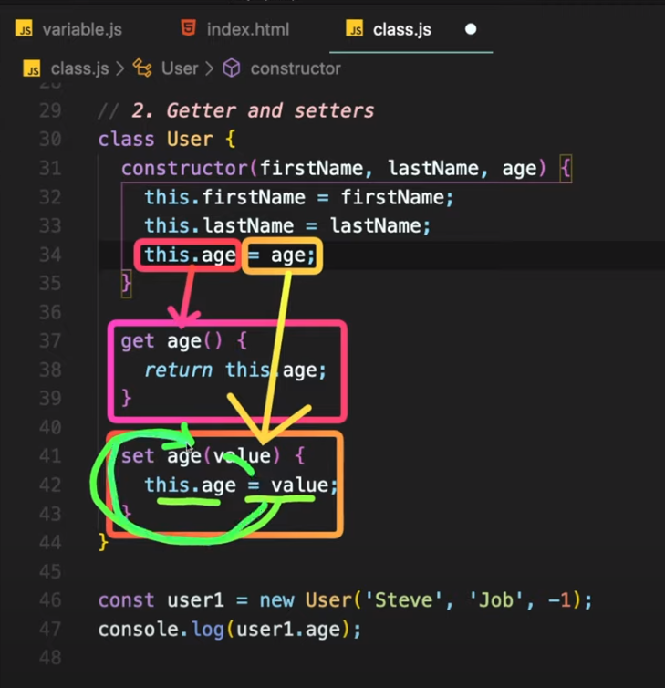
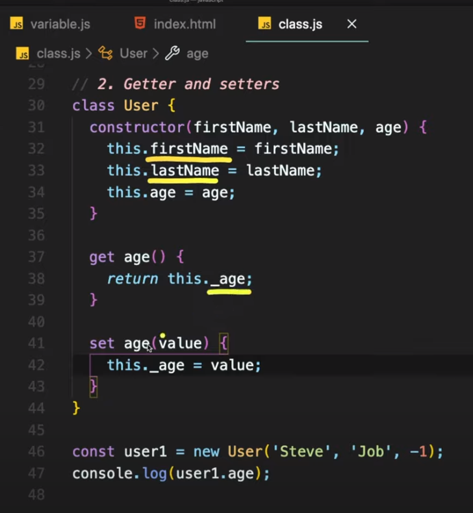
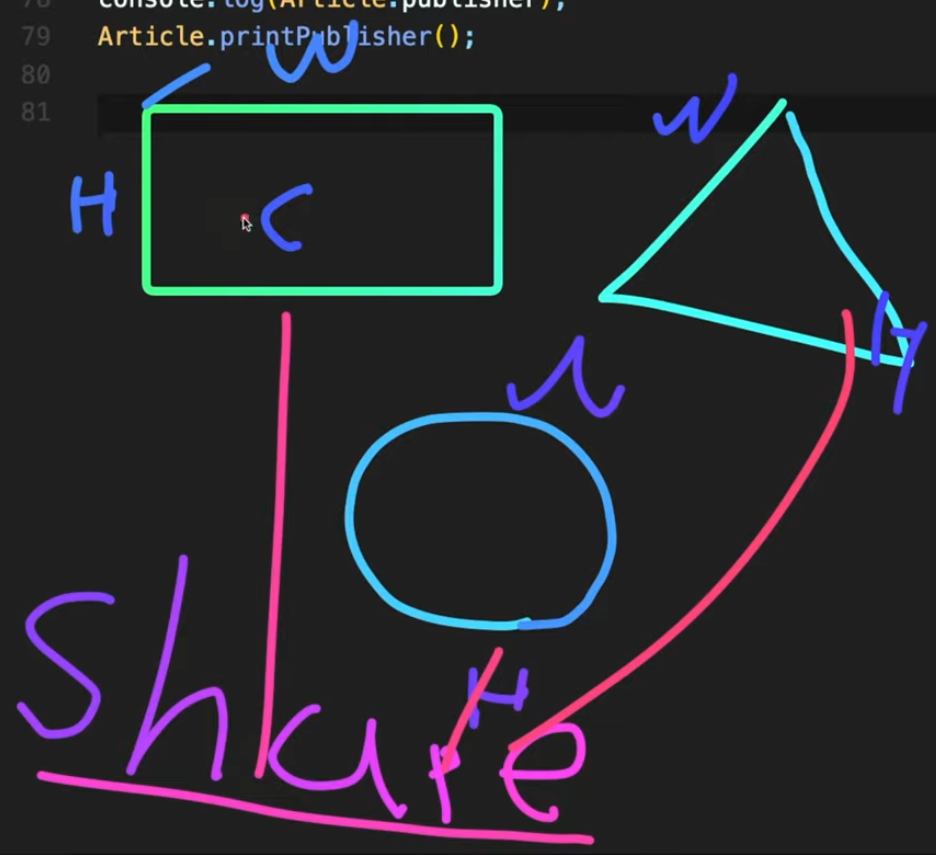
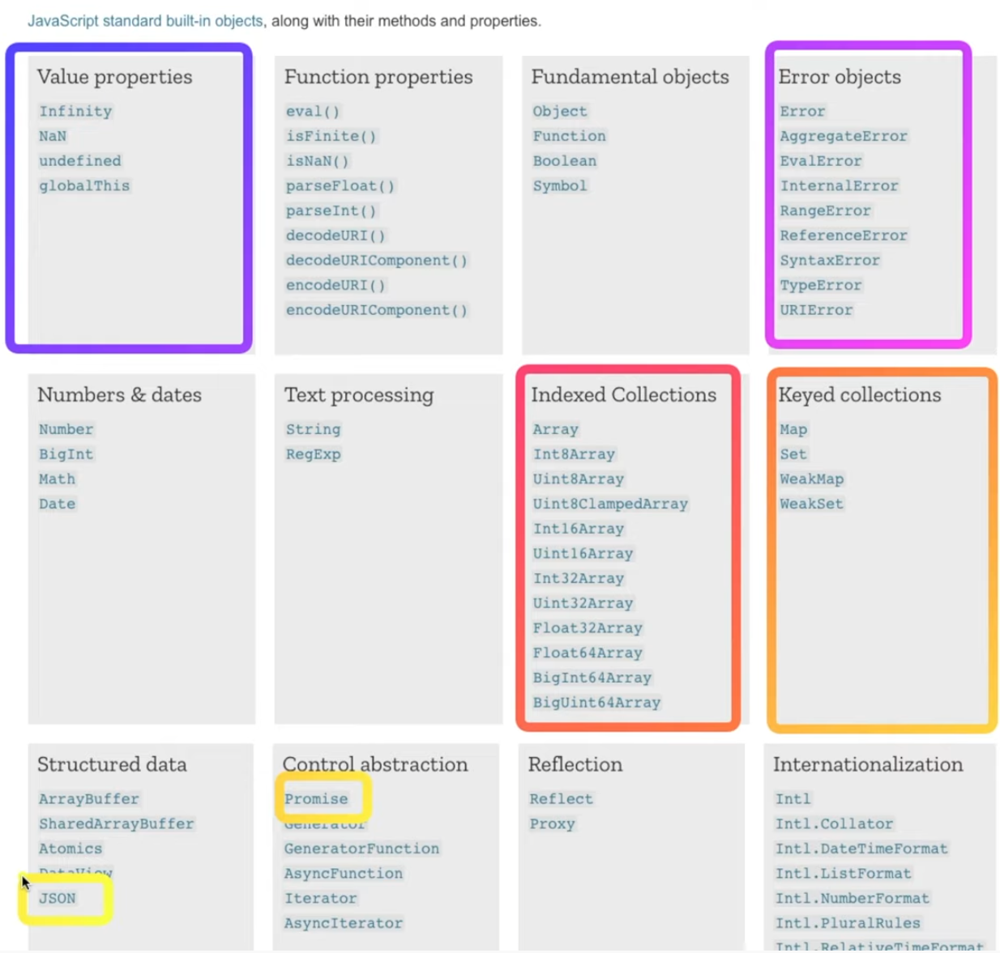

https://www.youtube.com/watch?v=_DLhUBWsRtw&list=PLv2d7VI9OotTVOL4QmPfvJWPJvkmv6h-2&index=6


오늘은 class, 객체 지향 언어에 대해 배워보는 시간을 가질 것이다.

class와 object는 무엇인지, 두 가지의 차이점은 무엇인지 정확하게 정리할 수 있는 시간을 가져보겠다.

오늘 강의를 전체적으로 이해하신다면, 안경 드림

모든 사물과 물체를 클래스로 정의할 수 있는 특별한 안경

오늘 클래스 잘 정의하셔서 이 안경 꼭 장착하셨으면 좋겠다.


만약 javascript에 class나 object가 없다면?

상상해보신 적 있나요?

우리가 정의한 변수들이 둥둥 떠다님

규모 있는 플젝 만들기가 굉장히 힘들었을 것.

class는 좀 더 연관있는 데이터를 한 데 묶어놓은 컨테이너같은 아이.

```javascript
class person {
    name;
    age;
    speak();
}
```

person이라는 클래스 안에는 이름과 나이라는 properties가 들어있고,

speak, 말하는 function이 들어있다.

클래스 안에는 이름과 나이같은 속성(field)이 들어있고,

말하는 행동(method)가 들어있다.


class는 조금 더 연관 있는 데이터들을 묶어놓은 fields와 methods가 종합적으로 묶여 있는 것을 말한다.

간혹 class 안에는 method는 들어 있지 않고 data만, fields만 들어 있는 경우도 있다.

그렇게도 굉장히 많이 쓰고, 그런 아이들을 data class라고 부른다.

이렇게 관련 있는 변수나 함수들을 묶어놓은 것 - class

class 안에서도 내부적으로 보여지는 변수와, 밖에서 보일 수 있는 변수를 나눠서

이런 것들을 encapsulation, 캡슐화라고 한다.

class를 이용해서 상속과 다형성이 일어날 수 있다.

이런 모든 것들이 가능한 게 바로 객체지향언어.


우리가 실제로 살아가고 있는 세상에는 수많은 물체와 사물들이 존재한다.

프로그래밍할 때도 사물과 물체들을 class, object로 정의해서 프로그래밍하는 것이 조금 더 자연스럽기 때문에 개발자들이 편하고 유용하게 프로그래밍을 할 수 있게 도와준다.

객체 지향 언어로 프로그래밍 잘 하는 개발자는 풀어야 되는 문제나 구현해야 되는 기능들을 객체로 잘 정의해서 만들 수 있는 개발자를 말한다.

오늘 강의가 끝나면, 여러분 주위를 둘러보면서 내가 저것들을 어떻게 클래스로 만들 수 있을지 생각하면 좋을 듯.

쇼핑몰을 만들 때, 수강신청 프로그램을 만들 때 어떻게 클래스로 정의할 수 있는지 생각해보는 것도 좋은 연습이 될 듯.


### class

- template
- declare once
- no data in

붕어빵 좋아하시나요?

클래스는 붕어빵을 만들 수 있는 틀을 말한다.

그래서 청사진이라고도 불리고, 템플릿이라고도 불리는데, 

클래스 자체에는 데이터가 들어있지 않고 틀만, template만 정의해놓는 것.

이런 클래스에는 요런요런 데이터가 들어올 수 있어 라고만 정의해놓고, 한 번만 선언한다.

그래서 class를 이용해서 실제로 데이터를 넣어서 만드는 것이 바로 이 object


### object

- instance of a class
- created many times
- data in

class 이용해서 새로운 인스턴스를 생성하면 object가 되는거죠?

object는 class 이용해서 굉장히 많이 만들 수 있다.

class는 정의만 한 거여서 실제로 메모리 상에 올라가진 않지만,

실제로 데이터를 넣으면, object는 메모리에도 올라가게 됩니다.


그래서 우리가 붕어빵이라는 class를 이용해서 

팥을 넣으면 팥붕어빵이 되고, 크림 데이터를 넣으면 크림 붕어빵이 되고,

피자 맛을 넣으면 피자붕어빵이 된다.

이렇게 만들어진 붕어빵 자체는 object이고,

붕어빵을 만들기 위해 우리가 정의한 붕어빵의 틀은 class가 되는 것이다.


개념 정리는 여기까지..

이제 javascript에서 class를 어떻게 선언할 수 있는지 한 번 알아보러 갈까요?

```javascript
'use strict';
// Object-oriented programming
// class: template
// object: instance of a class
// JavaScript classes
// - introduced in ES6
// - syntactical sugar over prototype-based inheritance
```


오늘 살펴볼 객체지향 언어는 캡슐화, 상속, 다형성

굉장히 다양한 기능들이 있지만, 오늘은 클래스에 대해서 조금 더 자세히 알아보는 시간을 가져보도록 하겠다.

class는 앞에서 말씀드렸듯이 template에 속하고, template을 이용해서 실제로 데이터를 넣어서 만드는 것이 object이다.

하지만 javascript에서는 이 클래스가 도입된 지 사실 얼마 되지 않았다.

ES6에 추가됨.


Q) 클래스가 새로 추가된라고요? 클래스가 없었을 때는 뭘로 만들었나요? 객체지향 언어가 아니였나요?

아주 좋은 질문.

class 도입 전엔, class를 정의하지 않고 바로 object를 만들 수가 있었다.

이 object를 만들 때 function을 이용해서 template을 만드는 방법이 있었다.

이 방법은 우리가 다음 시간에 알아보도록 하겠다.

오늘은 새로 추가된 class를 이용해서 template을 만드는 방법을 알아보도록 하겠다.

기존 존재하던 javascript 위에 추가된 것이기 때문에, 완벽하게 추가된 게 아니라,

기존에 존재하던 프로토타입을 베이스로 한 것에 기반해서 그 위에, 간편하게 쓸 수 있도록 문법만 클래스가 추가되었다.

그런 것들을 syntactical sugar라고 한다. 문법상으로 달달한, 각자의 편리함을 제공하는 그런 것들을 의미한다.


우리가 prototype-based는 아직 배우지 않았다.

여기서 설명한 것은 언어 자체에서 클래스가 구현된, 언어 구현사항 디테일

잘 몰라도 클래스만 잘 이용하면 된다.

하지만 언어가 어떻게 그렇게 만들어졌는지, 클래스가 어떻게 추가되었는지 조금 더 자세히 이해하려면, 우리가 이 프로토타입을 조금 더 살펴볼 필요가 있다.

다음에 정리해서 알려드리도록 하겠다.

오늘은 조금 더 high level에서 우리가 클래스를 어떻게 쓸 수 있는지에 대해 초점을 맞춰서 설명 드리도록 하겠다.


### 1.Class_선언

클래스를 쓰는 방법은 너무너무 간단하다.

```javascript
// 1. Class declarations
class Person {
  // constructor
  constructor(name, age) {
    // fields
    this.name = name;
    this.age = age;
  }

  // methods
  speak() {
    console.log(`${this.name}: hello!`);
  }
}
```

앞 예제에서 봤듯이, 클래스라는 키워드를 이용해서, 사람이라는 클래스를 만들고,

constructor, 생성자를 이용해서 나중에 object를 만들 때 필요한 데이터를 전달한다.

전달받은 데이터를 클래스에 존재하는 두 가지 fields,  name과 data에 전달된 데이터를 바로 할당해준다.

클래스에는 이름과 나이라는 fields가 있고, 말하는 speak method도 존재하게 된다.


speak method에 보시면, 단순하게, 클래스에 있는 이름을 출력하면서 hello 인사하는 것이다.


### Object_생성

이렇게 잘 정의한 class를 이용해서 ellie를 만들어보자.

```javascript
const ellie = new Person('ellie', 20);
console.log(ellie.name);
console.log(ellie.age);
ellie.speak();
```

새로운 Object를 만들 때는 new라는 keyword를 쓴다.

새로운 사람을 만들 꺼야.

사람엔, constructor 안에는 이름과 age란 데이터 전달.

위처럼 하면 새로운 오브젝트가 만들어진다.

콘솔로 엘리의 이름과 나이 출력되는 것을 확인할 수 있다.


엘리에는 speak, 말하는 method가 있다.

ellie.speak(); 로 함수 호출 가능.


this라는 것은 생성된 object.name이라고 하기 때문에, [${this.name}에서] 엘리의 이름이 출력된다.


### 2.Getter&Setter

두 번째로는, 영어로는 Getter & Setter, 한국어로는 게터와 세터라고 불리는[?] 아이에 대해서 알아보겠다.

저번 live에서 선배를 빌려 설명함..

C언어: processor 언어. 함수를 불러서 함수를 호출해서 실행하는 프로그램

Java: Object Oriented Programming 언어. Object가 서로 interaction하면서 돌아가는 어플리케이션을 만들 때 쓴다.

그 때는 이게 너무 이해가 안 됨.

encapsulation, 캡슐화도 이해가 안돼서 머리를 싸매고 있는데..

밥 선배가 뒤에서 괴로워하는 걸 보더니

자판기 커피 있지?

Class Vending Machine {}

자판기에는 커피가 있지? number of coffee

커피 갯수가 있다고 하자. 이건 integer지?

int cupNumberOfCoffee;


Q) 커피머신으로 뭘 하지?

동전을 넣고 커피를 만들죠..

그치? 그러면 커피 머신에는 property가 number of coffee가 있고, 

put coins, 동전을 넣고, make coffee, method가 두 개가 있지?

네..

이거 봐, number of coffee가 integer인데, number of coffee를 -1로 설정하는 게 맞을까 안 맞을까?

안 되죠. 제일 작은게 0이지 -1은 안맞죠

그렇지! 그니까 우리가 Getter와 Setter를 쓰는거지!

사용자가 멍청하게 -1이라고 설정하면 안 되니까

사용자는 -1이라고 설정해도, 우리는 setter에서 0으로 만들어주는 거지

그래서 getter와 setter를 쓰는 거야


근데, 다른 사람이 number of coffee를 설정하는 게 좋을까 안 좋을까?

당연히 안 좋죠.

그치? 그니까 number of coffee라는 property를 private로 만드는거야

이게 바로 encapsulation이지


바로 이해 됨.


새로운 유저 이름을 설정해보겠다.

```javascript
const user1 = new User('Steve', 'Job', -1);
console.log(user1.age);
```

이름 스티브 잡스

나이 실수로 -1로 설정

나이 당연히 -1로 지정되겠죠?

객체지향적으로 봤을 때 말이 안 된다.

사람의 나이 -1 되는게 말이 안 되죠?

클래스 사용하는 사용자나, 여러분이 작성한 클래스를 옆 동료가 바보같이 잘못 사용해도, 우리가 조금 방어적인 자세로 만들 수 있도록 해주는 것이 getter와 setter


user의 age가 -1이라는 것은 말이 되지 않기 때문에, get이라는 keyword로 값을 리턴하고,

set이라는 keyword를 이용해 값을 설정할 수 있다.

대신 set은 값을 설정하기 때문에, value를 받아와야 한다.

그래서 사용자가 get age를 호출하게 되면, 바로 this.age를 return해야 한다.

새로운 value를 [set에서] 받으면, this.age = value;로 설정하면 된다.

```javascript
// 2. Getter and setters
class User{
  constructor(firstName, lastName, age) {
    this.firstName = firstName;
    this.lastName = lastName;
    this.age = age;
  }

  get age() {
    return this.age;
  }

  set age(value) {
    this.age = value;
  }
}
```


이렇게만 하면, 계속 call stack이 초과되었다는 에러가 발생할 수 있다.

헷갈릴 수 있으니 조금 집중해서 듣기.

age라는 getter를 정의하는 순간,

this.age는 메모리에 올라간 데이터를 읽어오는 곳이 아니라,

getter를 호출하게 된다.

setter를 정의하는 순간, =[equal] sign assign을 호출할 때, 즉 값을 할당할 때 바로 메모리의 값을 할당하는 것이 아니라, setter를 호출하게 된다.




그 말은, setter 안에서 전달된 value를 this.age에 할당할 때, 메모리의 값을 업데이트하는 것이 아니라, setter를 호출하게 된다.

또다시 setter로 돌아와서 또다시 setter를 호출하게 됨.

무한정 반복 -> call stack이 닫혔다는 경고


방지를 위해서 getter와 setter에서 쓰는 변수 이름을 조금 다른 것으로 만들어줘야 한다.

```javascript
  get age() {
    return this._age;
  }

  set age(value) {
    this._age = value;
  }
```

age2 등도 사용 가능하지만, 보통 이런 기호를 이용해서 getter, setter 안에 쓰이는 변수들을 요렇게 만든다.

그래서 이 User라는 Class 안에는 총 세 개의 field가 있다.

firstName, lastName, _age




그래서 이젠 setter가 있기 때문에, - 값을 주면 어떡하니! 

경고를 보낼 수가 있다.

```javascript
  set age(value) {
    if (value < 0) {
      throw Error('age can not be negative');
    }
    this._age = value;
  }
```


이렇게 공격적으로 하셔도 되고, 아래처럼 젠틀하게도 가능.

```javascript
  set age(value) {
    // if (value < 0) {
    //   throw Error('age can not be negative');
    // }
    this._age = value < 0 ? 0 : value;
  }
```


field엔 기호가 들어간 age [_age]가 있지만, 우리가 .age라고 호출할 수 있는 것, .age에 값을 할당할 수 있는 것은 바로 내부적으로 getter와 setter를 이용하기 때문이다.


### 3.Public&Private

세 번째로 알아볼 것은 public, private fields

너무 최근에 추가되어 많은 javascript 개발자가 쓰고 있진 않다.

그냥 추가되었다고만 아시면 될 듯.

```javascript
// 3. Fields (public, private)
// Too soon!
// https://developer.mozilla.org/en-US/docs/Web/JavaScript/Refe
class Experiment {
  publicField = 2;
  #privateField = 0;
}
const experiment = new Experiment();
console.log(experiment.publicField);
console.log(experiment.privateField);
```


이렇게 constructor, 생성자를 쓰지 않고 fields를 정의할 수 있는데, 

그냥 정의하게 되면 public. 외부에서 접근이 가능하다.

해시 기호(#)를 붙이게 되면 private field

클래스 내부에서만 값이 보여지고, 접근이 되고 값 변경이 가능하다.

클래스 외부에서는 이 값을 읽을 수도, 변경할 수도 없다.


experiment.publicField 하면 2가 출력되지만,

experiment.privateField 하면 undefined가 나오는 것을 알 수 있다.

최근에 추가되었기 때문에 아직 safari에서도 지원되지 않는다.

정말 쓰려면 babel을 이용해야.. 아직 쓰긴 이른 듯.


### 4.Static

네 번째는 Static.

이것도 아직 쓰기에는 무리가 있지만, 이런 게 있다는 것만 알고 있으면 너무 좋을 듯.

```javascript
// 4. Static properties and methods
// Too soon!
class Article {
  static publisher = 'Dream Coding';
  constructor(articleNumber) {
    this.articleNumber = articleNumber;
  }

  static printPublisher() {
    console.log;log(Article.publisher);
  }
}
```

클래스 안에 있는 fields와 method들은 새로운 object를 만들 때마다 고대로 복제되어서,

값만 우리가 지정된 값으로 변경되어서 만들어진다.

간혹 이런 object에 상관 없이, data에 상관 없이 class가 가지고 있는 고유한 값과, 데이터에 상관 없이 동일하게 반복적으로 사용되어지는 method가 있을 수 있죠?

그런 것들을 이 static이라는 keyword를 이용해서 붙이면, object에 상관 없이 class 자체에 연결되어 있다.

이게 무슨 말인가?

```javascript
const article1 = new Article(1);
const article2 = new Article(2);
```

이렇게 article1과 2라는 object를 만들게 되면, 만약 여기서 우리가 static을 사용하지 않았다면..

```javascript
console.log(article1.publisher);
```

이렇게 object를 이용해서, object의 publisher를 출력할 수 있었을 것이다.


근데 결과값은 undefined가 나오는 것을 볼 수 있다.

그 말은, object 안의 publisher는

`몰라, 값이 지정되지 않았어'라고 알 수 있다.

static은 object마다 할당되어지는 것이 아니라, class 자체, 즉 Article이라는 클래스 자체에 붙어있기 때문이다.

```javascript
console.log(Article.publisher);
```

하면 Dream Coding이 나오는 것을 볼 수 있다.


그래서 static 함수를 호출할 때도, class 이름을 이용해서..

```javascript
Article.printPublisher();
```

라고 호출하면 출력되는 것을 볼 수 있다.

나중에 TypeScript할 때에도 많이 쓰인다.

어떤 때에 쓰면 좋을까요?

object에 상관 없이, 들어오는 데이터에 상관 없이 공통적으로 class에서 쓸 수 있는 거라면, static과 static method를 이용해서 작성하는 것이 메모리의 사용을 조금 더 줄여줄 수 있다.


이제 객체지향 언어의 하이라이트인 상속과 다형성에 대해 얘기해보겠다.

### 5.상속&다형성

만약 여러분들이 브라우저에 다양한 도형들을 그릴 수 있는 Web application을 만든다고 가정하면..

직사각형, 삼각형, 동그라미를 그릴 수 있다고 해보자..

이런 아이들을 클래스로 정의할 때 어떻게 만들 수 있을까요?

얘네들을 각각 나타낼 수 있는 속성을 보면

너비와 높이, 색상 같은 것들이 있다.

공통적으로 drawing. 색칠 등 할 수 있는 다양한 method들이 있을 것이다.

가만히 보면 반복되어지는 것등리 있다.

너비와 높이.


이것들을 각각 따로 만들어서 동일한 것을 계속 반복하는 것보다, 

얘네들의 공통점이 뭐죠? 도형입니다. shape

얘네들을 한 번에 빡 정의한 다음에, shape에 공통적으로 쓰이는 속성 값을 계속 재사용하면 더 간편하지 않을까요?

우리가 타이핑을 덜 하기 때문에 손가락도 편하고, 재사용이 가능하기 때문에 유지보수도 쉽다.

문제가 있다면 공통적인 shape에 와서 수정하면 되기 때문이다.




상속과 다형성에 대해 예제로 보여드리겠다.

```javascript
// 5. Inheritance
// a way for one class to extend another class.
class Shape {
  constructor(width, height, color) {
    this.width = width;
    this.height = height;
    this.color = color;
  }

  draw() {
    console.log(`drawing ${this.color} color of`);
  }

  getArea() {
    return width * this.height;
  }
}
```

Shape이란 클래스를 만든 다음에, Shape 클래스 안에는 width, height, color라는 세 가지 fields가 있고, draw 메소드, getArea 메소드가 있다.


여기서 만약 우리가 Rectangle이라는 클래스를 만들고 싶다면..

동일하게 반복해서 하기보다는 extends 라는 키워드를 이용해서 shape을 바로 연장한다.

```javascript
class Rectangle extends Shape {}
```

이렇게만 정의해도 우리가 Shape에서 정의한 fields와 method가 자동적으로 Rectangle에 포함된다.


제 말이 맞는지 증명하기 위해 보여드리겠다.

```javascript
const rectangle = new Rectangle(20, 20, 'blue');
rectangle.draw();
```

작성한 함수가 바로 호출되는 것이 보인다.

연장한다는 keyword extends만 이용하게 되면, shape에 있는 모든 것들이 이 Rectangle에 포함된다.

여기서 Triangle이란 class를 만들 수 있다.

```javascript
class Triangle extends Shape {}
const triangle = new Triangle(20, 20, 'red');
triangle.draw();
```

얘도 똑같이 Shape의 클래스를 확장한다.


이렇게 상속을 이용하게 되면, 공통되어지는 아이들을 일일이 작성하지 않고,

extends를 이용하여 동일한 것들을 계속 재사용할 수 있다.

만약 draw가 잘못됨 -> 한 곳에서 수정하면 모두 다 동일하게 똑같이 바뀐다.


다형성이 정말 획기적인 일을 하게 된다.

getArea를 한 번 호출하게 되면...

```javascript
console.log(rectangle.getArea());
console.log(triangle.getArea());
```

둘 다 400

삼각형의 면적을 구할 땐 2로 나누어야 된다.

여기서 다형성이 빛을 발한다.

우리가 필요한 함수만 바로 재정의해서 쓸 수 있다.

```javascript
class Triangle extends Shape {
  getArea() {
    return (this.width * this.height) / 2;
  }
}
```

이것을 overwriting이라고 한다.

width, height 곱한 다음에 2로 나누게 되면 바로 200이 나오는게 보인다.

필요한 함수들만 overwriting해서 작성할 수 있다.


삼각형 특별하게 그리고 싶으면

```javascript
  draw() {
    console.log('△');
  }
```

draw를 overwriting해서 삼각형이 출력되도록 할 수 있다.

더이상 Shape에 정의된 draw 함수가 호출되지 않는 것을 볼 수 있다.


공통적으로 정의한 draw도 그려주면서, 좀 더 색다르게도 그려주고 싶다.

```javascript
  draw() {
    super.draw();
    console.log('△');
  }
```

부모의 draw() 함수도 호출하게 되면, 부모의 메서드도 호출되고 그 뒤에 이어서 우리가 정의한 draw method가 호출되는게 보이시죠?


상속과 다형성 넘나 아름다움..

우리가 이것을 조금 더 실질적으로 사용하는 것은, 나중에 실전 프로젝트를 하면서 조금 더 다뤄보도록 하겠다.


### 6.instanceOf

여섯 번째로 살펴볼 것은 instanceOf operator

```javascript
// 6. Class checking: instanceOf
console.log(rectangle instanceof Rectangle); // T
console.log(triangle instanceof Rectangle); // F
console.log(triangle instanceof Triangle); // T
console.log(triangle instanceof Shape); // T
console.log(triangle instanceof Object); // T
```

이 오브젝트는 클래스를 이용하여 만들어진 새로운 instance

instanceof는 왼쪽에 있는 object가 오른쪽에 있는 클래스의 인스턴스인지아닌지,

즉 이 오브젝트가 클래스를 이용하여 만들어진 아이인지 아닌지 확인하는 거다.

true, false를 return

어떤 값이 출력될 지 한 번 맞춰보세요.


마지막이 좀 헷갈릴 듯. triangle이 Object의 클래스인가요?

네. 우리가 javascript에서 만든 모든 object의 class들은 javascript에 있는 object를 상속하는 것이다.

object 위에다가 command나 ctrl 키를 누르고 클릭 -> 정의된 부분으로 가실 수 있다.

javascript의 모든 object는 이 Object를 상속한 것이다.

[Object 안에] constructor, toString 등 다양한 이미 지정된 것들이 있다.

그 말은 어떤 object든지 공통적으로 존재하는 메소드를 쓸 수 있다는 거다.

```javascript
console.log(triangle.toString());
```

쓸모없는 데이터 출력


Triangle에서 object에 있는 toString이라는 함수를 overwriting할 수 있다.

Triangle 안에서

```javascript
  toString() {
    return `Triangle: color: ${this.color}`;
  }
```

이렇게 하면 좀 더 의미 있는 데이터 출력 가능.


### 자바스크립트_object들

오늘 여러분들께 알려드리고 싶은 웹 사이트

JavaScript MDN reference page

자바스크립트 내부에 포함되어 있는 오브젝트는 어떤 것들이 있는지 카테고리화로 묶여져 있는 아이들을 살펴볼 수 있다.

지난 시간에 알아봤던 value properties는 어떤 것들이 있는지, Error에 관련된 Object는 무엇이 있는지, Index Collection을 보시면 array도 굉장히 다양한 종류의 array가 있다.

key, value를 관리할 수 있는 Keyed collections을 보시면 Map, Set, WeakMap, WeakSet 이런 것들이 있다라고 볼 수 있다.


나중에 여러분들이 백엔드에서 데이터를 비동기적으로 받아올 수 있는 promise도 있다.

JSON도 javascript 내부에 포함되어 있는 object라는 것을 보실 수 있다.




사실 오늘 class를 하면서 this, binding, closure에 대해서 조금 더 자세히 알려드리려 했는데, 

양이 너무 많아져서 따로 영상을 만들어서 알려드리도록 하겠다. ㅠㅠ


### 숙제 확인

```javascript
function calculate(command, a, b) {
  switch (command) {
    case 'add':
      return a + b;
    case 'substract':
      return a - b;
    case 'divide':
      return a / b;
    case 'multiply':
      return a * b;
    case 'remainder':
      return a & b;
    default:
      throw Error('unknown command');
  }
}

console.log(calculate('add', 2, 3));
```


정해진 데이터를 처리할 때는 if문보다 switch문을 이용하는 것이 좋다.


class와 친해지는 시간이 되었으면 좋겠다.

이론 마치고 실전에서 practical한 팁을 알려드리겠다.

