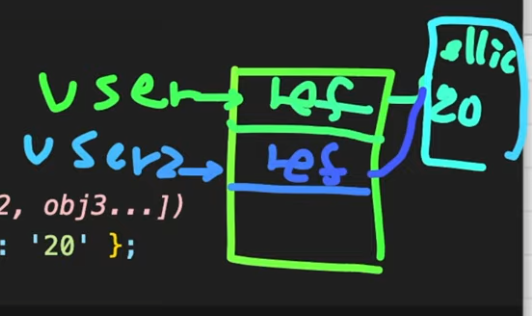
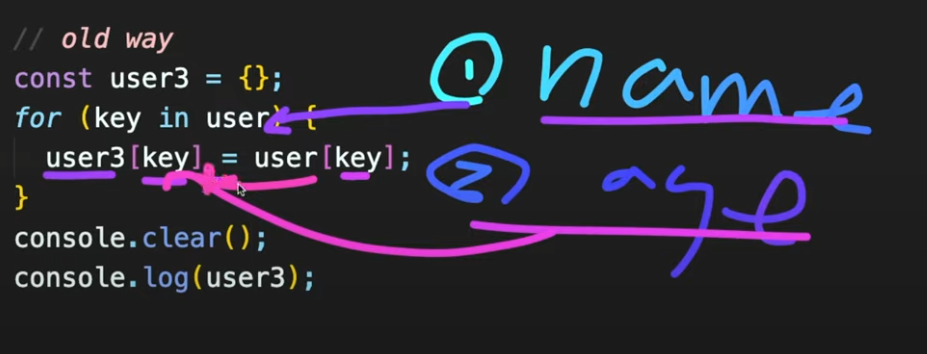

https://www.youtube.com/watch?v=1Lbr29tzAA8&list=PLv2d7VI9OotTVOL4QmPfvJWPJvkmv6h-2&index=7


오늘 드디어 Object에 대해 배우는 시간

data type, class를 아직 보시지 않으셨다면 먼저 보고 오시면 이해에 도움이 될 듯.

개념설명 없이 바로 코드로 들어감.


시간이 나시면 Object에 관련된 MDN site를 읽어보시면 조금 도움이 될 듯.

build in method는 어떤 것들이 있는지, 어떤 것들이 가능한지 한 번 읽어보시면 이런 것도 되는구나 큰 그림을 보실 수 있을 듯.

코드를 작성하면서 이 object는 무엇이고, 어떻게 쓰면 좋은지 알아보도록 하겠다.


### 1.Object란?

primitive type은 변수 하나당 값을 하나만 담을 수가 있다.

```javascript
// Objects
// one of the JavaScript's data types.
// a collection of related data and/or functionality.
// Nearly all objects in JavaScript are instances of Object

const name = 'ellie';
const age = 4;
```


name이란 변수엔 ellie(string)이 들어가 있고, age에는 number(4)가 들어가 있다.

출력하고 싶은 함수로 만들면 이름과 나이를 각각 파라미터로 전달해줘야 한다.

그리고 함수를 정의해서 쓸거고, 두 가지의 파라미터를 받아올 수 있도록 만들어야 한다.

```javascript
print(name, age);
function print(name, age) {
  console.log(name);
  console.log(age);
}
```

이렇게 하게 되면 문제가 무엇일까요?

address, 주소나, full name last name, 조금 더 인자가 많아지면 추가해야 되는 것들이 굉장히 많아진다.

관리하기도 힘들고, logical하게 그룹으로 묶어서 생각하기도 어렵기 때문에 힘들다.

그래서 이것을 개선하고자 우리가 object를 쓴다.

```javascript
const ellie = { name: 'ellie', age: 4 };
```

이렇게 하면, object로 관리하면 되니까, 더 이상 이렇게 name과 age를 따로 받을 수 없고, person이란 데이터를 받아서..

```javascript
// Objects
// one of the JavaScript's data types.
// a collection of related data and/or functionality.
// Nearly all objects in JavaScript are instances of Object
// object = { key : value };

// 1. Literals and properties
const name = 'ellie';
const age = 4;
print(name, age);
function print(person) {
  console.log(person.name);
  console.log(person.age);
}

const ellie = { name: 'ellie', age: 4 };
```

person의 이름과 나이를 출력하면 되는 거죠?

전달할 때도 ellie만 전달하면 되니까 간편하게 데이터를 관리할 수 있다.


object를 만드는 방법은, 앞에서 본 것처럼 Curly Brackets(중괄호)를 이용해서 만들수도 있고,

```javascript
const obj1 = {}; // 'object literal' syntax
```


class를 이용해서, new라는 키워드를 이용해서, Class를 template을 이용해서 Object를 만들 수가 있습니다.

```javascript
const obj2 = new Object(); // 'object constructor' syntax
```

new 키워드 이용하면 Object에서 정의된 constructor가 호출된다.


javascript에선 보다시피 클래스가 없어도 바로 object를 생성할 수 있다.

```javascript
const ellie = { name: 'ellie', age: 4 };
```


이름과 나이를 담을 수 있는 object 만들었다.

javascript는 dynamic clip type language

동적으로 타입이 Runtime(프로그램이 동작하고 있을 때)때 결정되는 언어.


그래서 이런 미친 짓을 할 수 있습니다.

뒤늦게 하나의 property를 추가할 수 있다.

```javascript
ellie.hasJob = true;
console.log(ellie.hasJob);
```


이미 name, age라는 object를 정의하였음에도 불구하고, 그 뒤에 마음이 바뀌면

사람은 이름과 나이 조건만 있으면 충분해 하고 만들다가,

뒤늦게 '일을 하는지 안하는지도 추가할까' 이렇게 생각해서, 맘이 바뀌어서 추가할 수 있다.

다른 언어에서 흔한 일은 아니다.

너무 동적으로 코딩하면 금방금방하기는 좋지만, 

나중에 유지보수가 힘들고 생각치도 않은 에러가 발생할 수 있기 때문에,

가능하면 이것을 피해서 코딩하는 것이 좋다.

하지만 이것이 가능하다는 거..


하나 더 가능한 것이 있다.

바로 삭제도 가능.

너무 미친 것 같지 않나요?ㅋㅋ

```javascript
delete ellie.hasJob;
console.log(ellie.hasJob);
```

undefined라고 나오는 것을 볼 수 있다.


여기서 중요하게 짚고 넘어가야 할 포인트

object는 key와 value의 집합체이다.

key: 우리가 접근할 수 있는 변수, property와

그 property가 가지고 있는 값

요렇게 두 가지로 나누어지는게 보이시죠?


그래서 ellie란 object를 보시면 두 가지의 키와(name, age) 그에 상응하는 value가 들어가 있다.

키는 name, age, value는 'ellie', 4 이렇게 각각 들어가있는 것을 알 수 있다.


### object['key']

두 번째로는 computed properties에 대해 알아보겠습니다.

계산된 properties란 말.

object 안에 있는 데이터에 접근할 때는 .을 이용해서 접근.


다른 방법도 있다.

대괄호를 이용해서 name이란 string, 즉 object 안에 있는 변수의 이름을 string 형태로 접근이 가능하다.

```javascript
// 2. Computed properties
// key should be always string
console.log(ellie.name);
console.log(ellie['name']);
```

동일한 아이가 출력되는 것을 볼 수 있다.

object는 name property를 .(dot)이란 문법을 이용해서 접근이 가능하고,

또는 computed properties, 배열에서 데이터를 받아오는 것처럼 이런 식으로 접근이 가능하다.


한 가지 주의하실 점) property는 바로 string type으로 해야 합니다.

만약에 그냥 name으로 함 -> `console.log(ellie[name])` ->값이 안나옴

key는 항상 string type으로 해서 받아와야 합니다.


우리가 아까 이미 생성된 ellie란 object에 hasJob이란 새로운 property를 추가했다가 뺐죠?

출력하면 당연히 undefined가 나옴.

여기서 computed property를 이용해서 동일한 것을 할 수 있다.

```javascript
ellie['hasJob'] = true;
console.log(ellie.hasJob);
```


ellie의 hasJob을 true라고 할당하게 되면, 다시 true가 나오는 것을 볼 수 있다.

Q) .과 computed properties.. 어떤 경우에 어떤 것을 쓰나요?

좋은 질문! 

dot은 코딩하는 그 순간 그 키에 해당하는 값을 받아오고 싶을 때.

computed properties -> 정확하게 어떤 키가 필요한지 모를 때. 즉, runtime에서 결정될 때 쓴다.

코딩하실 때는 그냥 dot을 쓰시는 게 맞다.

출력하실 때도 dot을 써서 출력하시는 게 맞다.

실시간으로 원하는 키의 값을 받아오고 싶다면, computed property를 쓰면 된다.

그 말이 무슨 말이냐 -> 한 가지 예를 들면..


printValue라는 함수가 있다고 하자.

```javascript
function printValue(obj, key) {
  console.log(obj.key);
}
printValue(ellie, 'name');
```


object, key를 받아서 object에 있는 key에 상응하는 value를 출력하는 함수

언제 어떤 키를 받을지 모른다.

key는 어떤 것을 출력할지 코딩하는 이 시점에는 모른다.

dot을 쓴다면..

key는 항상 string type으로 전달.

위 결과 -> undefined.

이 코드가 하고 있는 것 -> object에 key라는 property가 들어있니?

없자나. object에 key라는 property는 들어있지 않아.

그래서, 이 때는 우리가 앞에서 배운 computed properties를 써야 한다.

```javascript
function printValue(obj, key) {
  console.log(obj[key]);
}
printValue(ellie, 'name');
printValue(ellie, 'age');
```


이 뿐만 아니라, 다양한 키들을 변경해서 출력할 수 있다.

나중에 동적으로 key에 관련된 value를 받아와야 될 때 유용하게 쓰일 수 있다.


### Lovely_shorthand

세 번째로는 property value shorthand에 대해 알아보겠다.

```javascript
// 3. Property value shorthand
const person1 = { name: 'bob', age: 2 };
const person2 = { name: 'steve', age: 3 };
const person3 = { name: 'dave', age: 4 };
```

person 1 2 3, 세 가지 오브젝트 생성해보았다.

네 번째 사람 만들고 싶으면 다시 써야 됨.... 번거롭다.

어떻게 편하게 쓸 수 있을까?


makePerson이란 함수를 만들면 되지 않을까요?

```javascript
const person4 = makePerson('ellie', 30);
console.log(person4);
function makePerson(name, age) {
  return {
    name: name,
    age: age,
  };
}
```

너무너무 좋은 생각 같아요.

javascript에서는 property value shorthand라는 기능이 있어서, 

key와 value의 이름이 동일하다면, 생략할 수 있다.


```javascript
function makePerson(name, age) {
  return {
    name,
    age,
  };
}
```

이렇게만 해줘도 object가 생성될 수 있다.


제대로 됐는지 보기 위해 `console.log(person4);`

ellie와 나이가 정상적으로 나오는 것을 볼 수 있다.


### Constructor_function

여기서 우리가 해결하고자 했던 문제점이 무엇이었죠?

object를 필요할 때 일일이 만들게 되면, 불가피하게 동일한 key와 value를 반복해서 작성해야 되는 문제점이 있었다.

[person 1, 2, 3]

그래서 우리가 함수를 이용해서 값만 전달해주면, Object를 만드는 유용한 함수를 만들었다.

곰곰히 생각해보니, makePerson이라는 것은 지난 시간에 살펴본 Class같은 아이군요!

즉, template같은 아이네요!

네 맞아요! 정확하게 보셨습니다.

그래서 이전에 javascript에 class가 없을 때는, 이런 식으로 많이 작성이 되었다.

이렇게 다른 계산을 하지 않고 순수하게 Object를 생성하는 함수들은 보통 대문자로 시작하도록 함수들을 만든다.

return이란 값을 하지 않고 this.

```javascript
// 4. Constructor function
const person5 = new Person('ellie', 30);
console.log(person5);
function Person(name, age) {
  // this = {};
  this.name = name;
  this.age = age;
  // return this;
}
```

class에서 constructor에서 했던 것처럼, 요런 식으로 작성하게 됩니다.


호출할 때도 `new Person('ellie', 30)`

class에서 object를 만드는 것처럼 이런 식으로 할 수 있다.

이렇게 하면 javascript engine이 알아서 object를 생성해준다.


여기에서 생략된 것은, 우리가 새로운 object를 만들어서 this에다가 name이란 새로운 property를 넣고,

결국은 이 this를 return하는 함수.


그리고 이것을 바로 Constructor function이라고 합니다.


### in_operator

다섯 번째는 in operator입니다.

해당하는 object에 키가 있는지 없는지 확인한다.

```javascript
// 5. in operator: property existence check (key in obj)
console.log('name' in ellie); // true
console.log('age' in ellie); // true
console.log('random' in ellie); // false
console.log(ellie.random); // undefined
```

간단하게 키가 있는지 없는지 확인할 수 있다.

in keyword 이용해서 해당하는 key가 object에 있는지 확인할 수 있다.


### for..in,for..of

여섯 번째로 for in, for of 두 가지에 대해서 배워보겠다.

나중에 플젝 하시면 굉장히 유용하게 쓰실 수 있는 아이.

```javascript
// 6. for..in vs for..of
// for (key in obj)
console.clear()
for (key in ellie) {
  console.log(key);
}
```

ellie가 갖고 있는 키들이 블럭을 돌 때마다 key라는 지역변수에 할당된다.

console.clear()를 이용하여 이전 로그들을 다 지운 뒤, key 출력

모든 key들을 받아와서 일들을 처리하고 싶을 때 for in을 쓰면 된다.


하나 더 있는데요, for of입니다.

object를 쓰는 것이 아니라, 배열, 리스트와 같은 iterable한 아이들을 쓴다.

배열은 아직 배우지 않았지만, 이렇게 순차적으로 담겨있는 데이터가 있다고 가정.

```javascript
// for (value of iterable)
const array = [1, 2, 4, 5];
```

이 데이터의 모든 값들을 찍으려면..

예전 같으면 어떻게 해야 했죠?

```javascript
for(let i = 0; i < array.length; i++) {
  console.log(array[i]);
}
```

출력은 되겠지만 많이 적어야 돼서 쉽지 않다.


조금 더 쉽게 할 수 있는 방법이 있다. for of 사용.

```javascript
for (value of array) {
  console.log(value);
}
```

array에 있는 모든 값들이 value에 할당되면서, 블록 안에서 순차적으로 출력하거나 값을 개선할 수 있다.


### cloning

다음으로는 너무너무 재밌는 cloning에 대해서 배워보도록 하겠다.

```javascript
// 7. Fun cloning
// Object.assifn(dest, [obj1, obj2, obj3...])
const user = { name: 'ellie', age: '20' };
const user2 = user;
```

user라는 것의 object를 만들어 놓고, user2가 user를 가리키게 했다.

메모리엔 어떤 변화가 생겼을까요?

user라는 변수 -> 메모리를 가리킴.

메모리엔 reference가 들어있다.

reference는 실제로 name은 ellie고, age는 20이라는 object를 가리키고 있는 reference가 들어있다.

user2의 변수는 user가 할당되었다. -> user에 들어있는 reference 값이 user2에도 동일하게 할당된다.

user2에도 동일한 reference가 들어있다.

동일한 reference도 똑같은 ellie의 object를 가리키고 있다.




여기서 만약 제가 user2의 이름을 coder로 바꿨다.

```javascript
user2.name = 'coder';
console.log(user);
```

그러면 user의 이름은 무엇이 되어 있을까요?

-> ellie가 coder로 바뀌었습니다.


그림을 놓고 보면 너무 당연.

user2가 가리키고 있는 reference.이름을 coder로 변경

user 출력 -> user가 가리키고 있는 reference가 coder로 변경이 되어 있다.


이런 식으로 말고 정말 object를 복사할 수 있는 방법이 있나요?

네. 지금부터 알려드리겠다.


예전에는 텅텅 비어져 있는 object를 먼저 만들고,

object를 뱅글뱅글 돌면서 매뉴얼적으로, 수동적으로 할당해주는 방법이 있다.

```javascript
// old way
const user3 = {};
for (key in user) {
  user3[key] = user[key];
}
console.clear();
console.log(user3);
```


복사가 일어난 다음에 변경되어서 이름 coder로 되어 있다.

만약 변경 전이라면 당연히 ellie로 변경되는 것을 확인할 수 있다.


코드 조금 설명

user 안에 있는 key들을 뱅글뱅글 돌면서..

첫 번째 키는 바로 이름이 된다.

두 번째 키는 age가 된다.

이름일 때는 user3의 새로운 property, name을 추가할 것이다.

값은 기본 user key의 value. 즉 ellie가 할당.

두 번째로 돌 때는 user3의 age라는 property가 추가되고,

값은 user에 있는 age 20이 할당된다.

이런식으로 manual하게 복사할 수 있는 방법이 있었다.




다른 방법 이미 위에 주석으로 정답 적어놓음..

Object에 있는 assign을 쓴다.


Object는 javascript에 있는 기본적으로 탑재되어 있는 object중 하나.

javascript에 있는 모든 object는 이 Object를 상속한다고 말씀드렸다.

그래서 이 assign()을 보시면 된다.

앞에서 보여드린 웹 사이트(MDN)에 가셔서 이 함수는 어떤 것인지 읽어보셔도 되고,

Mac은 command, 윈도우 사용자는 control 키를 누르셔서 함수를 누르면, 정의된 곳으로 이동하실 수 있습니다.

이렇게 새로운 함수나 API를 쓸 때는, 어떤 parameter를 전달해서 어떤 값이 return되는지를 꼭 확인하고 쓰시는 것을 추천드린다.

```
assign<T, U>(target: T, source: U): T & U;
```


assign은 복사하고자 하는 target과 복사를 하려고 하는 source를 같이 전달해줘야 하고, 

리턴 값은 target과 source가 통합된 아이

아직 제네릭 배우지 않아서 T, U같은 기호는 좀 모르실 듯..

어느정도 확인하시면 된다.

T, U, V 들어가면 T, U, V 섞인 애가 나온다.


동일한 assign method 안에 source를 하나만 넣어도 되지만, 여러 가지를 넣어도 되는구나.

심지어 배열을 전달해도 되네? 확인할 수 있다.


타겟을 만들면 텅텅 비어져 있는 것을 정의한 다음에,

바로 복사하고자 하는 object를 전달하면 됩니다.

```javascript
const user4 = {};
Object.assign(user4, user);
console.log(user4);
```

복사된 value가 나오는 것을 확인할 수 있다.

이렇게 하셔도 되고,


전달하고자 하는 object는 텅텅 비어져 있고,

```javascript
const user5 = Object.assign({}, user);
console.log(user5);
```

리턴 값은 두 개가 섞인 것이 return 되니까..

이런 식으로 return 값을 받아와서 작성하셔도 좋을 것 같다.


아까 assign 함수의 interface를 살펴보니까, 여러 개의 source를 전달할 수도 있었다.

```javascript
// another example
const fruit1 = { color: 'red' };
const fruit2 = { color: 'blue', size: 'big' };
const mixed = Object.assign({}, fruit1, fruit2);
console.log(mixed.color);
console.log(mixed.size);
```

이런 경우는 어떤지 살펴보겠다.

fruit1 색깔 빨간색,

fruit2 색깔 파란색, 사이즈 큼

fruit1, 2의 공통적인 property는 color가 들어 있고, size라는 새로운 property가 fruit2에 들어 있다.

그래서 fruit1, fruit2를 섞은 것이 바로 mixed라는 변수.

mixed의 색깔과 크기는 무엇이 출력될까요?


정답은 blue와 big.

뒤에 나오는 아이일수록 앞에 동일한 property가 있다면, 값을 계속 덮어씌워지기 때문.

fruit3, 색깔 black인 애를 뒤에 섞게 되면 색깔은 black이 된다.

이런 점을 유의해서 assign을 쓰면 좋을 듯.


나중에 Object 많이 쓸 것 같은 느낌이 들지 않나요?

혹시 지난 시간 Class에서 헷갈리시거나 아직 객체지향 언어에 대해서 개념이 잘 잡히지 않으신 분들은 괜찮다.

javascript에선 사실 Object를 더 많이 쓰고 있다.


나중에 TypeScript나 다른 언어를 공부하실 때는 객체지향 언어가 조금 중요한 개념이기 때문에, 

객체지향 개념이 많이 부족하신 분들, 좀 더 공부해보고 싶은 분들은 서점에 가서 자바 책을 구입하셔서 공부하는 것을 추천드립니다.

여러분들이 보셨을 때 재밌게, 쉽게 읽을 수 있는 책 하나 고르면 도움이 될 듯.

나중에 TypeScript 배울 때도 조금 도움이 될 수 있으니 한 번 구입해서 읽어보십쇼.


다음 시간 너무너무 유용한 배열에서 만나도록 하겠습니다.