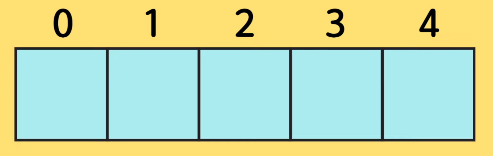

https://www.youtube.com/watch?v=yOdAVDuHUKQ&list=PLv2d7VI9OotTVOL4QmPfvJWPJvkmv6h-2&index=8


[Array_decalaration](#Array_decalaration)

[Index_position](#Index_position)

[Looping](#Looping)

[Add,delete,copy](#Add,delete,copy)

[Searching](#Searching)


기본적인 사항들에 대해서는 조금씩 훑어봤다.

드디어 자료구조 중 하나인 Array에 대해서 알아보도록 하겠다.

배열을 빼놓고 플젝 한 적이 없을 정도로 유용하게 많이 쓰인다.

제대로 공부하고 어떻게 활용하는지까지 알면 좋다.

Javascript 이미 공부했거나 현업에서 일하는데도 Array를 정확하게 제대로 쓰지 못하는 분이 꽤 있다.

Array는 무엇인지 개념정리부터 어떻게 활용할 수 있는지 제대로 된 팁을 알려드리겠다.


토끼와 당근이 있다.

일상 생활에서 토끼와 당근이 너무 많다면 바구니를 이용해서 한 곳에 담아놓을 것.

프로그래밍 언어에서도 비슷한 종류의 데이터들을 묶어서 한 곳에 보관하는 것 -> 자료구조라고 한다.

어떤 방식으로, 어떤 형식으로 데이터를 담느냐에 따라 다양한 형식이 있다.

Q) 지난 번에 비슷한 종류의 데이터를 묶어놓는 것은 Object라고 했잖아요?

Object와 자료구조의 차이점은 무엇인가요?

A) 좋은 질문이에요! 여기서 Object는 토끼와 당근이 될 수 있다.

토끼와 당근 Object는 각각의 특징이 있다.

토끼: 동물, 귀 두 개라는 property가 들어있을 수 있고, 먹는다, 뛴다와 같은 method들이 들어있을 수 있다.

당근: property만 쓸 수 있다. 주황색, 비타민C가 있다.

당근 자체로는 어떤 행동을 할 수 없기 때문에, 메소드가 없을 수도 있다.

이렇게 Object는 서로 연관된 특징과 행동들을 묶어 놓는 것을 말한다.

토끼 사람 당근 물체 자동차 은행 이런 것들처럼..


토끼와 당근들을 묶는 것처럼 비슷한 타입의 Object를 묶어놓는 것을 자료구조라고 한다.

보통 다른 언어에서는 동일한 타입의 오브젝트만 담을 수 있다.

타입이 있는 언어에서는 동일한 타입의 데이터만 담을 수 있다.

하지만 Javascript는 Dynamic typed language.

타입이 동적으로 정의가 된다.

타입이 없기 때문에, 미친 짓이 가능하다.

한 바구니 안에 다양한 종류의 데이터를 담을 수 있다.

가능은 하지만 좋지는 않다.


나중에 여러분들이 꼭 공부를 더 하셔야 되는 부분 - 자료구조, 알고리즘

물건들을 한 데 담아놓은 자료구조들 중에서도, 즉 Array, map, set, list, 

list 중에서도 single-linked list냐 double-linked list냐

요런 아이들 중에서도 새로운 데이터를 자료 구조에 삽입할 때 얼마나 효율적으로 삽입할 수 있는지,

삭제할 때도, 검색할 때도, 또 정렬할 때도 어떤 알고리즘을 써서 정렬을 할 수 있는지

이런 효율성을 같이 공부하시면 너무너무 좋겠죠?

이런 것들이 나중에 programmers나 인터뷰 문제에서도 종종 등장한다.

짧은 강의에서 아쉽게 모든 자료구조에 대해 설명할 순 없지만,

나중에 어떤 문제를 해결하느냐에 따라서 많은 자료구조들 중에 어떤 자료구조를 선택하는지,

선택할 때 검색과 삽입 삭제 정렬 이런 속도들을 고려해서, Big O라는 것을 고려해서 선택해서 잘 사용하는 것이 정말 중요합니다. 여기까지만 이해하시면 될 듯..


드디어 배열로 돌아와서

배열은 이렇게 큰 칸이 촘촘이 모여 있는 자료구조를 말한다.

포인트: 여기에 인덱스가 지정이 되어 있습니다.

프로그래밍의 인덱스는 0부터 시작한다.




텅 빈 배열이 있고, size는 5개

텅 빈 박스 5개

서로 모여있고, 박스의 인덱스 번호가 매겨져 있다.

우리가 준비한 토끼를 담아 넣는다.

당근도 동일하게 배열을 이용해서 보관할 수 있ㄷ.ㅏ

보통 한 배열 안에는 동일한 타입의 데이터를 넣는 것이 중요하다.

JavaScript는 다른 타입도 가능하나 하지 않는 것이 좋다.


배열의 포인트는 인덱스.

두 번째 있는 토끼랑 세 번째 당근 삭제하고 싶다 -> 인덱스로 접근 가능.

쑥 빼버리면 삭제 가능.

삽입, 삭제 너무 편해

코드로 자세히 알아봅시다.


array.js

오늘은 Array, 배열에 대해 배워보는 시간을 가져볼 것이다.


### Array_decalaration

첫 번째로 배열을 어떻게 만들 수 있는지 선언하는 방법에 대해 알아보겠다.

```javascript
// 1. Declaration
const arr1 = new Array();
```

우리가 new라는 키워드를 이용해서 Object를 만드는 것처럼, 이렇게 하면 배열을 만들 수가 있다.

두 번째가 더 흔하게 쓰이는 방법.

대괄호를 이용해서 데이터를 넣어서 배열을 만들 수가 있다.

```javascript
const arr2 = [1, 2];
```

총 길이가 2개인 배열이 만들어졌고, 0번째 인덱스는 숫자 1, 1번쨰 인덱스는 숫자 2

배열을 공부할 때는, 배열이 인덱스를 기준으로 데이터가 저장되기 때문에,

인덱스를 활용해서 어떻게 데이터를 검색, 삽입, 삭제하는지 정확하게 아는 것이 너무 중요하다.


### Index_position

두 번째로는 index를 통해 어떻게 배열에 접근할 수 있는지 알아보겠다.

귀여운 과일 배열을 만들어보겠다.

```javascript
// 2. Index position
const fruits = ['apple', 'banana'];
console.log(fruits)
```

과일에는 총 두 가지의 문제열이 있고, 사과와 바나나를 넣어보겠다.

출력하면 사과와 바나나가 출력되고, 열어서 보시면 0번째는 사과, 첫 번째는 바나나, length는 2인 것을 볼 수 있다.


proto는 아직 배우지 않았기 때문에 지금은 무시하고 넘어감.

다음에 알려드리는 시간을 갖겠다.


아까 fruits의 길이는 두 개라고 나왔다.

```javascript
console.log(fruits.length);
```


여기서 첫 번째[인] 사과에 접근하려면, 출력하려면 어떻게 해야 할까요?

배열에서 대괄호를 이용해서 데이터에 접근할 수 있습니다.

Object에서 많이 봤던 모양같지 않나요?

key라는 string을 이용하게 되면(name, age 등등), key 값에 상응하는 value들을 받아올 수 있었다.

```javascript
console.log(fruits['key'])
```


그것처럼, 배열은 숫자, 인덱스를 전달하게 되면, 그 인덱스에 해당하는 value들을 받을 수가 있다.

```javascript
console.log(fruits[0]);
console.log(fruits[1]);
console.log(fruits[2]);
```

만약 밖에 있는 index에 접근하게 되면 -> undefined

아무것도 들어있지 않기 때문에 undefined가 나온다.

보통 배열의 첫 번째 아이템을 찾을 때는 0을 많이 쓰고,

배열의 제일 마지막에 있는 아이템을 찾을 때는

배열 length - 1을 해서 마지막 데이터에 접근할 수 있다.

```javascript
console.log(fruits[fruits.length - 1]);
```


왜 그런지 아시겠죠?

배열은 index가 0부터 시작하기 때문에,

-1을 하면 제일 마지막 인덱스를 받아올 수 있기 때문이다.


### Looping

배열 안에 들어있는 전체적인 데이터를 돌면서 출력하는 것을 해보겠다.

과일 안에 들어있는 모든 과일들을 출력해볼까요?

```javascript
console.clear();
// 3. Looping over an array
// print all fruits
// a. for
for (let i = 0; i < fruits.length; i++) {
  console.log(fruits[i]);
}
```

a. for 루프 사용

i를 0부터 시작해서 fruits.length 이전까지 돌면서..

출력하게 된다.

2 < 2 -> stop. 넘어가게 된다.

사과, 바나나 출력.


두 번째 방법은 for of 사용.

let fruit 안에 fruits에 들어있는 데이터를 하나씩 순차적으로 할당하면서 블럭 형성

```javascript
// b. for of
for(let fruit of fruits) {
  console.log(fruit);
}
```

이렇게 간단하게 할 수 있다.


더 간단하게 하는 법 -> forEach 사용

```javascript
// c. forEach
fruits.forEach()
```

fruits에 있는 forEach API를 이용해서 출력을 할 수 있다.

forEach는 바로 콜백함수를 받아온다.

뭐라고요? 콜백함수?

무서워하지 마시고 ctrl + API 클릭

API 선언되어진 곳으로 이동

정확하게 어떻게 사용되어질 수 있는지 설명되어 있다.

함수 호출하거나 API 쓸 때는 무작정 쓰거나 문서 보면서 쓰지 마시고, 직접 선언된 곳으로 가서

이 함수는 무엇이며 파라미터는 어떤 파라미터를 전달할 수 있는지, 리턴되는 값은 어떤 게 있는지 확인하면서 직접 써보면서 배우시는 것이 정말 여러분들 실력에 도움이 많이 됩니다.

그냥 무작정 쓰면서 공부한 학생들보다, 직접 API가 정의된 곳으로 와서 읽어보면서 확인하는 친구들의 실력이 쑥 늘어난다.

저 믿고 정의된 곳 와서 문서 읽으면서 확인하면서 코딩하는 습관을 기르시는 것이 정말 중요합니다.

처음엔 조금 어렵지만 처음 배우실 때부터 좋은 버릇, 습관을 만드시면 개발 인생에 너무 도움이 된다.

영어라서 조금 힘들 수 있으나, 나오는 쉬운 단어 반복

처음에 오래 걸려도 시간 투자해서 보면 그렇게 어렵지 않다.

```javascript
    /**
     * Performs the specified action for each element in an array.
     * @param callbackfn  A function that accepts up to three arguments. forEach calls the callbackfn function one time for each element in the array.
     * @param thisArg  An object to which the this keyword can refer in the callbackfn function. If thisArg is omitted, undefined is used as the this value.
     */
    forEach(callbackfn: (value: T, index: number, array: T[]) => void, thisArg?: any): void;
```

forEach는 array에 들어있는 각 element에 정해진 어떤 액션을 수행하는 함수.

array, 배열 안에 들어있는 값마다 우리가 전달한 Action, callback 함수를 수행한다.

foreach라는 함수는 총 두 가지의 파라미터가 전달된다.

첫 번째로 전달되는 것은 콜백함수.


우리가 지난 시간에 배웠던 콜백함수.

우리가 전달한 함수를 value 하나하나마다 호출해주는구나.


두 번째 - ?로 되어 있으면, 파라미터를 전달해도 되고 전달하지 않아도 된다.

그래서 우리가 전달한 콜백함수를 value마다 호출해주고, 

이 콜백함수에는 총 세 가지의 인자가 들어오는구나

첫 번째는 value 배열에 있는 값이 전달된다.

그 값이 들어있는 index도 들어오고,

전체적인 배열을 이렇게 전달받을 수 있는거구나

사과와 바나나가 들어있으니까, 사과가 들어있는 index가 callback 함수로 들어오고,

그 다음에는 바나나가 들어있는 index 1이 callback 함수로 들어오겠구나 생각할 수 있다.

여기서도 아직 어렵다면, 코드로 돌아와서 한 번 다시 확인해보는 시간을 가져보자.


```javascript
// c. forEach
fruits.forEach(function() {
  console.log('he');
});
```

forEach에는 우리가 function을 전달할 수 있다.

그냥 he를 출력해보겠다.

he가 두 번 출력. 데이터 총 두 개가 들어있기 때문.


인자 세 개 받을 수 있었다.

value(fruit), index, array 전체

```javascript
fruits.forEach(function(fruit, index, array) {
  console.log(fruit, index, array);
});
```

사과, 바나나 출력

각각의 인덱스 출력

전체적인 array도 받아올 수 있다.


forEach에서 보통 array는 받아오지 않는다.

이름이 없는 anonymous function은 arrow function을 쓸 수 있었다.

한 줄만 있으면 괄호도 생략 가능. 세미콜론도 필요 없다.

인덱스 출력하고 싶지 않으니까 뺀다.

```javascript
fruits.forEach((fruit) => console.log(fruit));
```


아하, forEach는 배열 안에 들어있는 value들마다 내가 전달한 함수를 출력하는구나.


### Add,delete,copy

네 번째는 배열에 어떻게 데이터를 넣고 빼고 복사할 수 있는지까지 알아보겠다.

먼저, item을, 어떤 value들을 배열의 제일 뒤에 넣고 싶다.

그리고, 배열에서 제일 뒤에서부터 아이템을 지우고 싶다. 그런 것들도 알아보겠다.

```javascript
// 4. Addition, deletion, copy
// push: add an item to the end
fruits.push('apple', 'peach');
console.log(fruits);

// pop: remove an item from the end
fruits.pop();
fruits.pop();
console.log(fruits);
```

제일 뒤에다가 넣을 수 있는 API: push. 집어넣는 느낌

빼는 것은 pop. 하나를 떼어낸다.

fruits에 지금 딸기와 바나나가 있다.

우리가 좋아하는 과일들을 더 넣어보도록 하겠다.

딸기, 복숭아

과일을 출력해보면.. 네 개가 나온다.

사과, 바나나, 딸기, 복숭아.


데이터를 뺄 수도 있다.

fruits.pop();

하고 다시 과일을 출력.

-> 뒤에서 아이템 하나가 뽕 하고 빠짐.


하나를 더 빼려면 fruits.pop(); 한 번 더 한다.

 

그럼 앞에서부터 아이템을 넣고 빼는 것도 있나요?

당연하죠!

앞에서 넣는 것은 unshift란 API가 있다.

```javascript
// unshift: add an item to the beginning
fruits.unshift('strawberry', 'lemon');
console.log(fruits);

// shift: remove an item from the beginning
fruits.shift();
fruits.shift();
console.log(fruits);
```

용어가 헷갈리는데, shift한다는 것을 왜 쓰는지는 뒤에 가서 설명드리겠다.


unshift를 이용해서 앞에서부터 데이터를 넣을 수 있다.

딸기, 레몬이 앞에서부터 들어가는 것을 확인할 수 있다.


shift를 이용해서 앞에서부터 데이터를 뺄 수 있다.

fruits.shift();

앞에서부터 데이터가 빠지게 된다.

제일 앞에 있는 딸기가 빠지겠죠?

쉬프트 한 번 더 하면 레몬이 사라지고 사과가 남겠죠?


여기서 정말 중요한 노트를 작성해볼께요.


```javascript
// note! shift, unshift are slower than pop, push
```

shift, unshift는 pop과 push보다 훨씬 느리다.

왜냐? 설명을 해드리겠다.


배열에 아이템들이 들어있을 때, 뒤에서부터 데이터를 넣고 빼는 것은 빈 공간에 데이터를 넣었다가 지웠다가 하기 때문에, 기존에 있는 데이터들은 움직이지 않아도 돼서 한 공간에 인덱스를 이용해서 넣고 빼고가 되기 때문에, 정말 빠른 operation을 진행할 수 있지만, 

반대로 앞에서 데이터를 넣으려면 데이터들을 오른쪽으로 옮기면서 맨 앞을 텅텅 비게 만든 다음에 새로운 데이터를 집어넣어야 한다.

반대로 [맨 앞의] 데이터를 삭제할 때는 첫 번째에 있는 아이템을 지우고, 두 번째에 있는 아이템을 앞으로 땡겨오고 또 그 다음에 있는 애를 땡겨오고.. 이런 일들을 계속해서 반복해서 해줘야 한다.


배열의 길이가 길면 길수록 shift하다, 당겨오다, 움직이다

이런 일들을 계속해서 반복적으로 해야 하기 때문에, 

가능하면 shift / unshift를 사용하시기 보다는, pop과 push를 사용하는 게 더 좋다.


또 중요한 포인트

제일 뒤에서 아이템에 접근하는 것은 정말 빠르다.

중간에 데이터를 넣고 빼는 것도 인덱스를 이용해서 하기 때문에 빠르다.

하지만, 무언가 배열 전체의 데이터가 움직여야 한다 -> 전체의 데이터가 shift되는 operation은 굉장히 더 느릴 수 있다.

배열의 길이가 길면 길수록 전체적으로 움직여야 되는 것들이 많기 때문에, 더 느리겠죠?

더 어렵게 설명하면 BigO나 같은 알고리즘에 관련된, 정렬 같은 것들 설명 깊게 들어가야 한다.


배열 앞부분, 뒷부분에서 데이터 삽입 삭제에 대해 알아보았다.

아이템을 지정된 포지션에서 지우는 것은 가능할까요?

당연히 가능합니다.

splice라는 것을 이용하면 됩니다.

해보기 위해서 과일 안에 데이터를 더 넣어보겠다. 딸기, 복숭아, 레몬

과일 다섯 개가 들어가있죠?

```javascript
fruits.push('strawberry', 'peach', 'lemon');
console.log(fruits);
```


splice란 API를 쓰면 지정된 위치에서 데이터를 삭제할 수 있다.

```javascript
fruits.splice(1, )
```

여기까지 쓰면 힌트가 올라온다.

어디서부터 지울껀지 시작하는 인덱스 번호를 지정, 몇 개나 지울지를 얘기해주면 된다.

deleteCount라는 parameter 옆에 ?가 있따.


?는 optional, 즉 값을 지정해도 되고 안해도 된다는 뜻.

내가 1이란 인덱스부터 지우고 싶은데, 몇 개를 지우고 싶은지 말하지 않으면 어떻게 되는지 보겠다.


```javascript
fruits.splice(1);
console.log(fruits);
```

splice는 원하는 인덱스만 지정하고 몇 개를 지울 건지 말하지 않으면, 우리가 지정한 인덱스부터 모든 데이터들을 다 지워버린다.

원한다면 몇 개나 지우고 싶은지 말해줘야 한다.

``` javascript
fruits.splice(1, 1);
```


더 재밌는 것은, splice를 한 다음에 원하는 데이터를 추가할 수 있다.

```javascript
fruits.splice(1, 1, 'apple', 'watermelon');
```

인덱스 1번의 첫 번째 거를 지운 다음에, 사과와 수박을 넣어줘

딸기가 지워진 자리에 우리가 지정한 사과와 수박이 쏙 들어가게 되었다.

이렇게 splice를 이용하면, (한국어 단어 뜻은 꼬아서 잇다, 이어주다) 지우고 나서 우리가 원하는 데이터도 넣을 수 있다.

엄청 유용하게 쓸 수 있겠죠?


지우지는 않고 원하는 부분에 넣을 수도 있다.

```javascript
fruits.splice(1, 0, 'apple', 'watermelon');
```


한 가지 더 유용한 것을 알려드리고 싶다.

두 가지의 배열을 묶어서도 만들 수가 있다.

```javascript
// combine two arrays
const fruits2 = ['green', 'kakao'];
const newFruits = fruits.concat(fruits2);
console.log(newFruits);
```

fruits2를 만든 다음,

fruits에 concat. 연결하게 되면..


기존에 있던 fruits와 우리가 새로 만든 fruits2가 합쳐져서 일곱 개의 과일이 들어 있는 배열이 만들어진다.

음 그렇구나 하고 그냥 넘어가지 말고, API가 선언된 곳에 오셔서 읽어보고 확인하는 시간을 가져보십셔

```javascript
concat(...items: ConcatArray<T>[]): T[];
    /**
     * Combines two or more arrays.
     * This method returns a new array without modifying any existing arrays.
     * @param items Additional arrays and/or items to add to the end of the array.
     */
```

아 배열 안에 있는 concat이란 API는 새로운 배열을 받는데, concat을 호출하는 배열 + 새로 전달된 items란 배열을 합해서 새로운 배열을 return하는 것을 확인할 수 있다.


### Searching

다섯 번째로는 검사, 검색할 수 있는 API를 알려드리겠다.

배열 안에 어떤 값이 몇 번쨰 인덱스에 있는지 알고 싶을 때, 유용하게 쓸 수 있다.

```javascript
// 5. Searching
// indexOf: find the index
console.clear();
console.log(fruits);
```

다섯 개의 과일이 들어 있다.

내가 만약 fruits 안에 사과가 몇 번째 인덱스에 있는지 알아보고 싶다

indexOf란 API를 사용하면 된다.

```javascript
console.log(fruits.indexOf('apple'));
console.log(fruits.indexOf('watermelon'));
```

0번째라고 나옴.

수박은 2번째라고 나옴.


하나 더 유용한 것 - includes

```javascript
// includes
console.log(fruits.includes('watermelon'));
console.log(fruits.includes('coconut'));
console.log(fruits.indexOf('coconut'));
```

배열에 수박이 있는지 없는지를 true, false로 return

없는 coconut을 물어보면 false가 나온다.


index같은 경우 없는 값을 출력하면 -1이 출력된다.

배열 안에 해당하는 것이 없을 때는 -1이 출력.

이런 것도 유용하게 쓸 수 있겠죠?


lastIndexOf란 것도 있다.

```javascript
// lastIndexOf
console.clear();
console.log(fruits);
console.log(fruits.indexOf('apple'));
console.log(fruits.lastIndexOf('apple'));
```

사과 두 개[빨강, 초록], 수박, 복숭아, 레몬

만약 빨간 사과가 마지막에 하나 더 있다.

그러면 여기에서 indexOf사과라고 출력하게 되면..

0번 째.  indexOf는 젤 첫 번째로 해당하는 값을 만나면 그 값의 index를 return한다.

lastIndexOf는 제일 마지막에 있는 값을 출력하게 된다.

맨 마지막에 나온 사과의 index가 출력된다.

이런 것도 알고 있으면 나중에 플젝할 때 너무 도움된다.


여기까지 javascript 배열에서 가장 기본적이지만 너무 중요한 필수 APIs에 대해 말씀드렸다.

배열을 어떻게 선언하는지, index로 어떻게 접근할 수 있는지, 어떻게 for loop를 for each를 이용해 순환하면서 값들을 출력하거나, 우리가 원하는 action들을 할 수 있는지, 데이터를 제일 뒤에서 넣고 빼기(push pop), 앞에서 넣고 빼기(unshift shift), shift와 unshift는 pop과 push보다 느리다. 해당하는 인덱스부터 원하는 갯수만큼 데이터를 삭제하는 splice(데이터를 넣을 때도 사용 가능).

두 가지 array 합치기, 검사하기 까지 알려드렸다.


오늘 강의 숙제 조금 있다.

javascript 배웠다고 자부하는 분도, 현업자도 제대로 활용하지 못하는 너무 좋은 API들이 있다.

다음 강의에서 퀴즈를 내드리고, 같이 풀면서 조금 더 배열을 활용하는 부분에 대해 알려드리겠다.


오늘의 숙제: 배열이 선언된 곳으로 가셔서 


처음부터 array 안에는 length라는 갯수가 들어 있는 property가 있고, 

또 object에 기본적으로 있는 toString이 있구나

이렇게 한 번씩 읽어보기

읽어보고 갖고 놀아보고

pop은 지워지는 아이가 return 되는구나


```javascript
const poped = fruits.pop();
```

pop은 쭉 하고 나간 아이가 할당되어지겠구나

이렇게 한 번 확인하면서 써보는 시간을 가져보십셔

다음 영상 퀴즈 쉽게 따라오려면 한 번씩 읽어오셔야 한다.

정렬(sort), every, some 이런 아이들도 있다.

읽어보시고 다음 영상에서 뵙겠다.


이어지는 강의 - 배열 찰지게 쓸 수 있는 법.

