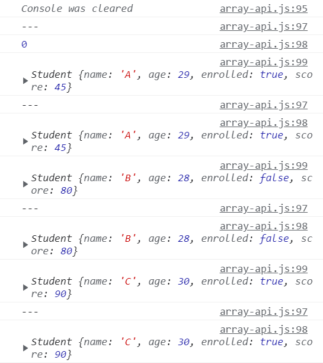

https://www.youtube.com/watch?v=3CUjtKJ7PJg&list=PLv2d7VI9OotTVOL4QmPfvJWPJvkmv6h-2&index=9


[Quiz_one](#Quiz_one)
[1_join](#1_join)
[Quiz two](#Quiz two)
[2_split](#2_split)
[Quiz_three](#Quiz_three)
[3_reverse](#3_reverse)
[Quiz_four](#Quiz_four)
[4_slice](#4_slice)
[Quiz_five](#Quiz_five)
[5_find](#5_find)
[Quiz_six](#Quiz_six)
[6_filter](#6_filter)
[Quiz_seven](#Quiz_seven)
[7_map](#7_map)
[Quiz_eight](#Quiz_eight)
[8_some](#8_some)
[Quiz_nine](#Quiz_nine)
[9_reduce](#9_reduce)
[Quiz_ten](#Quiz_ten)
[Quiz_bonus](#Quiz_bonus)
[10_sort](#10_sort)


지난 시간 - 배열은 무엇인지, 배열에서 새로운 아이템을 추가, 삭제, 검색할 때 쓰이는 기본적인 APIs에 대해 알아보았다.

이번 시간에는 알아보면 짱 도움되는 유용한 배열 APIs에 대해 좀 더 알아보는 시간을 갖겠다.

특별히 준비한 퀴즈 10가지를 함께 풀면서 조금 더 활용할 수 있는 방법에 대해 알려드리겠다.

퀴즈는 아래 동영상 정보란에 추가해뒀으니, 꼭 한 번 스스로 풀어보고 영상 보시면 도움 될 둣.

https://drive.google.com/file/d/1smYHFS5fbgdyGHjBmXx2P-IyY3VWJ9tm/view

array-api.js

```javascript
// Q1. make a string out of an array
{
  const fruits = ['apple', 'banana', 'orange'];
}

// Q2. make an array out of a string
{
  const fruits = '🍎, 🥝, 🍌, 🍒';
}

// Q3. make this array look like this: [5, 4, 3, 2, 1]
{
  const array = [1, 2, 3, 4, 5];
}

// Q4. make new array without the first two elements
{
  const array = [1, 2, 3, 4, 5];
}

class Student {
  constructor(name, age, enrolled, score) {
    this.name = name;
    this.age = age;
    this.enrolled = enrolled;
    this.score = score;
  }
}
const students = [
  new Student('A', 29, true, 45),
  new Student('B', 28, false, 80),
  new Student('C', 30, true, 90),
  new Student('D', 40, false, 66),
  new Student('E', 18, true, 88),
];

// Q5. find a student with the score 90
{
}

// Q6. make an array of enrolled students
{
}

// Q7. make an array containing only the students' scores
// result should be: [45, 80, 90, 66, 88]
{
}

// Q8. check if there is a student with the score lower than 50
{
}

// Q9. compute students' average score
{
}

// Q10. make a string containing all the scores
// result should be: '45, 80, 90, 66, 88'
{
}

// Bonus! do Q10 sorted in ascending order
// result should be: '45, 66, 80, 88, 90'
{
}
```


너무 시간 없으면 pause 눌러달라고 할 때 30초정도 머릿속으로 해보셨으면 좋겠다.

수동적으로 보시는 건 정말 도움이 안 된다.

문제 풀었다면 original file과 정답 file 비교해보셔도 좋을 듯.


### Quiz_one

주어진 배열을 string으로 변환하는 문제

```javascript
// Q1. make a string out of an array
{
  const fruits = ['apple', 'banana', 'orange'];
  // const result = fruits.join();
  const result = fruits.join('|');
  console.log(result);
}
```

주어진 배열 안에는 세 개의 아이템이 담겨져 있다.

담겨져 있는 아이템을 string으로, 하나로 묶어내라는 말.


### 1_join

어떻게 하셨나요?

배열을 string으로 변환할 수 있는 유용한 API가 있다.

바로 배열 안에 join이란 함수가 있는데요,

정의된 곳으로 가보시면..

```javascript
    /**
     * Adds all the elements of an array into a string, separated by the specified separator string.
     * @param separator A string used to separate one element of the array from the next in the resulting string. If omitted, the array elements are separated with a comma.
     */
    join(separator?: string): string;
```

이렇게 자세히 설명되어있는 것을 볼 수 있고, 파라미터는 뭘 전달해야 되는지 나와있다.

지난 시간에 프로그래밍을 효율적으로 공부할 수 있는 팁 알려드렸죠?

이렇게 프로그래밍 언어를 공부하시거나, 라이브러리를 공부하실 때도 API가 정의된 곳으로 오셔서, 정확하게 코멘트를 읽어보고 파라미터는 어떤 값들을 전달해야 되는지, 리턴되는 값은 무엇인지, 한 가지 더 나아가서 API가 Object 자체를 변형(Mutation)시키는 API인지, Object의 값(State)은 전혀 변형하지 않는 아이인지 이런 것들을 포인트를 잡고 확인해보시면 너무 도움이 많이 될 것이다.

join: 배열에 있는 모든 아이들을 더해서 string으로 리턴하는 거야.

근데 나는 그냥 string으로 만들지 않고, 니가 전달해준 separater라는 문자열을 통해서 각각 구분자를 넣어서 string으로 만들어줘.

separator ?가 들어있다. -> 전달해도 되고, 전달하지 않아도 된다.

배열 안에 있는 join이란 API는 seperator란 문자열을 받기도 하고 안받기도 하는데, 결국 배열에 있는 모든 아이템을 string으로 나타내주는구나 까지 이해하고 써보면 된다.

join에 구분자를 넣지 않아도, 자동으로 ,가 들어가면서 배열이 string으로 변환되는 것을 볼 수 있다.

구분자를 넣어서 전달해주면 바뀌어서 나타나는 것을 볼 수 있다.

이런식으로 여러분들이 원하는 구분자를 쓸 수 있다.


### Quiz_two

이번엔 반대되는 것..

주어진 string을 array로 변환하는 문제.

주어진 string은 ,로 구분되어져 있다.

얘네들을 배열로 만들어야 한다.

배열로 만들게 되면, 총 네 개의 과일이 들어있는 배열이 만들어져야 한다.

```javascript
// Q2. make an array out of a string
{
  const fruits = '🍎, 🥝, 🍌, 🍒';
  const result = fruits.split(',');
  console.log(result);
}
```

string 안에 들어있는 유용한 API를 사용하면 된다.

문자열 안에 split이란 API가 있다.


### 2_split

```javascript
    /**
     * Split a string into substrings using the specified separator and return them as an array.
     * @param separator A string that identifies character or characters to use in separating the string. If omitted, a single-element array containing the entire string is returned.
     * @param limit A value used to limit the number of elements returned in the array.
     */
    split(separator: string | RegExp, limit?: number): string[];
```

ctrl + 클릭해서 두 개가 뜨면

밑의 es5를 더블클릭해서 오시면 된다.

string에 정의된 split API는 두 가지의 parameter를 받는다.

seperator, limit을 전달받는다.

string을 여러 가지 문자열로 잘게 나누어주는데, 전달된 seperator를 받아와서..

seperator를 보아하니 type은 string이거나 RegExp 요 두 가지.

정규표현식은 아직 배우지 않아서, 일단 string을 이용해서 split을 해보도록 한다.

두 번째는 ?가 있어서 optional이긴 한데, limit, 우리가 return 받을 배열의 size를 지정하는 것도 가능하다.

돌아와서, 우리는 이 문자열을 콤마 단위로 나눌 것이기 때문에 ,를 전달한다.

console.log 찍어보자.

과일이 네 개가 담겨져 있는 배열이 만들어지는 것을 확인할 수 있다.


그리고 limit이란 parameter를 전달할 수 있다.

우리가 첫 번째 두 개의 배열을 전달받고 싶다 -> 2를 입력.

```javascript
const result = fruits.split(',', 2);
```

사과와 키위만 전달되는 것을 볼 수 있다.

여기서 limit은 optional이라서 전달 안해도 되지만,

필수적으로 전달해야 되는 구분자를 전달하지 않으면, 문자열 전체가 배열 한 곳에 들어있는 것을 볼 수 있다.


### Quiz_three

세 번째 퀴즈는 주어진 배열의 순서를 거꾸로 만드는 것.

```javascript
// Q3. make this array look like this: [5, 4, 3, 2, 1]
{
  const array = [1, 2, 3, 4, 5];
  const result = array.reverse();
  console.log(result);
  console.log(array);
}
```

쉽게 할 수 있다.

array 안에 reverse란 API가 있다.

배열 안에 들어있는 아이템의 순서를 거꾸로 만들어준다.


여기서 한 가지 더 중요한 포인트.

이 함수를 호출한 이 array, 배열의 순서 자체도 순서가 바뀌어있는 것을 확인할 수 있다.

이 reverse라는 것은 배열 자체를 변화시키고, return 값도 변화된 배열 자체를 return하는구나 라고  확인할 수가 있다.


### 3_reverse

```javascript
    /**
     * Reverses the elements in an array in place.
     * This method mutates the array and returns a reference to the same array.
     */
    reverse(): T[];
```

이런 것을 조금 유념해서 해야 한다.


### Quiz_four

네 번째 문제는 주어진 배열에서 첫 번째와 두 번째 요소를 제외한, 나머지 세 개만 들어있는 새로운 배열을 만드는 것.

```javascript
// Q4. make new array without the first two elements
{
  const array = [1, 2, 3, 4, 5];
  // const result = array.splice(0, 2);
  const result = array.slice(2, 5);
  console.log(result);
  console.log(array);
}

class Student {
  constructor(name, age, enrolled, score) {
    this.name = name;
    this.age = age;
    this.enrolled = enrolled;
    this.score = score;
  }
}
const students = [
  new Student('A', 29, true, 45),
  new Student('B', 28, false, 80),
  new Student('C', 30, true, 90),
  new Student('D', 40, false, 66),
  new Student('E', 18, true, 88),
];
```


이 문제를 풀기 위해 지난 시간에 배운 splice에 대해 다시 짚어보자.

어디서부터 몇 개나 지울 건지를 얘기하면, 그 부분을 삭제해주는 API

삭제된 요소들이 리턴된다.

splice는 배열 자체에서 데이터를 삭제한다.


result console 찍어보면 1, 2 return

배열 자체에는 1, 2 삭제되었으니 3, 4, 5가 남아있는 것을 알 수 있다.

여기서 point) array 자체를 변형하는 것이 아니라, 새로운 배열을 만들어야 한다.

splice는 사용할 수 없다.

slice를 사용하면 된다.


### 4_slice

```javascript
    /**
     * Returns a copy of a section of an array.
     * For both start and end, a negative index can be used to indicate an offset from the end of the array.
     * For example, -2 refers to the second to last element of the array.
     * @param start The beginning index of the specified portion of the array.
     * If start is undefined, then the slice begins at index 0.
     * @param end The end index of the specified portion of the array. This is exclusive of the element at the index 'end'.
     * If end is undefined, then the slice extends to the end of the array.
     */
    slice(start?: number, end?: number): T[];
```

배열의 특정한 부분을 return하는 아이.

특정한 부분은 start, end를 이용해서 지정할 수 있다.

start: 배열이 시작하는 index

end: 어디까지 할 건지, 배열에서 인덱스를 지정해주면 된다.

point) end는 exclusive하다.

0~2까지라고 지정하게 되면, 마지막 2는 배제가 되어서 0, 1까지만 전달된다.


우리가 원하는 범위 0, 1을 제외한 나머지 값들을 받아오고 싶다.

그래서 start index는 2부터. 3, 4까지 받아야 하니까,

마지막 index를 4라 하면 4 배제됨.

그래서 5라 하면 2~4를 가져올 수 있다.

새로 만들어진 result란 array는 3, 4, 5만 담겨 있다.

array는 이전과 동일한 것을 확인할 수 있다.


splice: 배열 자체를 수정하는 아이

slice: 배열에서 원하는 부분만 return해서 받아오고 싶을 때 쓰면 된다.

이제 조금 더 재밌는 부분을 공부해보도록 하겠다.

앞으로 나오는 퀴즈는 class, student라는 것을 이용할 것이다.

학생이라는 class에는 이름, 나이, 수업 등록여부, 점수 총 네 가지의 properties가 들어 있다.


### Quiz_five

다섯 번째 문제는 학생을 찾아야 하는데, 학생의 점수가 90점인 학생을 찾을 것이다.

```javascript
// Q5. find a student with the score 90
{
    
}
```

이거도 여러분들이 어떻게 했는지 궁금..

정말 간단하게 할 수 있는 기법이 있다.

먼저 students array의 find라는 API를 이용하면 된다.

우리가 이전 시간에 indexOf이런거 했는데..


### 5_find

find가 정의된 곳으로 오시면, 총 두 가지의 인자가 전달되는 것을 볼 수가 있다.

```javascript
    /**
     * Returns the value of the first element in the array where predicate is true, and undefined
     * otherwise.
     * @param predicate find calls predicate once for each element of the array, in ascending
     * order, until it finds one where predicate returns true. If such an element is found, find
     * immediately returns that element value. Otherwise, find returns undefined.
     * @param thisArg If provided, it will be used as the this value for each invocation of
     * predicate. If it is not provided, undefined is used instead.
     */
    find<S extends T>(predicate: (this: void, value: T, index: number, obj: T[]) => value is S, thisArg?: any): S | undefined;
    find(predicate: (value: T, index: number, obj: T[]) => unknown, thisArg?: any): T | undefined;
```

predicate, thisArg 두 개가 전달된다. [위에 두 개]

여기서 predicate가 전달된 모양새를 보아하니, 아 함수구나, callback 함수를 받는구나!

함수에는 this, value, index, obj라는 네 가지 인자가 전달되고, 값이 value is S, boolean 값으로 무언가가 정의되는 함수를 전달해주면 되는구나 확인해볼 수 있다.

읽어보면, find란 함수는 array 안에서 첫 번째로 찾아진 요소를 리턴.

이 요소는 predicate가 true일 때, 즉 전달된 callback 함수가 true가 되면, 찾자마자 찾아진 아이를 return.

만약 찾지 못하면 undefined를 return.

predicate란 callback 함수는 배열에 있는 모든 요소들마다 호출이 되어진다.

호출되어지는 callback 함수가 true를 return하면, 바로 함수를 멈추고 true가 된 요소를 return한다.

여기까지 확인이 되시나요? 이해 안되면 comment로 알려주세요.


아, find는 내가 callback 함수를 만들어서 전달해야 되는구나..

이 function에는 여러 가지 요소가 전달이 된다. this, value, index, obj 총 네 개가 있었는데, 

value라는 것은 students란 배열 안에 있는 모든 학생들을 말하겠죠?

student, value, item이라고 부르기도 한다.

일단 전 student, index까지만 확인하고 출력해보도록 하겠다.

잘 모를 때는 console.log 찍어가면서 확인하면서 하시면 이해가 더 잘 되겠죠?

```javascript
class Student {
  constructor(name, age, enrolled, score) {
    this.name = name;
    this.age = age;
    this.enrolled = enrolled;
    this.score = score;
  }
}
const students = [
  new Student('A', 29, true, 45),
  new Student('B', 28, false, 80),
  new Student('C', 30, true, 90),
  new Student('D', 40, false, 66),
  new Student('E', 18, true, 88),
];

// Q5. find a student with the score 90
{
  const result = students.find(function (student, index) {
    console.log(student, index)
  });
}
```


총 다섯 명의 학생이 있으니 다섯 번 호출이 되면 맞는 거겠죠?

다섯 번 출력된 것을 볼 수 있다.

우리가 원하는 학생들과, index까지 출력되는 것을 볼 수 있다.

아, 이렇게 되는구나!

우리가 궁극적으로 해야되는 것 -> 학생의 점수가 90점인 학생을 찾아내는 것.

이 callback 함수는 boolean 타입을 리턴해야된다고 했죠?

```javascript
// Q5. find a student with the score 90
{
  const result = students.find(function (student, index) {
    return student.score === 90;
  });
  console.log(result);
}
```

student의 score가 90점인지 아닌지를 return한다.

학생의 점수가 90점이라면 return이 true가 되니까, 여기까지 이해가 되시나요?

우리가 전달한 callback 함수는 배열에 있는 모든 요소들마다 하나씩 호출된다.

즉, 배열에 들어있는 아이템들마다 순차적으로 하나하나씩 호출이 된다.

-> 야, 나중에 호출할께! 해서 callback 함수라고 불려지잖아요?


그래서 첫 번째 학생일 때 callback 함수가 호출되어지고, callback 함수가 return을 true로 하게 되면, 당장 find method가 멈추게 되고, 첫 번째로 true가 된 이 student를 return하게 된다.

첫 학생 점수 45점 -> false return -> 다시 해보자.. 다음 학생 들어옴.

다음 학생 검사 (80점) -> false return -> 다음 학생

세 번째 학생 점수 90점 -> 찾았다! find 함수가 멈추게 된다.


맞는지 안맞는지 result 값을 출력해본다.
-> 점수가 90점인 학생이 return된 것을 확인해볼 수 있다.

index 값은 쓰지 않으니 지우고, function은 일일이 쓰지 않고 arrow function을 쓰면 되죠?

```javascript
  const result = students.find((student) => {
    return student.score === 90;
  });
```


한 문장이면 광호 생략 가능, return 생략 가능, 세미콜론 생략 가능.

```javascript
const result = students.find((student) => student.score === 90);
console.log(result);
```


한 줄로 이쁘게 작성할 수 있다.

우리가 배열에 있는 find라는 함수를 호출할 때, callback 함수를 이렇게 arrow function을 전달해줬다.

arrow function은 배열들의 요소마다 호출이 되고, student, 각각 하나씩 student를 받아왔을 때, 학생의 점수가 90점이면 true를, 아니면 false를 리턴한다.

find는 첫 번째로 true가 나오면, 해당하는 배열의 요소를 return해주는 API.

find를 이용하면 유용하게 원하는 것을 찾을 수 있겠죠?


너무 재밌지 않나요? 드디어 코딩다운 코딩을 시작하게 된 것 같다.


### Quiz_six

여섯 번째 퀴즈는 학생들 중에서 수업에 등록한 학생들만 골라내어서 배열로 만드는 것.

true인 학생들만 찾아서 세 학생들이 들어 있는 배열을 만든다.


배열에 있는 API를 활용하면 너무 간단하게 할 수 있다.


### 6_filter

enroll된 학생들만 filtering하고 싶다.

여러분 스스로 API를 확인해보세요.

```javascript
    /**
     * Returns the elements of an array that meet the condition specified in a callback function.
     * @param predicate A function that accepts up to three arguments. The filter method calls the predicate function one time for each element in the array.
     * @param thisArg An object to which the this keyword can refer in the predicate function. If thisArg is omitted, undefined is used as the this value.
     */
    filter<S extends T>(predicate: (value: T, index: number, array: T[]) => value is S, thisArg?: any): S[];
```

콜백함수를 전달해서, 콜백함수가 true인 아이들만 모아서 새로운 배열을 전달해주는 아이.

익숙해졌다고 보고 바로 arrow function을 만들어보도록 하겠다.


각각의 student가 전달되면, student가 등록되었는지를 확인하고 싶다.

```javascript
// Q6. make an array of enrolled students
{
  const result = students.filter((student) => (student.enrolled));
  console.log(result);
}
```

enrolled 되었으면 true니까, true인 아이들만 전달 받을 것이다.

이것을 출력해보시면..

총 세 명의 학생들이 들어있는 배열이 만들어졌다.

수업에 등록된 학생들만 return된 것을 확인해볼 수 있다.


이렇게 간단하게 filter를 이용해서 우리가 원하는 것만 받아올 수 있다.


### Quiz_seven

일곱 번째는 학생들의 배열에서 점수만 쏙쏙 뽑아와서 점수만 들어 있는 새로운 배열을 만든다.

이것도 배열에 있는 API를 활용하면 너무 간단하게 할 수 있다.


### 7_map

students 안에 있는 배열을 mapping할 것이다.

map: 배열 안에 들어있는 요소 한 가지 한 가지를 다른 것으로 변환해주는 것을 말한다.

```javascript
    /**
     * Calls a defined callback function on each element of an array, and returns an array that contains the results.
     * @param callbackfn A function that accepts up to three arguments. The map method calls the callbackfn function one time for each element in the array.
     * @param thisArg An object to which the this keyword can refer in the callbackfn function. If thisArg is omitted, undefined is used as the this value.
     */
    map<U>(callbackfn: (value: T, index: number, array: T[]) => U, thisArg?: any): U[];
```

무슨 말일까요?

만약 우리가 세 가지 아이템(1, 2, 3)이 들어 있는 배열이 있다고 치면,

map은 지정된 콜백 함수를 호출하면서 1, 2, 3 각각의 요소들을 함수를 거쳐서 다시 새로운 값으로 변환하는 것을 말한다.

우리가 전달한 callback 함수가 어떤 일을 하느냐에 따라서 1, 2, 3이 다른 값으로 mapping되어서 만들어지겠죠?

만약 function이 주어진 숫자를 두 배로, 2를 곱해주는 함수라면

1, 2, 3 -> 2, 4, 6 이런 식으로 변환하는 것을 말한다.


여기선 students란 주어진 object를 바로 score로만 변환해서 만들면 되겠죠?

arrow function으로 정의해보겠다.

```javascript
// Q7. make an array containing only the students' scores
// result should be: [45, 80, 90, 66, 88]
{
  const result = students.map((student) => student);
  console.log(result);
}
```

우리가 전달해준 function -> 받은 값을 고대로 return

당연히 result는 학생들이 들어있다.

학생들을 받아오고 싶은 게 아니라, 학생들이 갖고 있는 점수로 변환하고 싶다.


학생들을 받아서, 학생들이 갖고 있는 score만 return하게 되면..

```javascript
const result = students.map((student) => student.score);
```

이렇게 점수만 들어 있는 배열이 만들어졌다.

맵은 배열 안에 들어있는 모든 요소들을, 우리가 전달해준 callback 함수를 호출하면서, callback 함수에서 가공되어진, return 되어진 값들로 대체하는 것이다.

만약 학생들의 점수를 두 배로 곱하고 싶다 -> 두 배로 된 점수들이 바뀌어서 나오게 된다.

```javascript
const result = students.map((student) => student.score * 2);
```


배열 안에 있는 요소들을 우리가 원하는 함수를 이용해서 다른 형식의 데이터를 만들고 싶다 -> map을 이용하면 너무 유용하다.

한 가지 더 -> 많은 분들이 callback 함수에서 약간 의미 없는 식으로 이름을 지정해서 쓴다.

```javascript
const result = students.map((value) => value.score * 2);
```

프로젝트나 회사마다 다르겠지만, value.score를 하게 되면 한 눈에 이해하기 힘들다.

한 줄로 되어져 있는 경우, students가 바로 mapping되니까 '아 value가 student구나' 바로 이해되지만,

만약 이런 것들이 많아지고 길어지게 되면, 쉽게 이해하기 힘들다.

이렇게 콜백 함수로 전달되는 인자는 최대한 이해하기 쉽게 쓰는 것이 중요하다.


### Quiz_eight

학생들 중에 점수가 50점보다 낮은 사람이 있는지 없는지 확인하기

이 배열 안에 학생들 점수가 50점보다 작은 학생이 있는지 없는지..

있으니까 결과는 true가 return되게 만들면 되겠죠?


### 8_some

배열에 있는 API를 활용하면 쉽게 할 수 있다.

누구든 점수가 50점보다 낮은 사람이 있는지 확인하고 싶다.

그 때는 some을 이용하면 된다.

```javascript
    /**
     * Determines whether the specified callback function returns true for any element of an array.
     * @param predicate A function that accepts up to three arguments. The some method calls
     * the predicate function for each element in the array until the predicate returns a value
     * which is coercible to the Boolean value true, or until the end of the array.
     * @param thisArg An object to which the this keyword can refer in the predicate function.
     * If thisArg is omitted, undefined is used as the this value.
     */
    some(predicate: (value: T, index: number, array: T[]) => unknown, thisArg?: any): boolean;
```

some은 배열의 요소 중에서 callback 함수가 return이 true가 되는 애가 있는지, 없는지를 확인해주는 것이다.

나중에 읽어보십셔


```javascript
// Q8. check if there is a student with the score lower than 50
{
  console.clear();
  const result = students.some((students) => students.score < 50);
  console.log(result);
}
```

true라고 나오게 된다.

callback 함수는 배열에 있는 요소 하나하나마다 실행이 되게 되는데, 

학생들 중 점수가 50점보다 낮은 애가 한 명이라도 있으면 true가 return된다.

배열에서 하나라도 이 조건에 만족되는 사람이 있다면, true가 return된다.

이것을 every를 써서 동일하게 만들 수 있다.


every: 모든 요소들이, 배열에 들어있는 모든 요소들이 이 조건을 충족해야지만 true가 return된다.

모든 학생들의 점수가 50점보다 낮다면 true

아니라면 false

```javascript
  const result2 = !students.every((students) => students.score >= 50);
  console.log(result2);
  console.log(true);
  console.log(!true);
```


여기서는 some을 사용하면 더 간단하다.

굳이 every를 사용하고 싶다면, 모든 학생들의 점수가 50점보다 크거나 같으면 된다.

우리는 학생들중에 50점보다 점수가 낮은 아이가 있는지 없는지 확인하고 싶기 때문에, 

every가 true라면, 모든 학생들의 점수가 50점보다 높다면 당연히 false가 되어야겠죠?

우리는 이 값을 반대로 출력하면 됩니다. (!)

느낌표는 false -> true, true -> false로 return


! 써서 every를 써도 되지만 딱 봐도 이해하기 힘들죠?

배열 중에 어떤 것이라도 하나 만족되는 것이 있는지 없는지 검사할 때는 some을 이용하면 되고,

모든 배열의 조건이 만족되어야 할 때는 every를 쓰시면 됩니다.


### Quiz_nine

아홉 번째 문제는 학생들의 평균 점수를 구해오는 문제

조금 어려웠을수도 있을 것 같다.

array, 배열 안에 있는 API를 이용하면 간단하게 할 수 있다.

바로 reduce라는 것을 이용한다.


### 9_reduce

이것을 조금 어려워하는 분도 있다.

우선 API 보고 같이 보고 이해하면서 [해봅시다.]

```javascript
    /**
     * Calls the specified callback function for all the elements in an array. 
     * The return value of the callback function is the accumulated result, and is provided as an argument in the next call to the callback function.
     * @param callbackfn A function that accepts up to four arguments. The reduce method calls the callbackfn function one time for each element in the array.
     * @param initialValue If initialValue is specified, it is used as the initial value to start the accumulation. The first call to the callbackfn function provides this value as an argument instead of an array value.
     */
    reduce(callbackfn: (previousValue: T, currentValue: T, currentIndex: number, array: T[]) => T): T;
    reduce(callbackfn: (previousValue: T, currentValue: T, currentIndex: number, array: T[]) => T, initialValue: T): T;
```

callback 함수를 전달하고, 또는 initial value를 전달할 수도 있다. [아래쪽]

reduce는 callback과 initial value를 전달하게 된다.

한 번 읽어보면..

callback 함수는 배열 안에 들어있는 모든 요소들마다 호출이 된다.

이전에 살펴봤던 filter, some, every 이런 아이들과 비슷하죠?

callback 함수에서 return되는 값은 함께 누적된 결과 값을 return한대.

아, 우리가 전달하는 callback 함수 안에서 return할 때는, 어떤 값이 누적된 값을 전달해야 되는구나 라고 생각할 수가 있다.

reduce는 배열에 있는 모든 요소들의 값을 누적하는, 뭔가 함께 모아놓을 때 쓰는 거구나 라고 감을 잡으시면 된다.

우리가 전달하는 callback 함수에는 이전 값과, current 값을 받을 수 있다.

뭔지 모르니까 출력하면서 만들어보도록 하자.

```javascript
// Q9. compute students' average score
{
  console.clear();
  const result = students.reduce((prev, curr) => {
    console.log('---')
    console.log(prev);
    console.log(curr);
  });
}
```

첫 번째로 호출되었을 때는, prev는 첫 번째 배열에 있는 요소 A.

curr는 B가 된다.

그 다음에 호출될 때는, 이전 값은 정의되어져 있지 않다.

curr값은 C.

이렇게 점점 순차적으로 호출되어진다.

두 번째부터 이전 값이 출력되지 않는 것은, 이 콜백 함수는 return 값을 해 줘야 된다.

```javascript
// Q9. compute students' average score
{
  console.clear();
  const result = students.reduce((prev, curr) => {
    console.log('---')
    console.log(prev);
    console.log(curr);
    return curr;
  });
}
```

이렇게 반복해서 호출되는 것을 볼 수 있다.

결론) reduce는, curr에 배열 하나하나씩 순차적으로 전달된다.

prev는 우리가 여기서 return한 값이 그 다음에 호출될 때 prev로 연결되어진다.

우리가 return하는 값들이 순차적으로 prev로 전달된다.


여기서 제가 reduce로 원하는 것은, 학생들의 모든 점수를 더할 것이다.

시작할 때는 0으로 먼저 시작해보겠다.

```javascript
// Q9. compute students' average score
{
  console.clear();
  const result = students.reduce((prev, curr) => {
    console.log('---')
    console.log(prev);
    console.log(curr);
    return curr;
  }, 0);
}
```

이렇게 initial value를 전달하는 동안 보시면, 0부터 시작되는 것을 볼 수 있다.

이전에는 prev가 A부터 시작했다면, 이제는 initial 값이 0부터 시작해서 A, B, C, D가 순차적으로 호출되는 것을 확인할 수 있다.



우리가 return할 때는, prev + curr.score

나중에 return된 값이 그 다음에 호출되는 prev 값으로 할당이 되죠?

```javascript
// Q9. compute students' average score
{
  console.clear();
  const result = students.reduce((prev, curr) => {
    console.log('---')
    console.log(prev);
    console.log(curr);
    return prev + curr.score;
  }, 0);
  console.log(result);
}
```

출력해보면 0부터 시작해서 학생들 값이 더해져서, 다음에 호출될 때는 prev 값이 45.

45에서 지금 학생의 score 80을 더했으니 다음에 호출되는 학생의 값은 125.

이렇게 순차적으로 누적된 값들이 계속 전달되어지는 것을 확인할 수 있다.

result를 출력하게 되면..

369, 전체적으로 더해진 아이가 출력되는 게 보이시죠?

이해가 안되시면 조금씩 log를 더해서 한 번 해 보시면 이해가 될 거예요.

즉, reduce는 우리가 원하는 시작점부터, 모든 배열을 돌면서 어떤 값을 누적할 때 쓰는 거구나라고 해볼 수 있다.


여기에 reduceRight이란게 있다.

배열이 가장 뒤에서부터 시작한다.

```javascript
{
  const result2 = students.reduceRight((prev, curr) => {
    console.log('---')
    console.log(prev);
    console.log(curr);
    return prev + curr.score;
  }, 0);
  console.log(result2);
}
```


순서가 거꾸로 호출되어지는 것을 볼 수 있다.

reduce는 배열을 하나하나 돌면서 무언가 값을 누적할 때 쓰는 것이다.

prev value는 이전에 callback 함수에서 return된 값이 전달되어져 오고,

curr는 배열의 아이템을 순차적으로 전달받는다 까지만 이해하시면 될 것 같다.

이제 이것을 간단하게 만들어보면..

```javascript
const result = students.reduce((prev, curr) => prev + curr.score, 0);
console.log(result);
```


여기까지 잘 따라오셨죠?

여기서 평균 값을 구해야되니까..

지금 값은 합한 점수.

평균 값을 구할 때는 모든 값을 더한 다음 총 갯수를 나누면 된다.

students의 길이를 나눠주게되면, 평균 점수는 73.8점이 되겠다.


### Quiz_ten

열 번째는 조금 쉬울 수도 있다.

학생들의 모든 점수를 string으로 변환해서 만드는 것.

앞에서 살펴본 아이들을 같이 묶어서 쓰면, 편하게 할 수가 있다.

학생들의 배열을 먼저 점수로 변환해야 되니까, 

```javascript
// Q10. make a string containing all the scores
// result should be: '45, 80, 90, 66, 88'
{
  const result = students.map(student => student.score);
  console.log(result);
}
```

student를 student.score로 mapping해서 새로운 배열을 만든다.

점수들만 들어있는 배열이 만들어졌다.

map을 이용하게 되면, 새로운 배열이 return된다.

return된 배열에 있는 join을 쓰게 되면..

```javascript
{
  const result = students.map(student => student.score).join();
  console.log(result);
}
```

string으로 바뀌는 것을 볼 수 있다.

이런 식으로 map이나 요런 아이들은 서로 그 배열 자체를 return하기 때문에, 

operation들을 섞어서, API들을 섞어서 호출할수가 있다.

여기서 만약 점수가 50점 이상인 아이들만 출력하고 싶다.

```javascript
{
  // const result = students.map(student => student.score);
  // const result = students.map(student => student.score).join();
  const result = students
    .map((student) => student.score)
    .filter((score) => score >= 50)
    .join();
  console.log(result);
}
```

-> 똑같이 filter를 이용해서.. 지금 map을 이용해서 학생들을 점수로 변환했기 때문에,

이제는 점수가 되겠죠? 점수가 50점보다 같거나 큰 아이들만 filtering해서 join하겠다.

이런식으로 묶어서 작성이 가능합니다. 너무 유용하죠?

이렇게 묶어서하면 너무 간편, 유용

이걸 함수형 프로그래밍이라고도 말한다.

이 부분은 나중에 따로 영상으로 만들어보겠다.


한 눈에 봐도 정확하게 무슨 일을 하는지 이해가 쉽죠?

학생들을 우선 점수로 변환한 다음에(map)

점수가 50점 이상인 아이들만 filtering해서

join하는구나

이렇게 가독성도 좋아집니다.

이렇게 묶어서 쓰면 너무너무 간편하겠죠?


### Quiz_bonus

마지막 보너스는 학생들의 점수를 정렬해서 string으로 변환하는 것.

한 번 해보시면 재밌을 것 같다.


먼저 students의 값을 map을 이용해서 점수로 변환.

얘네들을 sort라는 것을 이용해서 정렬하면 된다.


### 10_sort

```javascript
    /**
     * Sorts an array in place.
     * This method mutates the array and returns a reference to the same array.
     * @param compareFn Function used to determine the order of the elements. It is expected to return
     * a negative value if first argument is less than second argument, zero if they're equal and a positive
     * value otherwise. If omitted, the elements are sorted in ascending, ASCII character order.
     * ```ts
     * [11,2,22,1].sort((a, b) => a - b)
     * ```
     */
    sort(compareFn?: (a: T, b: T) => number): this;
```

한 번 읽어보면 될 듯.

콜백함수에는 a와 b, 즉 이전 값과 현재 값이 전달된다.

네가 만약 -값을 return하게 되면, 첫 번째가 뒤에 것보다 작다고 간주되어져서 정렬이 돼 라고 나와있다.

아, 여기에 학생 a, b라는 값이 전달이 되는데, a에서 b를 뺐을 때, 즉 b가 a보다 크다면 - value니까, 우리가 원하는대로 sorting이 되겠구나!

그리고 sorting된 아이를 join해서 string으로 변환하면 되겠지?

```javascript
{
  const result = students.map(student => student.score)
  .sort((a, b) => a - b)
  .join();
  console.log(result);
}
```

우리가 원하는대로 정렬되는 것을 볼 수 있다.

만약 점수가 큰 것이 앞에 나오게 하고 싶다.

-> b - a를 쓰면 된다.


이해가 되지 않으면 다시 API로 가셔서 값들을 출력해보면서 여러분들이 직접 해보시면 이해 잘 될거라고 믿습니다.


오늘 알려드린 API들은 현업에서 플젝을 할 때 유용하게 쓰일 뿐만 아니라, 기술 면접에서도 많이 물어봐지는 아이.

한 가지라도 이해되지 않는 게 있다면, 그냥 넘어가시기보다 꼭 API를 읽고 직접 console.log를 추가해서 써보면서, 이해하시고 손에 익혀서 넘어가면 너무 많은 도움이 될 것.

