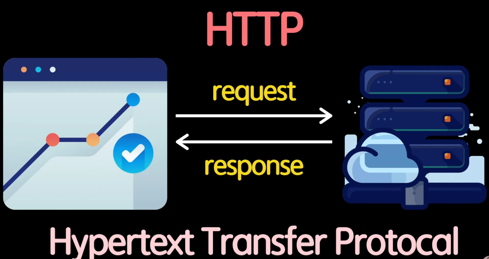
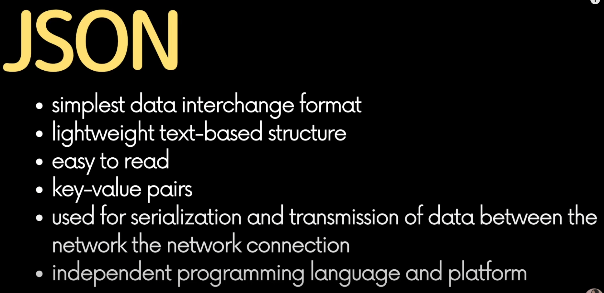
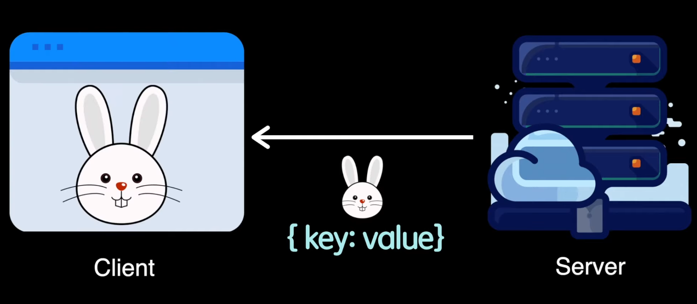
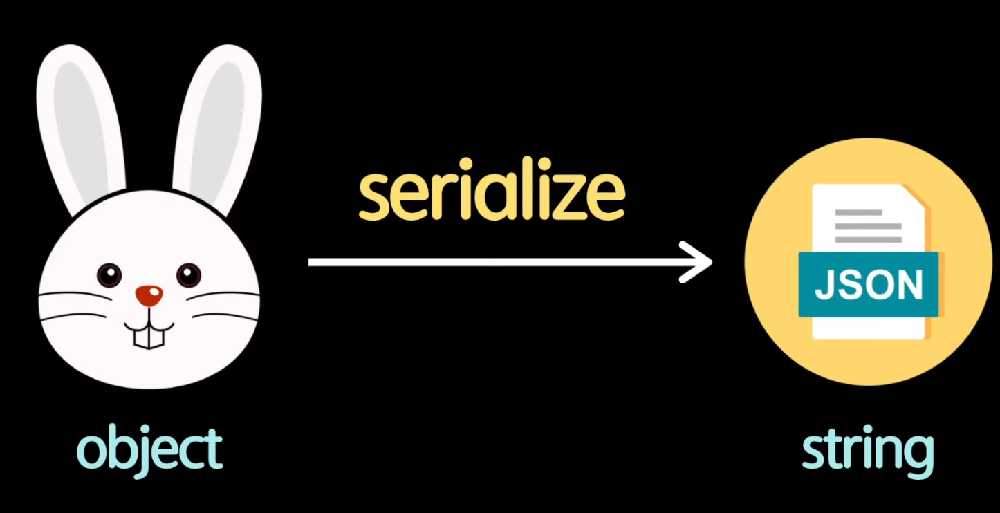
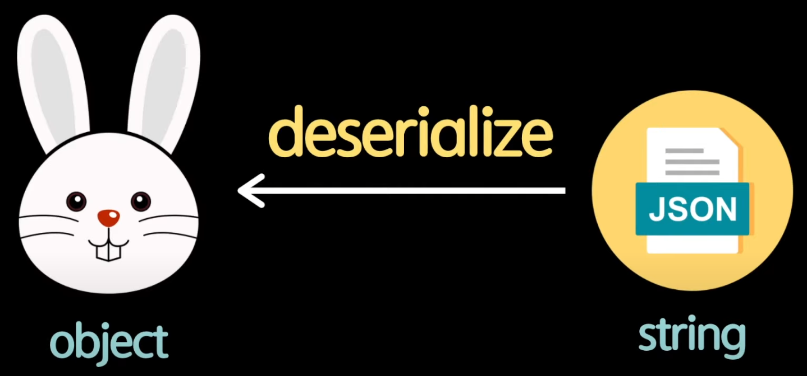

https://www.youtube.com/watch?v=FN_D4Ihs3LE&list=PLv2d7VI9OotTVOL4QmPfvJWPJvkmv6h-2&index=10


[stringify(obj)](#stringify(obj))
[parse(json)](#parse(json))
[JSON Diff](#JSON Diff)
[JSON Beautifier](#JSON Beautifier)
[JSON Parser](#JSON Parser)
[JSON Validator](#JSON Validator)


드디어 서버 통신의 시작, JSON에 대해서 알아보는 시간을 가져보겠다.

JSON은 무엇인지 기본 개념부터 시작해서, 자바스크립트에서 어떻게 활용할 수 있는지, 알아두면 짱 도움되는 유용한 웹사이트 알아보는 시간을 갖도록 하겠다.


브라우저 위에서 동작하고 있는 웹사이트나 웹어플리케이션과 같은 클라이언트들이 어떻게 서버와 통신할 수 있는지를 정의한 것이 바로 HTTP

Hypertext Transfer Protocol의 약자

어떻게 Hypertext를 서로 주고받을 수 있는지를 규약한 프로토콜의 하나.

HTTP는 Client가 Server에게 Data를 Request(요청)할 수 있고,

서버는 Client가 요청한 것에 따라서 그에 맞는 Response를 Client에 보내주는 방식으로 진행되는 것을 의미한다.




Hypertext는 웹상에서 이용되어지고 있는 Hyperlink만 얘기하는 것이 아니라, 전반적인 리소스들, 문서나 이미지 파일들, 이런 아이들을 다 포함해서 말한다.

이렇게 HTTP를 이용해서 서버에게 데이터를 요청해서 데이터를 받아올 수 있는 방법으로는,

AJAX를 썼다.

AJAX는 지난 javascipt 소개 영상때 잠깐 언급했었다.

바로 Asynchronous Javascript And XML의 약자이다.

웹페이지에서 동적으로 서버에게 데이터를 주고받을 수 있는 기술을 의미한다.

대표적인 예로는 XHR(XMLHttpRequest)라는 Object가 있다.

이 Object는 BrowserAPI에서 제공하는 Object 중 하나로,

이 Object를 이용하면 간단하게 서버에게 데이터를 요청하고, 받아올 수 있다.

최근 추가된 fetch API를 이용하면 간편하게 데이터를 주고받을 수 있다.

그치만 무조건 신상이라고 해서 함부로 사용할 수 없다.

IE에서 지원되지 않기 때문에 유의해서 사용해야 한다.


AJAX, XHR

반복해서 XML이 등장한다.

XML은 HTML과 같은 Markup 언어 중 하나이다.

태그들을 이용해서 데이터를 나타낸다.

HTML 첫 강의에서 잠깐 XML 언급했었다.

HTML과 마찬가지로 데이터를 표현할 수 있는 한 가지 방법.

'엘리, AJAX도 그렇고 XHR도 그렇고 반복해서 XML만 나오고 있는데, 서버와 데이터를 주고받을 때는 XML만 가능한가요?'

좋은 질문! 서버와 데이터를 주고받을 때는 XML뿐만 아니라 굉장히 다양한 File Format을 전달받을 수 있다.

여러분이 제목을 보고 유추할 수 있겠지만, JSON을 요즘에 많이 쓴다.

근데 왜 XML이란 이름이 지어졌냐?

AJAX, XHR이 활발히 개발되고 있을 당시, MS의 Outlook을 만드는 개발 팀이 활발히 참여해서 만들게 되었다.

이 때 Outlook은 server와 client data 전송을 할 때 XML을 사용했다.

그래서 XML을 HttpRequest 앞에다가 붙여서 개발하게 되었다.(XMLHttpRequest)

데이터를 주고받을 때는, XML 뿐만 아니라 다양한 타입의 데이터를 주고받을 수 있기 때문에, XML이라고 앞에 이름지은 것은 굉장히 큰 실수같음.

이것을 통해서 우리가 함수나 클래스, 오브젝트 이름을 정할 때, 특히 외부로 노출되는 API를 만들 때는, API의 이름을 명료하게 잘 지어야 한다는 교훈을 얻을 수 있다.


다시 브라우저로 돌아와서, 브라우저에서 서버와 통신할 때는 우리가 새로 추가된 fetch란 API를 사용할 수도 있고, 요즘도 많이 쓰여지고 있는 XMLHttpRequest란 Object를 이용해서 서버와 통신을 할 수도 있다.

이 XML을 사용하면 불필요한 태그들이 너무 많이 들어가서, File Size가 커질뿐만 아니라, 가독성도 좋지 않기 때문에 XML은 많이 사용되어지지 않는다.

대신 JSON이 많이 사용되고 있다.


JavaScript Object Notation의 약자

JavaScript와 관련된 파일인가? 유추 가능.

1999년도 ECMAScript 3rd에 쓰이는 Object에서 큰 영감을 받아서 만들어진 Data Format

JavaScript에서 Object를 보면, { key: value } 키와 벨류로 이루어져 있다.

JSON도 똑같이 Key, Value로 이루어져 있다.


JSON은 Browser뿐만 아니라 모바일에서도 서버와 데이터를 주고받는다.

서버와 통신을 하지 않고 Object를 File System에 저장할 때도 JSON data type을 많이 이용하고 있다.

아주 지루하게 text 위주로 정리해보자면..




- simplest data interchange format
  - 데이터를 주고받을 때 쓸 수 있는 가장 간단한 파일 포맷.
- 텍스트 기반으로 가볍다.
- 사람이 눈으로 읽기 편하다.
- 키, 벨류로 이루어져 있는 파일 포맷.
- data를 보통은 server와 주고받을 때, serialization을 위해 쓴다.
  - serialization: 직렬화하다 라고 직역이 된다.
  - 한국말이 더 어려운 듯. 직렬화하고 데이터를 전송할 때 쓰인다.
- (제일 중요한 포인트) programming language나 platform에 상관없이 쓰일 수 있다.

C, C++, C#, Java, Python, PHP, Kotlin, GO

이런 언어들에 상관없이 모든 언어와, 언어가 쓰여지고 있는 플랫폼에 상관없이 거의 대부분의 언어들이 JSON으로 Serialization된 Object를 다시 그 언어의 특징에 맞게 Object로 변환하고, Object를 다시 JSON으로 Serialization하는 것을 지원해주거나, 많이 쓰여지고 있는 외부 라이브러리를 통해서 이런 것들이 가능하게 된다.


한 가지 예시) 우리의 웹 어플리케이션에 토끼라는 Object가 있다면, 토끼 Object를 Server에 전송할 때는

토끼라는 Object를 key, value의 String type으로 변환해서 서버에 전송하게 되고,

서버에서 다시 토끼를 받아올 때도 key, value의 String type으로 토끼를 전송받아와서 다시 토끼라는 Object로 변환해서 Browser에 표기하게 된다.




JSON 공부 포인트

JSON 어떻게 공부해야 되는지 공부 방법이 명확해진다.

첫 번째: Object를 어떻게 serialize, 직렬화해서 JSON으로 변환할지

다른 하나는, 직렬화된 JSON을 어떻게 deserialize해서 Object로 다시 변환할건지

이 두 가지를 중점적으로 공부하면 된다.






우리 이제 코드를 보면서 어떻게 이용하면 되는지 알려드리겠다.


10-json.js

오늘 정말 간단하게 딱 두 가지만 알아보겠다.

먼저, 1. Object를 JSON으로 변환하는 방법과, 2. JSON을 Object로 변환하는 방법. 두 가지에 대해서 알아볼 것이다.

JSON이란 Object를 이용하면 간단하게 할 수 있다.

JSON.을 눌러보면 총 두 가지의 API가 있는 것을 확인할 수 있다. [parse, stringify]

이름으로 봤을 때 조금 유추해보자면, Object를 JSON으로 stringify, string으로 만드는거니까

아, stringify를 이용하면, JSON을 변환할 수 있겠지?

JSON으로 변환된 string을 뭔가 parsing해서 object로 만드니까,

아 parse를 이용하면 Object로 변환할 수 있겠구나 라고 약간 감이 오지 않나요?


우리가 stringify를 어떻게 사용할 수 있는지,

그리고 string으로 만들어진 JSON을 어떻게 Object로 변환할 수 있는지에 대해 알아보도록 하겠다.


### stringify(obj)

먼저, 간단한 데이터 타입부터 JSON으로 변환해볼 것이다.

JSON Object 안에 있는 두 가지 API중에, stringify를 이용하게 되면 Object를 JSON으로 변환할 수 있다.

```javascript
// 1. Object to JSON
// stringify(obj)
let json = JSON.stringify(true)
console.log(json)
```

이렇게 boolean type의 primitive type도 JSON으로 변환이 가능하다.

어떻게 나오는지 볼까요?

->  true로 나오는 것을 확인할 수 있다.

이제는 일일이 설명하지 않아도 마우스 API 키에 올리시거나, ctrl 키를 눌러서 API키가 정의된 곳으로 오셔서, 한 번씩 읽어보면서 확인하는 연습을 해보세요.

```javascript
interface JSON {
    /**
     * Converts a JavaScript Object Notation (JSON) string into an object.
     * @param text A valid JSON string.
     * @param reviver A function that transforms the results. This function is called for each member of the object.
     * If a member contains nested objects, the nested objects are transformed before the parent object is.
     */
    parse(text: string, reviver?: (this: any, key: string, value: any) => any): any;
    /**
     * Converts a JavaScript value to a JavaScript Object Notation (JSON) string.
     * @param value A JavaScript value, usually an object or array, to be converted.
     * @param replacer A function that transforms the results.
     * @param space Adds indentation, white space, and line break characters to the return-value JSON text to make it easier to read.
     */
    stringify(value: any, replacer?: (this: any, key: string, value: any) => any, space?: string | number): string;
    /**
     * Converts a JavaScript value to a JavaScript Object Notation (JSON) string.
     * @param value A JavaScript value, usually an object or array, to be converted.
     * @param replacer An array of strings and numbers that acts as an approved list for selecting the object properties that will be stringified.
     * @param space Adds indentation, white space, and line break characters to the return-value JSON text to make it easier to read.
     */
    stringify(value: any, replacer?: (number | string)[] | null, space?: string | number): string;
}
```

아, JSON이란 Interface 안에는 총 두 가지 API가 있구나

parse, stringify가 있다.

동일한 이름의 stringify 함수가 두 개 있고, 전달되는 매개변수가 약간 차이가 있다.

이런 아이들을 오버로딩(Overloading)이라고 한다.

함수의 이름은 동일하지만, 어떤 파라미터를 전달하냐, 몇 개의 파라미터를 전달하냐에 따라서 각각 다른 방식으로 호출이 가능하다.

그래서 결국은 총 2개의 API가 있는데, parse는 JSON에 string data를 넣으면[text:string], 어떤 type의 object로 변환이 되고[맨 뒤 any], 이렇게 전달해도 되고 안해도 되는 optional type의 콜백 함수 reviver이라는 것이 있는데, 이것은 읽어보시면 callback 함수인데 결과값을 변형한다 이런 느낌이죠?

그래서 우리가 string을 object로 변환할 때, object가 만들어지는 과정을 우리가 조금 더 세밀하게 조정하고 싶다면, 바로 revival 함수를 이용하면 된다. 나중에 예제로 보여드리겠다.


stringify는 어떠한 type의 object를 받아와서[value: any], 바로 string으로 변환해준다. [맨 끝에 string;]

string으로 만들 때 조금 더 세밀하게 통제하고 싶다면, callback함수를 전달하면 우리가 더 통제하면서 string으로 만들수가 있다.

이렇게 조금 문서를 읽어보면서 큰 그림을 읽어 본 다음에, API를 사용하면서..

사용할 때도 console.log를 이용하여 확인하면서 공부하시면 조금 더 쉽게 접근할 수 있습니다.


이제 배열을 한 번 JSON으로 변환해볼까요?

```javascript
json = JSON.stringify(['apple', 'banana']);
console.log(json);
```

배열 타입처럼 보이면서, single quote가 아니라 double quote로 들어가있는 것이 보인다.

' -> " [console창]

이것이 바로 JSON의 규격사항이다.

이런 식으로 어느정도 배열처럼 보이게 표기되는 것을 확인할 수 있다.


이제 Object를 한 번 JSON으로 변환해보겠다.

토끼라는 Object를 만들었다.

```javascript
const rabbit = {
  name: 'tori',
  color: 'white',
  size: null,
  birthDate: new Date(),
  // symbol: Symbol("id"),
  jump: () => {
    console.log(`${this.name} can jump!`);
  },
};
```

이름 토리, 색깔 하얀색, size는 일부러 null 넣음.

언제 태어났는지는 Date란 Object를 한 번 정의해보았다.

토끼는 jump하는 함수가 있다.

그냥 console.log를 출력한다.

이 rabbit을 JSON으로 변환하면 어떻게 될까요?

이렇게 토끼 object를 JSON으로 변환하게 되면, 

```javascript
json = JSON.stringify(rabbit);
console.log(json);
```

```
{"name":"tori","color":"white","size":null,"birthDate":"2021-10-28T15:01:12.180Z"}
```

이런 식으로 이름, 색깔, 사이즈, 탄생일은 date란 object가 string으로 변환되어서 JSON으로 만들어진 것을 확인할 수 있다.

jump란 함수는 JSON에 포함되지 않는 것을 확인할 수 있다.

이 함수는 Object에 있는 데이터가 아니기 때문에 함수는 제외되고,

javascript 자체로 들어있는 symbol같은 javascript에만 있는 특별한 데이터도 JSON에 포함되지 않습니다.

json으로 변환되는 것을 조금 더 통제하고 싶다면, 아까 살펴본 callback 함수를 이용하면 된다.

```javascript
json = JSON.stringify(rabbit, );
```

이렇게 뒤에 ,를 하게 되면, replacer라는 것이 있다.

함수 형태로 전달해도 되고, 밑에 내려보시면 array, 배열 형태로 전달하셔도 된다.

어떻게 동작하는지 한 번 살펴보자.


토끼 object에서 이름만 json으로 하고 싶다면,

배열에 property 이름만 전달하게 되면, 이름만 포함되어 나온다.

```javascript
json = JSON.stringify(rabbit, ['name']);
console.log(json);
```

```
{"name":"tori"}
```

이렇게 내가 원하는 property만 골라서 정의하게 되면, 해당하는 property만 JSON으로 변환이 된다.


이런 식으로 여러분들이 원하는 목록을 만드셔서 하셔도 된다.

```javascript
json = JSON.stringify(rabbit, ['name', 'color', 'size']);
console.log(json);
```


콜백함수를 이용해서 좀 더 세밀하게 통제할수도 있다.

array 대신에.. replacer는 key와 value를 전달받는다.

이렇게 key와 value를 전달받는 콜백함수를 전달하게 되면..

key, value에 따라서 우리가 조금 더 다양한 것들을 해볼 수 있다.

먼저, 어떤건지 궁금하니까 console에 출력해보면 더 도움이 되겠죠?

```javascript
json = JSON.stringify(rabbit, (key, value) => {
  console.log(`key: ${key}, value: ${value}`);
  return value;
});
console.log(json);
```

```
key: , value: [object Object]
key: name, value: tori
key: color, value: white
key: size, value: null
key: birthDate, value: 2021-10-28T15:41:33.278Z
key: jump, value: () => {
    console.log(`${this.name} can jump!`);
  }
{"name":"tori","color":"white","size":null,"birthDate":"2021-10-28T15:26:09.285Z"}
```


이렇게 모든 key, value들이 콜백함수에 전달되는 것을 확인할 수 있다.

조금 독특한 것 - 제일 처음으로 전달되는 것은 토끼의 object를 싸고 있는 제일 최상위 것이 전달되고,

그 뒤부터 key, value들이 전달되는 것을 볼 수 있다.

여기서 어떤 걸 할 수 있냐?


만약, 키가 이름이란 것이 들어오게 되면, 무조건 ellie라는 value로 설정하고,

key가 name이 아닌 경우는 원래 original value를 써야지 라고 설정하게 되면..

```javascript
json = JSON.stringify(rabbit, (key, value) => {
  console.log(`key: ${key}, value: ${value}`);
  return key === 'name' ? 'ellie' : value;
});
console.log(json);
```

```
key: , value: [object Object]
key: name, value: tori
key: color, value: white
key: size, value: null
key: birthDate, value: 2021-10-28T15:44:07.027Z
key: jump, value: () => {
    console.log(`${this.name} can jump!`);
  }
{"name":"ellie","color":"white","size":null,"birthDate":"2021-10-28T15:44:07.027Z"}
```

이름이 ellie로 변환되는 것을 확인할 수 있다.

우리가 조금 더 세밀하게 통제하고 싶을 때 callback 함수를 이용해서 쓸 수 있다.


### parse(json)

자, 이제 JSON을 object로 변환하는 parse에 대해 알아볼 것이다.

아까 JSON.stringify란 API를 이용해서, rabbit object를 JSON으로 변환했었다.

```javascript
// 2. JSON to Object
// parse(json)
console.clear();
json = JSON.stringify(rabbit);
```


이제 반대로 JSON으로부터 object를 만들어 볼 것이다.

너무 간단..

JSON에 있는 parse란 API를 이용해서 우리가 변환하고 싶은 JSON을 전달해주기만 하면 된다.

```javascript
const obj = JSON.parse(json);
console.log(obj);
```

```
{name: 'tori', color: 'white', size: null, birthDate: '2021-10-28T15:48:39.054Z'}
```

너무 간단..

토끼가 나오는 것을 확인할 수 있죠?


한 가지 포인트: rabbit이란 object엔 jump란 함수가 있었다.

하지만 변환한 object는 serializer가 된, 즉 string으로 만들어진 JSON으로부터 다시 object를 만들었기 떄문에, 함수는 serialize될 때 포함되지 않았죠?

우리가 다시 JSON으로부터 obj를 만들면, jump란 API가 없다.

그래서 이것을 출력하게 되면 에러가 발생.

```javascript
rabbit.jump();
// obj.jump(); // 에러 발생
```


무슨 일이 일어났죠?

토끼란 object를 JSON으로 변환할 때는 함수가 전혀 포함되어있지 않다.

data만 JSON으로 갔다가, 다시 JSON을 다른 object로 변환했으니까, 당연히 jump란 method는 포함되어 있지 않으니까 이 object에는 jump란 기능이 없다.

이 점을 유의하셔서 코딩하셔야 된다.


한 가지 더 중요한 포인트: 아까 토끼에는 birthDate란 object가 있었다.

이것은 date란 object.

getDate라는, date 안에 존재하는 API를 쓸 수가 있다.

얘를 한 번 출력해보게 되면..

```javascript
console.log(rabbit.birthDate.getDate());
```

29란 숫자가 나온다.


반대로, 우리가 json으로부터 만든[obj의] birthDate를 출력하게 되면..

```javascript
console.log(obj.birthDate.getDate());
```

에러가 발생한다.

birthDate는 바로 string이기 때문이다.


```javascript
console.log(obj.birthDate);
```

```
2021-10-28T16:08:14.999Z
```

보시면, JSON으로 만든 data 자체에 있는 string이 object에 할당이 된거죠?

잠깐 헷갈리시면, JSON을 한 번 출력해보시면 도움이 될 듯.

우리가 rabbit이란 object를 JSON으로 만들었을 때는, 이런 식으로 birthDate가 string 형태로 만들어졌기 때문에, 이 JSON을 다시 object 형태로 가져올 때도, 당연히 string으로 할당이 되어졌다.

하지만 이 rabbit 안에 있는 date는 바로 Date란 Object 자체였죠?

그래서 얘네들을 조금 더 세밀하게 다시 Date로 변환하고 싶을 때 callback 함수를 이용할 수 있다.


그래서 parse란 API를 보시면, reviver란 콜백 함수를 전달할 수 있다. 엄청 유용하겠죠? 한 번 전달해보면..

```javascript
const obj = JSON.parse(json, (key, value) => {
  console.log(`key: ${key}, value: ${value}`);
  return value;
});
```

key, value의 parameter를 받아서 무언가를 처리하는 콜백함수를 전달할 것이다.

일단 기본적으로는 value를 return하고, 아까 했던 것처럼 똑같이 출력해볼까요?

```
key: name, value: tori
key: color, value: white
key: size, value: null
key: birthDate, value: 2021-10-28T16:13:11.559Z
key: , value: [object Object]
{name: 'tori', color: 'white', size: null, birthDate: '2021-10-28T16:16:04.563Z'}
```

이렇게 모든 key와 value들이 출력되는 것을 볼 수 있다.


여기서 우리가 원하는 것: 만약 key가 birthDate면, 나는 birthDate를 새로운 Object, Date라는 Object를 만들거고, 만약 키가 birthDate가 아니면 원래 있던 value 그대로를 쓰자.

```javascript
const obj = JSON.parse(json, (key, value) => {
  console.log(`key: ${key}, value: ${value}`);
  // return value;
  return key === 'birthDate' ? new Date(value) : value;
});
```

```
key: name, value: tori
key: color, value: white
key: size, value: null
key: birthDate, value: 2021-10-28T16:16:04.563Z
key: , value: [object Object]
{name: 'tori', color: 'white', size: null, birthDate: Fri Oct 29 2021 01:16:47 GMT+0900 (한국 표준시)}
```

뭔가 조금 다르게 출력됐죠?

이제 getDate란 API를 이용하게 되면..

```javascript
console.log(obj.birthDate.getDate());
```

29가 출력되는 것을 확인할 수 있다.


오늘은 너무너무 간단한데요,

JSON에는 stringify와 parse가 있다.

각각 callback 함수를 전달해서, 우리가 좀 더 세밀하게 무언가를 통제할 수 있다.

여기까지 이해하시면 될 듯.

이해가 조금 되지 않는다면, 한 번씩 가지고 놀면서 여러분들이 한 번 써보셨으면 좋겠다.


유용한 사이트 몇 가지 알려드리겠다.

- ### JSON Diff

[http://www.jsondiff.com/](http://www.jsondiff.com/)

서버에게 요청했을 때 첫 번째로 받아온 데이터와 두 번째로 받아온 데이터가 어떤게 다른지 잘 모를 때 비교해보면 좋다.

compare 버튼을 누르면, 바뀐 부분을 알려준다.

문제를 디버깅할 때 유용


- ### JSON Beautifier

https://jsonbeautifier.org/

가끔 서버에서 받아온 JSON을 복사해서 붙여넣으면, 포맷이 망가지는 경우가 있다.

vscode에서 JSON 파일을 만드셔서 복붙해서 포멧하면 되지만,

간단하게 웹사이트에서 하실 수도 있다.

붙여넣은 다음에 Beautify 버튼을 클릭하시면, format이 이쁘게 만들어지는 것을 볼 수 있다.


- ### JSON Parser

https://jsonparser.org/

세 번째는 JSON Parser

JSON 타입을 Object 형태로 한 번 확인해보고 싶다면, 왼쪽에 JSON을 붙여넣고 JSON Parser 버튼을 누르시면..

JSON으로부터 Object가 어떻게 표기되어지는지 눈으로 쉽게 확인 가능.


- ### JSON Validator

https://tools.learningcontainer.com/json-validator/

마지막 네 번째로는 JSON Validator

JSON을 붙여넣어서 Validate를 누르면..

유효한 JSON 데이터이다.

콤마 하나 빼먹었다면..

여기서 문제가 생겼네 나타내준다.

JSON이 약간 이상할 때 이런 곳에 오셔서 확인해보시면 너무너무 도움이 되겠죠?

이거 외에도 굉장히 다양한 것들이 있다. 확인해보시면 좋을 듯.


실제 현업에서 플젝할 때 JSON 데이터가 굉장히 클 수 있다.

그래서 이런 property name들을 다시 minify하거나, compress하거나 조금 다양한 방식을 이용해서 최대한 서버와 주고받는 데이터의 양을 줄여서 하는 trick들이 많이 있다.

그런 것들을 다음에 다뤄보도록 하겠다.

어떻게 minify할 수 있는지 찾아보면 많은 도움이 될 듯.


서서히 서버 통신과 가까워지는 게 느껴지나요?

다음 시간엔 콜백과 프로미스 편에서 만나뵙도록 하겠습니다.