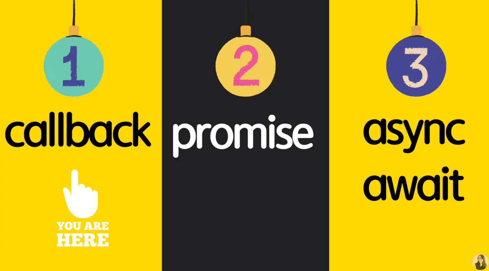
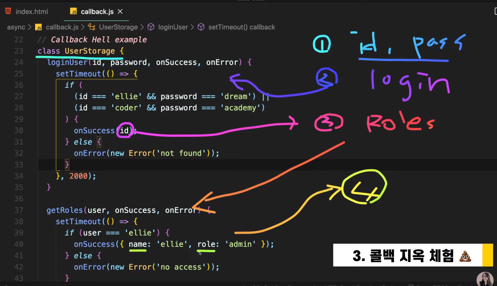

https://www.youtube.com/watch?v=s1vpVCrT8f4&list=PLv2d7VI9OotTVOL4QmPfvJWPJvkmv6h-2&index=11


[1_동기와-비동기](#1_동기와-비동기)
[2_콜백-마지막-정리](#2_콜백-마지막-정리)
[3_콜백-지옥-체험](#3_콜백-지옥-체험)
[4_콜백-체인의-문제점](#4_콜백-체인의-문제점)


지옥인 코드를 이쁘게 만들면서 희열을 느껴보자


비동기 프로그래밍의 첫 시작, 콜백에 대해 알아볼 것이다.

콜백은 우리가 이전에 많이 알아보고 사용해봤지만, 정확하게 콜백이 무엇인지, 어떤 경우에 어떻게 사용하면 안 되는지에 대해 한 번 정확하게 짚고 넘어가는 시간을 가져볼 것이다.

이번 영상을 포함하여 총 세 가지 영상에  걸쳐서, 비동기 프로그래밍은 무엇인지, 어떻게 사용하는 것이 더 좋은지, 현업에서는 어떤 경우에서 어떻게 사용하는 것이 조금 더 맞는지 여러분들에게개념부터 시작해서, 꿀팁까지 알려드리도록 하겠습니다.

네트워크 통신을 할 때 자신감있게 동기 처리를 할 수 있다.




async 폴더 - 11-callback.js


### 1_동기와-비동기

첫 번째로는 synchronous와 asynchronous에 대해 알아볼 것이다.

JavaScript is synchronous.

자바스크립트는 동기적인 아이이다.

hoisting이 된 이후부터 코드가 작성한 순서에 맞춰서 하나하나씩 동기적으로 실행된다.


호이스팅이 뭐였죠?

이전에 많이 설명해드렸고, 면접에서도 질문이 많이 나온다.

바로 var 변수, function declaration(함수 선언)들이 자동적으로 제일 위로 올라가는 것.

hoisting이 된 이후부터, 코드가 나타나는 순서대로 자동적으로 실행이 된다.

```javascript
`use strict`;

// JavaScript is synchronous.
// Execute the code block in order after hoisting.
// hoisting: var, function declaration
console.log('1')
console.log('2')
console.log('3')
```

작성한 1, 2, 3 순서대로 출력되는 것을 볼 수 있다.

synchronous는 정해진 순서에 맞게 코드가 실행되는 것.

asynchronous는 비동기적으로 언제 코드가 실행될지 예측할 수 없는 것을 말한다.

정말 좋은 예) setTimeout이란 web API가 있다.

Browser에서 제공되어지는 API로, 우리가 지정한 시간이 지나면 우리가 전달한 Callback 함수를 호출한다.

Callback 함수: 우리가 전달해준 함수를 나중에 니가 불러줘 란 개념.

배열, Array 편에서도(9강) Callback 함수를 이용해서 배열에 있는 map, filter, find 이런 API들을 많이 활용하는 연습을 했었다.


```javascript
declare function setTimeout(handler: TimerHandler, timeout?: number, ...arguments: any[]): number;
```

setTimeout이란 함수에는 handler: Timehandler란 콜백 함수를 전달해주고, timeout, 어느정도 시간에 timeout할 건지 시간을 지정해주는 인자가 있다.

```javascript
console.log('1')
setTimeout(function () {
  console.log('2')
}, 1000);
console.log('3')
```

우리가 콜백함수를 전달할 수 있구나..

우리가 지정한 시간은 ms.

1000ms = 1초.

1초가 지나면 우리가 전달한 함수가 실행되도록 한다. (console.log(2))


이렇게 하면..

1 3 2

어떻게 된 걸까요?

javascript 엔진은 코드를 맨 위에서부터 밑으로 실행하게 된다.

1 출력, setTimeout은 browser API

browser야 너에게 요청이 왔어, 1초 뒤에 이 전달한 콜백을 실행해줘

이렇게 잘 내부적으로 동작하는 것은 메시지 큐도 있고, 스펙, 마이크로테스크 같은 차이점들도 많이 있다.

다음에 정리해서 알려드림.

지금은, Browser API는 무조건 browser한테 먼저 요청을 보내게 된다.

응답을 기다리지 않고 바로 다음 console.log로 넘어가게 된다. 3 출력.

Browser에서 1초의 시간이 지난 다음에 다시 '야 1초 지났어 이 콜백함수 실행해'라고 얘기하면, 그 때서야 console.log('1')을 출력하게 된다. 이것이 asynchronous, 비동기적인 실행 방법.


### 2_콜백-마지막-정리

여기서 우리가 전달하는 이 함수 console.log('2')는 바로 실행되는 것이 아니라, setTimeout이라는 함수 안에 하나의 파라미터 인자로 우리가 지정한, 만든 함수를 전달해준다.

지금 당장 실행하진 않고, 니가 나중에 1초가 지난 다음에 내 함수를 실행해줘, 나중에 불러줘 이렇게 해서 call back.. 나중에 다시 불러줘 해서 전달하는 함수를 콜백함수라 한다.

보통은 이런 것들은 arrow function으로.. 일일이 함수라는 것을 선언하지 않고 간단하게 전달할 수 있다고 반복해서 설명드렸다.

```javascript
setTimeout(() => console.log('2'), 1000);
```


여기까지 간단하게 동기와 비동기에 대해서 알아보았다.

그럼 콜백은 항상 비동기일때만 쓸까요?

아니요. 콜백도 두 가지 경우로 나누어집니다.

즉각적으로 동기적으로 실행되는 Synchronous callback과,

나중에 언제 실행될 지 알 수 없는 Asynchronous callback 요 두 가지로 나누어서 한 번 생각해볼 수가 있다.

우리가 한 번 callback을 파라미터 인자로 받아서 일을 처리하는 함수를 만들어보겠다.

```javascript
// Synchronous callback
function printImmediately(print) {
  print();
}
printImmediately(() => console.log('hello'));
```

printImmediately 함수 만들어서, 뭔진 모르지만 print란 callback을 받아서 바로 실행하는 함수를 만들 수 있다.

printImmediately는 print란 함수를 바로 전달받죠?

javascript는 type이 아니라서, 어떤 type의 callback 함수를 받는지는 예측할 수 없지만, 

아무런 인자가 전달되지 않고, 간단하게 console.log를 출력하는 함수를 전달해보도록 하겠다.


hello가 바로 출력되고, 앞에 작성했던 2가 출력되는 것을 볼 수 있다.

javascript 엔진은 어떻게 동작했을까요?

함수의 선언은 hoisting -> printImmediately 함수의 선언을 맨 위로 보냈을 것.

순서대로 함수가 선언이 되었고, 1, 3, 함수 호출 후 프린트 -> hello, 2


비동기 콜백은 어떻게 구현할 수 있을까요?

```javascript
function printWithDelay(print, timeout) {
  setTimeout(print, timeout);
}
printWithDelay(() => console.log('async callback'), 2000);
```

printWithDelay라고 해서 print와, 얼마정도 timeout을 하고 싶은지 ms로 인자를 두 개 받아오도록 하겠다.

Browser API[setTimeout]를 이용해서 우리가 원하는 print라는 콜백함수를 호출하고, timeout이란 인자를 전달해서..

이 printWithDelay함수는 결국 setTimeout이란 함수를 감싸고 있는 Wrapping하는 함수.

전달받은 print와 timeout을 결국에는 setTimeout에 요청하는 것이죠?


우리가 이것을 호출하고 싶다면, 우리가 원하는 기능을 동작하는 콜백 함수를 전달해야 한다.

시간은 2초 정도..

(실행 후)이렇게 전달되는 것을 볼 수 있다.


javascript 엔진은 어떻게 이해했을까요?

아까와 똑같이 모든 함수의 선언은 hoisting되기 때문에, 선언이 제일 위로 올라가고 이런 순서로 실행.

```javascript
console.log('1')
setTimeout(() => console.log('2'), 1000);
console.log('3')
printImmediately(() => console.log('hello'));
printWithDelay(() => console.log('async callback'), 2000);
```

1 출력

브라우저에게 요청하고 빼놓음

3 출력

함수 호출 후 바로 출력

브라우저에게 요청

2 출력

async callback 출력


여기까지 동기와 비동기 차이점, callback 함수는 무엇인지, 어떻게 활용할 수 있는지, 콜백에도 동기적으로 실행하는 방법, 비동기적으로 실행하는 방법이 있다고 말씀드렸다.

javascript는 함수를 이렇게 콜백 형태로, 인자로 다른 함수에 전달할 수도 있고, 또는 변수에 할당할 수도 있는 그런 언어.

언어들마다 콜백을 지원하는 방식은 차이점이 있다.

subroutine, lambda expression, function pointer를 이용하는 방법도 있다.

javascript에서는 이런 식으로 콜백이 지원되는 것을 보여드렸다.


간단한 개념 설명은 여기까지..

콜백들로만 코드 작성시 별로.

콜백 함수는 유용하게 쓰일 때도 있지만, 콜백지옥..

콜백 함수를 계속 묶어나가서, resting하면서, 콜백 함수 안에서 다른 콜백 함수를 부르고 부르고... 하면서 콜백 지옥이라는 말이 발생했다.


### 3_콜백-지옥-체험

실제로 콜백 지옥 예제를 작성해보겠다.

나중에 promise, async await를 배우면 이 지옥인 코드를 이쁘게 변환해보면서 희열을 맛볼 것이다.


사용자의 데이터를 백엔드의 서버에게서 받아오는 class를 작성해보겠다.

```javascript
// Callback Hell example
class UserStorage {
  loginUser(id, password, onSuccess, onError) {

  }

  getRoles(user, onSuccess, onError) {

  }
}
```

UserStorage에는 총 두 가지의 API가 있다고 가정.

첫 번째 아이: 사용자 로그인. id, password 받아와서 로그인이 정상적으로 이뤄졌다면 onSuccess란 callback 함수를 사용자 데이터와 함께 호출.

존재하지 않는 사용자 / 비밀번호가 틀림 / 네트워크에 문제가 생기는 등 에러 발생 -> onError란 콜백함수 호출.

또 하나: getRoles. 사용자의 데이터를 받아서 사용자마다 갖고 있는 admin, guest같은 역할들을 서버에게 다시 요청해서 정보를 받아오는 API 있다고 생각.

원래는 사용자가 로그인하면, 로그인하는 사용자 정보 안에 관련된 정보를 한 번에 백엔드에서 받아오는 것이 맞다.

백엔드가 너무 오래 전 설계되어서, 사용자의 역할을 따로 네트워크 요청해서 다시 받아와야 하는 나쁜 백엔드로 가정..

사용자의 역할을 잘 받아오면 onSuccess 콜백 함수를 사용자의 역할과 호출.

문제가 있다면 onError를 호출해보는 함수를 만들어보겠다.


백엔드와 직접 통신하는 것까지는 배우지 않았고, 이런 실제 백엔드가 없기 때문에 setTimeout이란 API를 이용해 어느정도 시간의 delay를 주면서 network 통신을 하는 것처럼 만들어주겠다.

```javascript
  loginUser(id, password, onSuccess, onError) {
    setTimeout(() => {
      if (
        (id === 'ellie' && password === 'dream') ||
        (id === 'coder' && password === 'academy')
      ) {
        onSuccess(id);
      } else {
        onError(new Error('not found'));
      }
    }, 2000);
  }
```

로그인 유저란 함수를 호출하게 되면, 2초 뒤에 코드가 실행된다.

id, password가 조건에 맞다면, 우리가 전달받은 onSuccess란 callback을 불러준다.

id를 전달해준다.

만약 포함되지 않은 경우라면 onError 콜백을 불러주면서, Error라는 Object를 하나 만들어서 not found, 발견되지 않았어라고 전달해 줄 것이다.


다음으로는 사용자가 역할을 받아올 때 1초 뒤에 코드 블럭이 실행됨.

```javascript
  getRoles(user, onSuccess, onError) {
    setTimeout(() => {
      if (user === 'ellie') {
        onSuccess({ name: 'ellie', role: 'admin' });
      } else {
        onError(new Error('no access'));
      }
    }, 1000);
  }
```

사용자가 ellie면 onSuccess를 호출하면서, 이름은 엘리, 역할은 admin인 object를 전달.

ellie가 아니면 onError 콜백을 호출하면서 에러의 object를 만들면서 no access, 권한이 없어라고 전달해줄 것이다.

여기까지 이해 되시죠?

이 UserStorage 클래스를 이용해서 코딩해볼 것이다.


첫 번째로는 사용자에게 id와 password를 입력받아올 것이다.

입력받아온 id, password를 이용해서 첫 번째로는 서버에 로그인.

로그인 성공적으로 된다면, 로그인한 사용자의 id를 다시 받아온다.

받아온 아이디를 이용해서 roles, 역할을 요청할 것이다.

역할이 성공적으로 받아와진다면, 우리에겐 사용자 Object가 있겠죠?

이름과 역할이 들어있는..

얘네들을 출력해보는 것을 간단하게 해보겠다.




```javascript
userStorage.loginUser(
  id,
  password,
  user => {
    userStorage.getRoles(
      user,
      userWithRole => {
        alert(`Hello, ${userWithRole.name}, you have a ${userWithRole.role} role`);
      },
      error => {
        console.log(error);
      }
    )
  },
  error => {
    console.log(error);
  }
)
```

먼저 userStorage란 변수 선언.

class니까 new란 키워드로  UserStorage란 클래스를 만듦.

이제 이 클래스를 이용해서 백엔드와 통신을 한 번 해볼 것이다.


그 다음으로는 사용자에게 id를 받아올 것이다.

간단하게 browser API 중 하나인 prompt를 이용해보겠다.

password도 prompt로 가져온다.


이런 식으로 사용자에게 데이터를 받아와서.. 뭘 해야 하죠?

userStorage를 이용해서 로그인을 해야 합니다.

받아온 id와 password를 전달하고, onSuccess와 onError 두 개를 전달해줘야 한다.

성공하게 되면 사용자의 데이터를 받아온다. 그냥 아이디 전달해주지만 사용자라고 한 번 ㅎㅎ 가정.

성공해서 사용자를 받아왔을 때 처리하려는 코드 블럭과,

사용자를 받아오는 데 실패했을 때, 에러가 전달될 때 실행하는 두 가지가 있었죠?

일단 에러가 발생하면 console.log에 출력을 해보도록 하겠다.

사용자가 로그인이 되었다면 로그인된 정보를 이용해서 userStorage.getRoles(). 사용자의 역할을 받아와야 하죠?

사용자의 user를 이용해서, 사용자와, onSuccess, onError라는 콜백을 전달해줘야 하죠?

userWithRole, 데이터가 들어오면 이것을 다시 처리해주는 콜백함수 하나와,

다시 에러가 발생하면 처리해주는 콜백함수를 전달해주면 된다.

에러 처리시 간단하게 console.log를 출력해준다.

사용자의 데이터를 받아오면 이것을 가지고..

이 블럭이 실행되려면, 사용자가 성공적으로 로그인이 되고, 사용자의 Roles를 잘 받아왔을때만 코드 블럭이 실행된다.

사용자에게 로그인이 잘 됐다는 message를 출력해볼 것이다.


이것을 실행해볼까요?

(실수 바로잡기 -> user.name -> userWithRole.name)

로그인했을 때 받아오는 user는 id만 있다.

userWithRole라는 콜백함수에 주어진 데이터를 이용해서 유저의 이름과 role을 출력할 수 있다.


ellie / dream 입력시 alert 뜸.

없는 것으로 하면 console.log로 출력 -> not found라고 나온다.


### 4_콜백-체인의-문제점

문제점이 무엇일까요?

콜백을 이용해서 callback 함수 안에서 무언가 다른 것을 호출하고, 그 안에서 또 다른 콜백 함수를 전달하고.. 다른 것을 호출하고..

이것이 바로 콜백 지옥.

문제점

1. 읽기 너무 거북. 가독성이 너무 떨어진다.

   어디서 어떤 식으로 연결되어 있는지 한 눈에 가늠하기도 어렵고, 비즈니스 로직을 한 눈에 이해하기 어렵다.

   로그인한 다음에, 로그인한 데이터를 이용해서 사용자의 역할을 받아오는구나

   이것을 한 눈에 알아보기가 굉장히 어렵다.

   나중에 에러가 발생하거나 디버깅해야할 경우에도 굉장히 어렵다.

   만약 무슨 문제가 생기면, 어떤 에러에서 처리가 되는지.. 점점 chain이 길어질수록 디버깅, 문제 분석 어렵. 유지 보수도 어렵.

   이런 이유도 콜백지옥이란 말이 많이 나오고, 이런 식으로 코딩하는 것은 좋지 않다.

이어지는 promise, async await 편에서 어떻게 비동기 코드를 깔끔하게 작성할 수 있는지, 그리고 조금 더 병렬적으로, 효율적으로 네트워크 통신을 해나갈 수 있는지에 대해 알아보는 시간을 갖도록 하겠다.

너무 중요한 기본적인 지식이니, 이해되지 않는다면 곱씹어가면서 여러분들 것으로 소화하시고,

코드를 조금씩 바꿔가면서 작성해보시고, console.log를 중간중간 넣으면서 이해하는 시간 갖길 바람.

다음 시간 promise 편에서 만나도록 하겠다.

