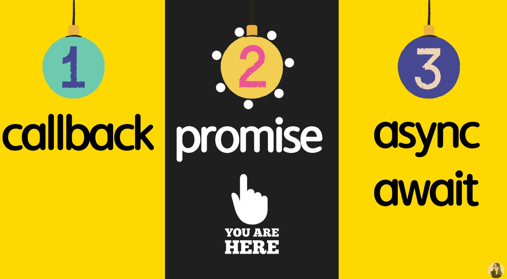

https://www.youtube.com/watch?v=JB_yU6Oe2eE&list=PLv2d7VI9OotTVOL4QmPfvJWPJvkmv6h-2&index=12


[1_Promise-만들기](#1_Promise-만들기)

[2_Promise-사용하기](#2_Promise-사용하기)

[3_Promise-연결하기](#3_Promise-연결하기)

[4_오류를-잘-처리-하자](#4_오류를-잘-처리-하자)

[5_Be-Bright](#5_Be-Bright)


오늘 드디어 promise에 대해 알아보는 시간

지난 비동기 첫 번째 callback편: 콜백은 무엇인지, 어떻게 콜백을 작성하면 콜백 지옥이 되는지 알아보았다.

이번 promise 편: promise는 무엇인지, 콜백을 대체해서 어떻게 깔끔하게 작성할 수 있는지 알아보는 시간을 가져보겠다.




promise. 한국어로 약속.

자바스크립트에서 제공하는 비동기를 간편하게 처리할 수 있도록 도와주는 object

정해진 장시간의 기능을 수행하고 나서, 정상적으로 기능이 수행되었다면 성공의 메시지와 함께 처리된 결과값을 보여준다.

만약 기능을 수행하다가 예상치 못한 문제가 발생했다면 에러를 전달해준다.

한 가지 예를 들어서 설명하면, 드림코딩 아카데미에서 준비중인 코스가 언제 완성될지 모른다.

관심 있는 학생들은 미리 이메일을 통해서 등록할 수 있는 시스템이 있다고 가정해보자.


한 학생 분이 등록을 완료하게 되면, 몇 시간, 몇 일 뒤 코스가 오픈되면 바로 메일로 공지가 온다.

수업이 준비되기 전에 미리 등록해놨기 때문에 수업이 완료되자마자 공지를 받을 수 있었다.

수업 이미 오픈 뒤 뒤늦게 사전공지창 발견. 등록

수업 이미 오픈되었기 때문에 바로 메일로 공지가 오고 수업 참여 가능.


간단하게 추상적으로 promise에 대해 알려드렸다.

코드를 보면서 어떻게 콜백을 쓰지 않고 promise object를 통해서 비동기 코드를 깔끔하게 처리할 수 있는지 코드로 알아보는 시간을 가져보겠다.


async/12-promise.js 만들기


우리가 오늘 배울 promise는 바로 javascript 안에 내장되어져 있는 object

promise object는 async operation을 위해서 쓰인다.

비동기적인 것을 수행할 때 콜백 함수 대신에 유용하게 쓸 수 있는 object.

promise는 딱 두 가지만 포인트를 잡고 공부하면 된다.

1. state(상태)

process가 heavy(무거운)한 operation을 수행하고 있는 중인지, 아니면 기능 수행이 완료가 되어서 성공했는지 / 실패했는지를 이해했는지가 중요하다.

2. producer / consumer의 차이를 아는 것.

우리가 원하는 데이터를 producing, 제공하는 사람과, 이 제공된 데이터를 쓰는 사람, 필요로 하는 사람. 이 두 가지의 차이점을 잘 이해하시면 좋을 것 같다.

정보를 제공하는 producer와 정보를 소비하는 소비자의 두 가지 다른 견해를 이해하시면 좋을 것 같다.

이것을 염두에 두고 알아보자.


노트로 정리해보면..

promise의 상태는 promise가 만들어져서 우리가 지정한 operation이 수행중일 때는 pending 상태가 된다.

opeartion이 성공적으로 끝나게 되면 fulfilled state가 된다. 완벽하게 완료한 상태.

아니면 파일을 찾을 수 없거나 네트워크에 문제가 생긴다면, rejected state가 된다.

promise에는 우리가 원하는 기능을 수행해서 해당하는 데이터를 만들어내는 producer, 즉 promise object겠죠? 이거와 우리가 원하는 데이터를 소비하는 consumer로 나눠진다고 말씀드렸다.

```javascript
// Promise is a JavaScript object for asynchronous operation.
// State: pending -> fulfilled or rejected
// Producet vs Consumer
```


### 1_Promise-만들기

자, 이제 첫 번째 Producer part부터 공부해보도록 하겠다.

먼저, 우리가 원하는 기능을 비동기적으로 실행하는 promise를 만들어보겠다.

```javascript
// 1. Producer
// when new Promise is craeted, the executor runs automatically.
const promise = new Promise((resolve, reject) => {
  // doing some heavy work (network, read files)
  console.log('doing something...');
})

```

Promise는 class이기 때문에, new라는 keyword를 이용해서 object를 생성할 수 있다.

Promise의 생성자를 보시면[마우스 갖다대기], 바로 executor라는 callback함수를 전달해줘야 한다.

이 콜백함수에는 또 다른 두 가지 콜백 함수를 받습니다.

바로 resolve, 기능을 정상적으로 수행해서 마지막에 최종 데이터를 전달하는 콜백함수와,

기능을 수행하다가 중간에 문제가 생기면 호출하게 될 reject, 두 가지로 나누어져 있는 것을 확인해볼 수 있다.


두 가지 resolve, reject를 받는 executor를 한 번.. 콜백함수를 만들면 된다.


이렇게만 하면, 우리가 promise object를 만들었습니다~

보통은 promise 안에서 조금 헤비한 일들을 하겠죠?

왜냐하면, 네트워크에서 데이터를 받아오거나, 파일에서 무언가 큰 데이터를 읽어오는 과정은 시간이 꽤 걸린다.

그런 것을 동기적, synchronous로 처리하면, 파일을 읽어오고 네트워크에서 데이터를 읽어오는동안, 그 다음 라인의 코드가 실행되지 않기 때문에 시간이 조금 걸리는 일들은 이렇게 promise를 만들어서 비동기적으로 처리하는 것이 좋다.

네트워크 통신, 파일 읽기 이런 것들은 다 비동기적으로 처리하는 것이 좋다.

우선 console.log를 출력해보자.. doing something

바로 doing something이 나옴.


한 가지 알 수 있는 사실 -> promise라는 것을 만드는 순간, 우리가 전달한 executor라는 콜백함수가 바로 실행되는 것을 확인할 수 있다.

이 말인즉슨, 만약 여러분들이 promise 안에 네트워크 통신을 하는 그런 코드를 작성했다면, promise가 만들어지는 그 순간 바로 네트워크 통신을 수행하게 된다.

여기서 한 가지 우리가 배울 수 있는 중요한 포인트 - 만약 네트워크 요청을 사용자가 요구했을때만 해야되는 경우라면, 즉 사용자가 버튼을 눌렀을 때 네트워크 요청을 해야되는 경우라면 이런 식으로 작성하면 사용자가 요구하지도 않았는데 불필요한 네트워크 통신이 일어날 수 있다.

promise를 만드는 순간, 그 안에 전달한 executor란 콜백함수가 바로 실행되기 때문에, 이 점을 조금 유의하셔서 공부하셔야 한다.

이 사실을 조금 간과하고 넘어갔다가, 불필요한 네트워크 통신을 하는 경우가 있다.

그래서 이것을 꼭 적어놓으셨으면 좋겠다.

새로운 promise가 만들어질때는, 우리가 전달한 executor라는 콜백함수가 바로 실행이 된다. 자동적으로.

꼭 적어놓고 염두에 둔 채로 코드를 작성하면 좋을 것 같다.


여기까지 잘 따라오신다고 가정하고..

이제 이 promise 안에서 네트워크 통신을 하는 것처럼 setTimeout을 이용해서 시간의 delay를 주겠다. 2초 정도.

```javascript
const promise = new Promise((resolve, reject) => {
  // doing some heavy work (network, read files)
  console.log('doing something...');
  setTimeout(() => {
    resolve('ellie');
  }, 2000);
})
```

이 안에서는 '우리가 기능을 성공적으로 수행했어!' 라고 한다면, resolve라는 콜백함수를 호출하면 된다.

데이터를 받아왔는데, 사용자의 이름은 엘리였어 라고 성공적으로 네트워크에서 받아온, 또는 파일에서 읽어온, 그것들을 가공한 데이터를 resolve란 콜백함수를 통해 전달하면 된다.


이 promise는 어떤 일을 2초 정도 무언가를 하다가, 결국 일을 잘 마무리해서 resolve라는 callback 함수를 호출하면서 ellie라는 값을 전달해주는 promise를 만들어 봤다.


### 2_Promise-사용하기

이렇게 멋있는 promise라는 producer를 만들어놨으니, 이제 이걸 이용하는 consumers를 한 번 만들어봐야 한다.

consumers는 then, catch, 최근에 추가된 finally를 이용해서 값을 받아올 수 있다.

무슨 말이냐면, 여기서 promise란 변수를 만들었죠?

promise 값이 정상적으로 잘 수행된다면, 내가 어떤 값을 받아올꺼야. 받아와서 원하는 기능을 수행하는 콜백함수를 전달해주면 된다.

```javascript
const promise = new Promise((resolve, reject) => {
  // doing some heavy work (network, read files)
  console.log('doing something...');
  setTimeout(() => {
    resolve('ellie');
  }, 2000);
})

// 2. Consumers: then, catch, finally
promise.then((value) => {
  console.log(value);
})
```


여기서 value란 parameter는 promise가 정상적으로 잘 수행이 되어서 마지막으로 resolve 콜백함수에서 전달된 ellie란 값이 여기에 들어오겠죠?

value가 들어오면 console로 출력을 해보겠다.

ellie가 출력되는 것을 확인할 수 있죠?

즉, then은 promise가 정상적으로 잘 수행이 되어서 마지막 최종적으로 resolve 콜백함수를 통해서 전달한 값이 value의 parameter로 전달되어 들어오는 것을 확인할 수 있다.

Q) 그럼 우리가 resolve 말고 reject를 쓰면 어떻게 되나요?

너무 좋은 질문이에요. 만약 network를 하다가 무언가 실패함.

이제 resolve 대신 reject를 호출해보도록 하겠습니다.


```javascript
// 1. Producer
// when new Promise is craeted, the executor runs automatically.
const promise = new Promise((resolve, reject) => {
  // doing some heavy work (network, read files)
  console.log('doing something...');
  setTimeout(() => {
    // resolve('ellie');
    reject(new Error('no network'));
  }, 2000);
})
```

reject는 보통은 Error란 object를 통해서 값을 전달한다.

여기서 Error란 class는 javascript에서 제공하는 object중의 하나이다.

무언가 Error가 발생했다는 것을 나타내는 object.

이것도 다루려면 양이 꽤 많아서 다음에 error handling part에서 알려드리도록 하겠다.

보통 error object에는 어떤 에러가 발생했는지 이유를 잘 명시해서 작성해야 된다.

no network란 에러를 발생시켜보자.

이것을 실행해보면.. 에러 발생.

메시지를 읽어보면 Uncaught, 잡히지 않은 에러가 발생했다.

그 말은, 우리가 then을 이용해서 성공적인 case만 다루었기 때문에, Uncaught, 잡히지 않은 에러가 발생했다 라고 한다.

여기서 Error handling을 어떻게 잘 할 수 있냐?

첫 번째로 우리가 promise에서 then이란 API를 이용해서 성공적인 케이스를 잘 다뤘다면, 

catch라는 함수를 이용해서 에러가 발생했을 때 어떻게 처리할 것인지 콜백함수를 등록해주면 된다.

```javascript
// 2. Consumers: then, catch, finally
promise
  .then((value) => {
  console.log(value);
  })
  .catch(error => {
    console.log(error);
  })
```


이렇게 해서, 더 이상 에러가 발생하지 않고 우리가 받아온 에러가 console.log에 출력되는 것을 확인할 수 있다.

여기서 조금 헷갈려하시는 분들이 계실 듯..

promise의 then을 호출하게 되면, then은 결국 똑같은 promise를 return하기 때문에 그 return된 promise의 catch를 다시 호출할 수가 있다.

이것을 chaining이라고 한다.

우리가 지난 시간에 array 편에서도[9강 맨 마지막 부분 Bonus], API들을 묶고 묶어서, 결국은 map도 똑같은 array를 return하기 때문에, return된 array의 sort 함수를 호출하고, sort 함수에서 return된 문자열에 join을 이용한 것처럼, promise에서도 then을 호출하게 되면, 다시 promise가 return되고, return된 promise에 catch를 등록하는 것이다.

```javascript
// Bonus! do Q10 sorted in ascending order
// result should be: '45, 66, 80, 88, 90'
{
  const result = students.map(student => student.score)
  .sort((a, b) => a - b)
  // .sort((a, b) => b - a) // 내림차순
  .join();
  console.log(result);
}
```


요기까지 이해가 잘 되셨을까요? 알고보면 너무 간단.

promise object를 만들 때, 우리가 비동기적으로 수행하고 싶은 기능들의 코드를 작성하고 나서, 성공적으로 잘 되면 resolve를 호출하게 되고, 실패했다면 실패한 것과 왜 실패했는지 에러를 전달하게 된다.

나중에 promse를 이용해서, then과 catch를 이용해서 성공한 값, 또는 실패한 에러를 받아와서 우리가 원하는 방식으로 처리해주면 된다.


최근에 추가된 것이 하나 있는데요, 바로 finally란 아이.

성공 실패와 상관없이 무조건 호출되는 아이.

아무런 인자를 받지 않고 console.log 출력

```javascript
promise
  .then((value) => {
  console.log(value);
  })
  .catch(error => {
    console.log(error);
  })
  .finally(() => {
    console.log('finally');
  })
```


실패했을 때도 error callback함수가 처리되고 나서, finally가 호출되는 것을 확인할 수 있다.

만약 위에서 reject 대신에 resolve를 쓰면.. [reject 주석처리, resolve 주석해제]

ellie라는 성공적인 callback함수가 수행되고 나서, 무조건 finally가 실행되는 것을 볼 수 있다.

성공하든 실패하든 상관 없이 어떤 기능을 마지막으로 수행하고 싶을 때 finally를 사용할 수 있다.


### 3_Promise-연결하기

알아두면 너무 유용한 promise chaining에 대해 한 번 알아볼 것이다.

재밌는 예제를 통해 알아보겠다.

서버에서 숫자를 받아오는 새로운 promise를 만들 것이다.

자꾸 서버 통신이라고 해놓고 setTimer쓰는거 감이 오시죠? ㅎㅎ


```javascript
// 3. Promise chaining
const fetchNumber = new Promise((resolve, reject) => {
  setTimeout(() => resolve(1), 1000);
})
```

Promise는 resolve와 reject라는 콜백 함수를 받는 executor라는 콜백 함수를 전달해줘야 되죠?

그리고 서버 통신을 해야하니까.. 1초정도 있다가 숫자를 전달해주는 promise를 만들어보겠다.

이 promise는 1초 있다가 숫자 1을 전달하겠죠?


```javascript
fetchNumber
  .then(num => num * 2)
  .then(num => num * 3)
  .then(num => {
    return new Promise((resolve, reject) => {
      setTimeout(() => resolve(num - 1), 1000);
    });
  })
  .then(num => console.log(num));
```

fetchNumber란 promise를 then..

fetching number가 성공적으로 잘 되면, 그 숫자를 이제는 두 배로 곱하고,

다시 그 숫자를 세 배로 곱하고,

그 숫자를 다른 서버에 보내서 다른 숫자로 변환된 값을 받아올 것이다.

새로 Promise를 return. 이 Promise는 다른 서버랑 통신을 하겠죠?

resolve, reject를 받아서, 다시 setTimeout을 이용해서 숫자에 1을 뺀 값을 다시 resolve를 통해서 전달해보도록 하겠다.

이렇게 한 다음에, 그 숫자를 출력해보도록 하겠다. 최종적으로 쓰는거죠?


이렇게 하면, 실행하기 전에.. 1이 전달됨.

1*2 = 2

2*3 = 6

새로운 Promise를 전달.

6-1 = 5

5가 전달되어서 5가 출력된다.

여기서 조금 헷갈릴 수도 있을 것 같은데요,

then은 값을 바로 전달할 수도 있고요, promise를 전달해도 됩니다.

아 또다른 비동기인 promise를 전달해도 되는구나


이것이 최종적으로 출력되는 데에 걸리는 시간은 1+1 = 2

이렇게 then then then then, 여러 가지를 동시에 묶어서 다른 비동기적인 아이들을 묶어서 처리할 수도 있습니다.


### 4_오류를-잘-처리-하자

네 번째로는, 이렇게 promise를 training했을 때, 어떻게 error를 handling할 수 있는지에 대해 알려드리도록 하겠습니다.

```javascript
// 4. Error Handling
const getHen = () =>
  new Promise((resolve, reject) => {
    setTimeout(() => resolve('hen'), 1000);
  });
const getEgg = hen =>
  new Promise((resolve, reject) => {
    setTimeout(() => resolve(`${hen} => egg`), 1000);
  });
const cook = egg =>
  new Promise((resolve, reject) => {
    setTimeout(() => resolve(`${egg} => friedegg`), 1000);
  });
```

정말 재밌는 예제를 만듦. 총 세 가지의 promise를 return하는 함수가 있다.

getHen: 암탉을 받아옴. 1초 있다가 닭을 return

getEgg: 치킨을 받아서, 치킨으로부터 달걀을 얻어오는 promise를 return

cook: 달걀을 받아와서 fried egg를 만든다.


```javascript
getHen()
  .then(hen => getEgg(hen))
  .then(egg => cook(egg))
  .then(meal => console.log(meal));
```

서버에서 닭 받아오고, 달걀 받아오고 요리까지 하는 것으로 가정해서 해보겠다.

닭을 받아와서, 받아와지면 전달받은 닭을 이용해서 getEgg 함수를 호출.

그것이 정상적으로 수행되면 받아온 달걀을 가지고 cook, 요리를 할 것이다.

요리가 완료된 다음에는, 문자열이 출력됨.

요리된 음식을 console.log에 출력해보도록 하겠다.


시간 3초 소요 예정

실행해볼께요..

`hen => egg => friedegg`

이렇게 나오는 것을 볼 수 있다.

닭을 받아서 계란을 만든 다음에, 계란을 이용해서 fried egg를 만들었다.

우리가 먼저 암탉을 받아왔고, 얻어진 암탉을 이용해 달걀을 만들었고, 얻어진 달걀을 이용해 맛있는 프라이드 에그를 만들었다.

최종적으로 만ㄷ르어진 문자열이 출력되었다.


여기서 코드를 조금 깔끔하게 작성할 수 있다.

콜백함수를 전달할 때, 받아오는 value를 다른 함수로 바로 하나를 호출하는 경우에는

`.then(hen => getEgg(hen))`

생략이 가능합니다.

`.then(getEgg)`

그러면, 자동으로 then에서 받아오는 value를, 바로 getEgg라는 함수에 암묵적으로 전달해서 호출해준다.

한 가지만 받아서 고대로 전달하는 경우엔 이렇게 생략이 가능하다.

```javascript
getHen() //
  .then(getEgg)
  .then(cook)
  .then(console.log)
```

깔끔하게 출력 가능.

prettier format에서 한 줄로 바꿔준다.

한 줄로 작성하면 가독성이 좋지 않기 때문에, // 주석을 붙여서 한 줄 한 줄씩 나오게 하는 것을 확인할 수 있다.


만약 달걀을 받아오는 부분에 네트워크 문제가 생겨 실패하면 어떻게 될까요?

```javascript
const getEgg = hen =>
  new Promise((resolve, reject) => {
    // setTimeout(() => resolve(`${hen} => egg`), 1000);
    setTimeout(() => reject(new Error(`error! ${hen} => egg`)), 1000);
  });
```


`Uncaught (in promise) Error: error! hen => egg
    at 12-promise.js:53`

우리가 어떤 error handling도 하지 않았기 떄문에, 똑같이 Error를 핸들링하지 않았네 라고 exception 에러가 발생하는 것을 볼 수 있다.

우리가 제일 마지막에 catch를 작성하게 되면..

``` javascript
getHen() //
  .then(getEgg)
  .then(cook)
  .then(console.log)
  .catch(console.log);
```

달걀을 받아오는 부분에서 에러가 발생했지만, 에러가 제일 밑으로 전달되면서 catch가 잡혀지는 것을 볼 수가 있다.

`Error: error! hen => egg
    at 12-promise.js:53`

여기서 만약, 우리가 달걀을 받아올 때 무슨 문제가 생긴다면, 우리가 준비한 다른 재료로 대체하고 싶다.

Error를 잘 핸들링하고 싶어요

계란을 받아올 때 문제가 생긴다면, 우리가 다른 것을 전달해줄꺼야

달걀 대신 빵을 리턴해주는 것을 해보겠습니다.

```javascript
getHen() //
  .then(getEgg)
  .catch(error => {
    return 'bread';
  })
  .then(cook)
  .then(console.log)
  .catch(console.log);
```

전달되어진 에러를 잘 처리해서, 빵으로 대체해서, 즉 계란을 받아오는 데에 문제가 생겨도, 전체적인 Promise chain에 문제가 발생하지 않도록 빵꾸처리를 해주는 것.

이것을 실행해보면..

`bread => friedegg`

비록 우리가 계란을 받아오는 것엔 실패했지만, 빵을 대신 전달해줬기 때문에 promise chain이 실패하지 않고, 결국 마지막에 맛있는 요리까지 완성된 것을 확인할 수 있다.

.then(getEgg) 에서 발생되는 에러를 처리하고 싶을 때는, 바로 그 다음에 catch를 작성하면서 바로바로 문제를 해결할 수 있다.

만약 여기서 처리를 안해주면, 계란을 받아오는 곳에서 실패했기 때문에, 요리가 완성되지 않는 것을 확인할 수 있다.

이런 부분을 순서를 변경해가면서 어떤 식으로 처리가 됐는지 한 번 가지고 놀면 이해하는 데 도움이 될 것 같습니다.


### 5_Be-Bright

여기까지 잘 따라오고 계신가요?

너무 어렵지 않았으면 좋겠다.

다섯 번째로는, 우리가 지난 시간에 만든 callback hell[11-callback.js]을 다시 이쁘게, Promise를 이용해서 작성해보도록 하겠다. [Callback Hell example 이하]

12-callback-to-promise.js


이 아이를 promise를 이용하는 것으로 바꿔보시고,

callback hell을 promise chaining으로 바꿔보실까요?


이전 코드

```javascript
'use strict';

// Callback Hell example
class UserStorage {
  loginUser(id, password, onSuccess, onError) {
    setTimeout(() => {
      if (
        (id === 'ellie' && password === 'dream') ||
        (id === 'coder' && password === 'academy')
      ) {
        onSuccess(id);
      } else {
        onError(new Error('not found'));
      }
    }, 2000);
  }

  getRoles(user, onSuccess, onError) {
    setTimeout(() => {
      if (user === 'ellie') {
        onSuccess({ name: 'ellie', role: 'admin' });
      } else {
        onError(new Error('no access'));
      }
    }, 1000);
  }
}

const userStorage = new UserStorage();
const id = prompt('enter your id');
const password = prompt('enter your password');
userStorage.loginUser(
  id,
  password,
  user => {
    userStorage.getRoles(
      user,
      userWithRole => {
        alert(`Hello, ${userWithRole.name}, you have a ${userWithRole.role} role`);
      },
      error => {
        console.log(error);
      }
    )
  },
  error => {
    console.log(error);
  }
)


```


```javascript
// Callback Hell example
class UserStorage {
  loginUser(id, password) {
    return new Promise((resolve, reject) => {
      setTimeout(() => {
        if (
          (id === 'ellie' && password === 'dream') ||
          (id === 'coder' && password === 'academy')
        ) {
          resolve(id);
        } else {
          reject(new Error('not found'));
        }
      }, 2000);
    });
  }
```

먼저, loginUser API는 더이상 콜백 함수를 전달받을 필요가 없다.

onSuccess, onError 삭제

그리고 우리가 Promise를 return할 것이다.

Promise 안에서 2초 있다가, 우리가 원하는 login하는 기능을 수행하는 함수를 일단 만들어본다.

로그인이 잘 된다면, onSuccess 대신에 resolve(id)를 전달해준다.

실패한다면 reject를 이용해서 에러를 전달해준다.


```javascript
  getRoles(user) {
    return new Promise((resolve, reject) => {
      setTimeout(() => {
        if (user === 'ellie') {
          resolve({ name: 'ellie', role: 'admin' });
        } else {
          reject(new Error('no access'));
        }
      }, 1000);
    });
  }
}
```

똑같이 필요 없는 것들 지우고, setTimeout도 다시 한 번 return new Promise란 곳에 넣어볼까요?

이제 success 대신에 resolve와, reject를 이용하면 된다.

벌써 API 자체도 너무 깔끔해졌다.

더이상 콜백 함수를 전달받지 않아도 되기 때문에, 깔끔해진 것을 확인할 수 있따.


userStorage에 id와 password를 전달한 다음에,

이것이 잘 되면 user를 받아오겠죠? user를 받아와서 userStorage 안에 있는 getRoles 함수를 호출하는데, 인자가 똑같으니까 `user =>` 간단하게 생략할 수 있다.

여기서, 우리가 사용자 역할을 잘 받아온다면, alert를 이용해서 사용자를 출력해 볼 것 이다.

이제 userWithRole 필요 없다. 사용자 user를 쓰면 되니까.

```javascript
const userStorage = new UserStorage();
const id = prompt('enter your id');
const password = prompt('enter your password');
userStorage
  .loginUser(id, password)
  .then(userStorage.getRoles
// .then(user => userStorage.getRoles())
  .then(user => alert(`Hello, ${user.name}, you have a ${user.role} role`))
  .catch(console.log)
```

userStorage에서 로그인을 한 다음에, 

로그인이 성공하면 user가 전달되니까 user를 이용하여 getRoles를 호출하게 되고,

모든게 다 성공적으로 된다면, 최종적으로 받아오는 user를 이용해서 우리가 alert 창을 나타내보도록 할 것이다.

만약 이것을 수행하다가 문제가 생기면, catch를 이용해서 간단하게 console.log를 출력하는 것을 만들어보도록 하겠다.


이렇게 해서 이 밑에 있는 코드가 간단하게 변형되는 것을 확인할 수 있다.

더러운 코드는 빨리 지워버리고, 되나 안되나 확인해보자.

ellie / dream

로그인되는 것 확인 가능.

만약 다른 아이디를 작성하게 되면.. console.log 출력

not found 나오는 것을 볼 수 있다.


이렇게 해서 promise는 무엇인지, callback으로 작성된 아이를 promise로 변환하는 방법, 콜백지옥인 코드를 이쁘게 만들 수 있는 방법에 대해서 알아보았다.

위에 짠 코드도 더 깔끔하게 작성할 수 있는 방법이 있다.

다음 시간에 알아보도록 하겠다.


멘붕 안오셨으면 좋겠다.

알고 계신 내용이라면 조금이라도 얻어가는 부분이 있는지,

전혀 모르는 초보분이시라서 너무 어렵진 않으셨는지 피드백 주세염

