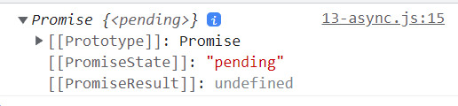
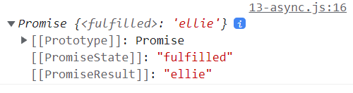

https://www.youtube.com/watch?v=aoQSOZfz3vQ&list=PLv2d7VI9OotTVOL4QmPfvJWPJvkmv6h-2&index=13


[1_async-await](#1_async-await)

[2_async-써보기](#2_async-써보기)

[3_await-기다려](#3_await-기다려)

[4_await-병렬-처리](#4_await-병렬-처리)

[5_유용한-Promise](#5_유용한-Promise)

[6_Homework](#6_Homework)


오늘 비동기의 마지막시간 async, await에 대해 알아보는 시간

첫 편: callback은 무엇인지, callback 지옥이란 말이 왜 발생했는지

두 번쨰: promise 배움. callback 지옥 해결하는 방법에 대해 알아봄.

오늘: 비동기 하이라이트, 핵심, 꽃. async, await에 대해 알아보겠다.


async, await는 지난 시간에 살펴본 promise를 조금 더 간결하고, 간편하고, 동기적으로 실행되는 것처럼 보이게 만들어주는 아이이다.

지난 시간에 promise들을 여러 가지 chaining을 할 수 있다고 알려드렸다.

promise then, 다른 promise then, 다른 promise then..

이런 식으로 chaining을 계속해서 하게 되면, 코드가 조금 난잡해질 수도 있다.

이런거 위에 조금 더 간편한 api로 async와 await을 사용하면, 동기식으로 코드를 순서대로 작성하는 것처럼 간편하게 작성할 수 있게 도와준다.

async, await는 새로운 것이 추가된 게 아니라, 기존에 존재하는 promise 위에 조금 더 간편한 API를 제공한다.

이렇게 기존에 존재하는 것 위에, 또는 기존에 존재하는 것을 감싸서 우리가 조금 더 간편하게 쓸 수 있는 API를 제공하는 것을 syntactic[문장 구성의] sugar라고 부른다.

한 가지 더 좋은 예로 class가 있었죠?

javascript에서 class는 전혀 새로운 것이 아니라, prototype을 베이스로 한 위에 살짝 덧붙여진 그럴싸하게 보이는 syntactic sugar이다.

바로 코드로 들어가볼까요?


async/13-async.js


### 1_async-await

오늘 우리가 살펴볼 async와 await은 깔끔하게 promise를 사용할 수 있는 방법.

```javascript
// async & await
// clear style of using promise :)
```

무조건 promise가 나쁘고, async와 await으로 대체해서 사용해야 된다는 것은 절대 아니다.

promise를 유지해서 써야 맞는 경우가 있고, async와 await으로 변환해야 조금 더 깔끔해지는 경우가 있다.

이런 차이점은 조금 더 플젝을 해보면서 감을 찾아가는 게 좋다.


async, await은 처음에 이해만 잘하면 굉장히 간단한 친구.


### 2_async-써보기

첫 번째로, async을 어떻게 쓰는지 한 번 알아보는 시간을 가져보도록 하겠다.

사용자의 데이터를 백엔드에서 받아오는 이런 함수가 있다.

```javascript
// 1. async
function fetchUser() {
  // do network request in 10 secs....
  return 'ellie';
}

const user = fetchUser();
console.log(user);
```

네트워크 통신을 해서 백엔드에서 데이터를 받아오는 데에 10초 정도 걸리는 코드가 있다고 가정.

10초가 지나면 받아온 사용자의 이름을 return하는 함수를 만들어보겠다.

바로 호출하고 console.log를 출력


이렇게 오래 걸리는 코드를, 비동기적인 처리를 전혀 하지 않으면, javascript 엔진은 동기적으로 코드를 처리하기 때문에, 즉 한 줄 한 줄씩, 한 줄이 끝나야 그 다음으로 넘어가는 동기적인 처리를 하기 때문에, 

'fetchUser가 호출되었네?' 함수가 선언된 곳으로 가서, 함수의 코드 블럭을 실행.

한 줄이 수행되면서 10초가 걸리니까, 끝날 때까지 10초가 걸리는 동안 여기에 머무르다가, 10초가 지나서 성공적으로 network data를 받아오게 되면, 그제서야 다음 줄로 넘어가면서 ellie가 return된다.

이 return된 코드가 user에 할당이 되고, 그 다음 line으로 넘어가서 ellie가 출력이 되겠죠?

우리가 여기서 비동기적인 처리를 전혀 하지 않으면, 사용자의 데이터를 받아오는 데에 10초가 걸리기 때문에, 만약 이 뒤에서 웹페이지의 UI를 표시하는 기능을 수행하는 코드들이 있다면, 이것이 끝날 때까지 데이터가 웹페이지에 표시되지 않기 때문에, 사용자는 10초 정도 텅텅 비어있는 웹페이지만 보게 될 것.

이렇게 오래 걸리는 일들은 비동기적으로 처리할 수 있게 해줘야 한다.


```javascript
function fetchUser() {
  return new Promise((resolve, reject) => {
    return 'ellie';
  })
}
```

지난 시간엔 어떻게 했었죠?

이것을 promise로 만들었습니다.

'내가 언제 user의 데이터를 받아올지 모르겠지만, 약속할께. promise란 object를 갖고 있으면, 여기에 니가 then이란 callback함수만 등록해놓으면, user의 data가 준비되는대로 니가 등록한 callback 함수를 불러줄께'

이렇게 약속하는 것.

promise 안에는 resolve와 reject라는, 각각의 callback 함수를 받는 executor라는 callback 함수를 만들게 되었다.

그래서 code block 안에 있는 것들이 비동기적으로 수행됐었죠?


이렇게 resolve와 reject를 호출하지 않고 그냥 return을 하게 되면, 



Promise가 pending 상태가 되어있는 것을 볼 수 있다.

promise에는 상태가 pending[미결의]이거나, fulfilled 완료되었거나, reject, 실패한 이런 상태가 있었다.

지금은 resolve도 호출하지 않았고, reject도 호출하지 않았기 때문에, 계속 pending된 상태로 남아 있다.

결과값도 아무 것도 없는 게 보이죠?

그래서 꼭 promise 안에는 resolve나 reject를 이용해서 완료를 해줘야 한다.

```javascript
function fetchUser() {
  // do network request in 10 secs....
  return new Promise((resolve, reject) => {
    // return 'ellie';
    resolve('ellie');
  })
}
```



promise가 fulfilled로 바뀌게 되면서, 결과는 ellie로 변화된 것을 볼 수 있다.


```javascript
const user = fetchUser();
user.then(console.log); // Promise 출력
console.log(user); // ellie 출력
```

fetchUser라는 것은, 결국은 Promise를 return하기 때문에, 

우리가 .then()이라는 콜백함수를 이용해서 user가 들어오면 console.log에 출력하는 것처럼 작성했었죠?


자, 이렇게 promise를 이용하지 않고도, 조금 더 간편하게 비동기를 작성할 수 있는 방법이 있다.

바로 함수 앞에 async라는 키워드를 붙여주면 된다.

```javascript
// promise를 이용하지 않고도, 조금 더 간편하게 비동기를 작성할 수 있는 방법
async function fetchUser() {
  // do network request in 10 secs....
    return 'ellie';
}

const user = fetchUser();
user.then(console.log); // Promise 출력
console.log(user); // ellie 출력
```

번거롭게 promise를 쓰지 않아도, 자동적으로 함수 안에 있는 코드 블록들이 promise로 변환이 된다.


똑같이 fetchUser가 바로 promise를 return하는 것이 보이시죠?

오.. async란 keyword를 함수 앞에 쓰면, 코드 블럭이 자동으로 promise로 바뀌는 건가요?

네! 완전 쫭 좋죠?

이렇게 async란 keyword를 쓰면, 아까 async와 await은 promise를 감싸고 있는, promise를 조금 더 간편하게 쓸 수 있는 syntactic sugar라고 말했는데요,

그것처럼 keyword를 이용하면, promise로 바로 만들 수 있다.


### 3_await-기다려

다음으로는 더 유용한 await에 대해 알려드릴 것.

조금 유용한 팁도 알려드리도록 하겠습니다.

await을 쓰기 전에, 미리 준비한 간단한 예제를 복사.

```javascript
// 2. await
function delay(ms) {
  return new Promise(resolve => setTimeout(resolve, ms));
}

async function getApple() {
  await delay(3000);
  return 'apple';
}

async function getBanana() {
  await delay(3000);
  return 'banana';
}
```

await란 keyword는, async가 붙은 함수 안에서만 쓸 수 있다.

delay란 함수는 Promise를 return하는데, 정해진 ms가 지나면 resolve를 호출하는 promise를 return하게 된다.

밑에서 3초를 전달했기 때문에, 3초가 지나면 resolve를 호출하는 promise가 전달되겠죠?

await이란 keyword를 쓰게 되면, delay가 끝날 때까지 기다려준다.

3초 있다가 사과를 return하는 promise가 만들어진다. async란 키워드가 있으니까.

getBanana도 promise를 만드는 함수.

3초 있다가 바나나를 return하는 함수.

우리가 굳이 얘를 promise를 쓰는 동일한 함수로 만들어보면..


```javascript
function getBanana2() {
  return delay(3000)
    .then(() => 'banana');
}
```

바나나 안에서는 promise를 return. 3초 delay 된 다음에, 어떤 값을 받아오든 상관 없이 바나나를 return하는 함수를 만든다.

이렇게 chaining을 하는 것보다[아래], 동기적인 코드를 쓰는 것처럼[위] 만들게 되면 delay가 끝날 때까지 기다렸다가 banana를 return한다 이렇게 더 쉽게 이해할 수 있겠죠?


하이라이트 이제 시작..

사과, 바나나, 모든 과일을 한 번에 다 따오는 pickFruits라는 함수를 만들어 볼 것이다.

기존의 promise chaining을 이용하게 되면..

return getApple()을 먼저 부른 다음에, 

apple이 받아와지면, 받아온 apple을 이용해서 우리가 getBanana를 받아오겠죠?

그리고 바나나가 되면, 바나나를 string template을 이용해서 apple과 banana를 묶어주는 애를 리턴.

얘를 최종적으로 부를 때는, pickFruits가 다 받아와지면 console.log를 받아오도록 하겠다.

```javascript
function pickFruits() {
  return getApple().then(apple => {
    return getBanana().then(banana => `${apple} + ${banana}`);
  });
}

pickFruits().then(console.log);
```


6초정도 기다려야되겠죠?

apple + banana

사과와 바나나가 나온다.


이걸 보니까 떠오르는 게 없나요? 콜백 지옥이 떠오르는 듯..

이렇게 promise도 너무 중첩적으로 chaining을 하게 되면, 콜백 지옥과 비슷한 문제점이 발생한다.


그래서 우리는 이것을 async란 키워드를 이용하면 간단하게 만들 수 있다.

await란 키워드를 이용해서 사과와 바나나를 다 받아와서 리턴하면 되겠죠?

```javascript
async function pickFruits() {
  const apple = await getApple();
  const banana = await getBanana();
  return `${apple} + ${banana}`;
}

pickFruits().then(console.log);
```

이것을 수행하기 전에 delay를 1초로 수정..


사과와 바나나가 나왔다.

이렇게 하니까 너무 간단하지 않나요?

async, await란 키워드를 이용해서, 우리가 동기적으로 코드를 작성하듯이, 원래 자연스럽게 코드를 작성하는 것처럼 쓰고, return값도 자연스럽게 하게 되니까, 너무너무 간편하다.

error 처리도, 만약 여기서 무언가가 에러가 발생했다면, throw 'error' 하면 에러가 발생한다.

```javascript
async function getApple() {
  await delay(1000);
  throw 'error';
  return 'apple';
}
```

에러 처리를 아무 곳에서도 하지 않았기 때문에 콘솔창에서 에러 발생


이것도, 기존에 우리가 error handling을 하는 것처럼 try catch를 이용해서..

요런 식으로 에러 처리를 할 수 있다.

```javascript
async function pickFruits() {
  try {
    const apple = await getApple();
    const banana = await getBanana();
  } catch () {
    
  }
  return `${apple} + ${banana}`;
}
```

이것이 우리가 기존에 쓰는 코드랑 비슷하기 때문에, 조금 더 쉽게 이해할 수 있는 장점이 있다.


await에서 한 가지 문제점이 있다. [위에 try 쓰기 전에]어떤 문제일까요?


### 4_await-병렬-처리

여기서 사과를 받는데 1초가 걸리고, 바나나를 받는 데 1초가 걸린다.

```javascript
async function pickFruits() {
  const apple = await getApple();
  const banana = await getBanana();
  return `${apple} + ${banana}`;
}

pickFruits().then(console.log);
```

그 말은, 사과를 받는 데 기다려 했으니 1초 지남

그 다음에 getbanana가 호출되면서 기다려 했으니까, 1초가 소요된다.

순차적으로 진행하게 되면 조금 비효율적이다.

바나나와 애플을 받아오는 데는, 서로 연관이 되어있지 않기 때문에 서로 기다릴 필요가 전혀 없다.


이것을 조금 개선하려면..

첫 번째로 해볼 수 있는 건.. applePromise를 바로 만들면, promise를 만드는 순간 바로 promise안에 들어있는 코드 블럭이 실행된다고 지난 시간에 알려드렸죠?

bananaPromise를 만들어서 바로 promise를 만들면, promise가 실행 된다.

밑에서 await으로 동기화를 시켜준다.

```javascript
async function pickFruits5() {
  const applePromise = getApple();
  const bananaPromise = getBanana();
  const apple = await applePromise;
  const banana = await bananaPromise;
  return `${apple} + ${banana}`;
}
```

이렇게 해서 실행하게 되면, 1초 만에 병렬적으로 실행되는 것을 볼 수 있다.

위에서 사과와 바나나의 promise를 만들었기 때문에, 만들자마자 안에 코드가 실행이 됩니다.

병렬적으로 사과와 바나나를 동시에 따서 한 번에 기다렸다가 출력하게 된다.

이렇게 동시다발적으로 수행이 가능한 경우에는, 즉 바나나를 다운받는데 사과가 필요없고, 사과를 다운받는 데 바나나가 필요없어서 병렬적으로 기능을 수행할 수 있는 경우에는 이렇게 더럽게 코드를 작성하지 않는다.


### 5_유용한-Promise

아주 유용한 promise에서 제공하는 API가 있다.

이 API를 이용하면, 아주 간단하게 만들 수 있다.


이제 조금 다른 함수를 만들어보겠다.

pickAllFruits(). promise에 있는 all이란 API를 쓰면 된다.

```javascript
// 3. useful Promise APIs
function pickAllFruits() {
  return Promise.all();
}
```

promise 배열을 전달하면, 모든 promise들이 병렬적으로 다 받을 때까지 모아주는 아이.

무슨 말이냐?


```javascript
// 3. useful Promise APIs
function pickAllFruits() {
  return Promise.all([getApple(), getBanana()])
    .then(fruits => fruits.join(' + '));
}

pickAllFruits().then(console.log);
```

배열 형태로 getApple promise와 getBanana의 promise 배열을 전달하게 되면,

얘네들이 다 받아지면, 그러면 이렇게 다 받아진 배열이 다시 전달된다.

과일의 배열이 전달받아지겠죠?

배열을 string으로 묶을 수 있는 건 join이 있었다.


이걸 호출해볼까요?

이렇게 하[고 실행하]면 두 번 출력된 것을 볼 수 있죠?

위, 아래가 한 번씩 출력됐기 때문


이렇게 각각 Promise all이라는 API를 활용해도 되고,

딱 하나만 더 해볼께요.


어떤 것이든 상관없고, 먼저 빠지는 첫 번째 과일만 받아오고 싶다!

pickOnlyOne

만약 사과는 따는 데에 2초가 걸리고, 바나나를 따는 데 1초가 걸린다고 가정.

```javascript
function pickOnlyOne() {
  return Promise.race([getApple(), getBanana()]);
}

pickOnlyOne().then(console.log);
```

return Promise에 있는 race란 API를 이용하게 되면,

배열에 전달된 Promise중에서 가장 먼저 값을 return하는 아이만 전달된다.

이렇게 전달하고, 얘를 호출..

딱 하나만 수행되는 애가 전달되면, console.log로 출력.


바나나가 1초만에 전달돼서 1초만에 출력되는 것을 볼 수 있다.


### 6_Homework

async, await는 Promise를 조금 더 간편하게 쓸 수 있는 아이이고, 

promise에는 all이나 race같은 유용한 API가 있다 여기까지 알아보았다.

끝내기 전에, 12-callback-to-promise 파일에 오셔서, 지난 시간에 우리가 callback 지옥을 promise를 이용해서 간단하게 만들었다.

```javascript
const userStorage = new UserStorage();
const id = prompt('enter your id');
const password = prompt('enter your password');
userStorage
  .loginUser(id, password)
  .then(userStorage.getRoles)
  .then(user => alert(`Hello, ${user.name}, you have a ${user.role} role`))
  .catch(console.log)
```


이 부분을 async와 await을 이용해서 어떻게 깔끔하게 작성했는지 남겨주십셔

비동기 처리부분 1, 2, 3 파트가 여기서 끝.

부족하거나 이해되지 않는 것이 있다면, 아래 코멘트로 남겨주시면 미니 게임 하기 전에 한 번 더 다뤄보는 시간을 가져보겠다.

다음 시간에 봐요~

